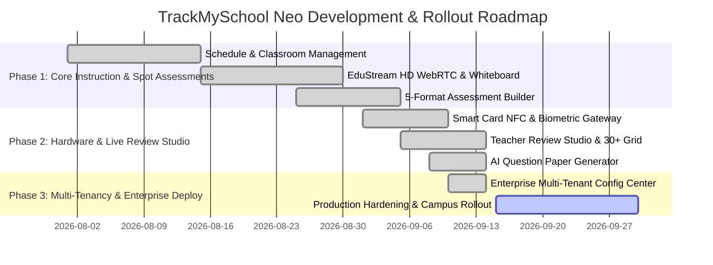

# Product Requirement Document (PRD): TrackMySchool Neo Online Classroom & Assessment Platform

---

## 1. Executive Summary & Product Vision

### 1.1 Product Overview
**TrackMySchool Neo** is a next-generation, unified Virtual Classroom, Live Assessment, and Multi-Tenant Academic Governance Platform. It bridges real-time synchronous video instruction (**EduStream HD**) with formative spot assessments, proctored examinations, NFC/biometric identity verification, and deep curriculum taxonomy alignment.

### 1.2 Core Objectives
- **Zero-Friction Live Instruction**: Enable teachers to host high-fidelity lectures with native HD WebRTC streaming, collaborative digital whiteboards, integrated slide decks, and instant external conferencing options (Google Meet, Zoom, MS Teams).
- **Interactive Formative Spot Quizzes**: Allow teachers to dispatch interactive assessments during lectures, testing comprehension across 5 cognitive question formats with automatic real-time grading.
- **Smart Hardware & Biometric Identity Verification**: Enforce high-integrity candidate authentication using contactless RFID/NFC student smart cards and real-time facial recognition verification before quizzes unlock.
- **Real-Time Live Proctoring & Review Studio**: Provide educators with a live 30+ student progress grid, step-level score override mechanisms, and student notebook rough-work inspection.
- **Multi-Tenant Enterprise Governance**: Support hierarchical inheritance where system-wide baselines are configured globally while individual institutions manage customized branding, video engines, proctoring sensitivity, and local hardware endpoints.

---

## 2. User Personas & Role-Based Access Control (RBAC)

| Role / Persona | Core Responsibilities | Key UI Surfaces & Privileges |
| :--- | :--- | :--- |
| **Super Admin** | Platform-wide infrastructure management, tenant provisioning, system security, API keys. | Full read/write access to Global Baseline Configuration, Integrations (JWT keys, Zoom/Google Workspace OAuth, AI evaluation API), Platform Maintenance mode. |
| **Institution / School Admin** | Campus branding, curriculum selection, local reader endpoints, campus-wide scheduling. | Tenant-wise Configuration Center, Organization Profile, School-specific SMS Sender ID, campus video platform overrides, attendance thresholds. |
| **Teacher / Instructor** | Virtual lecture hosting, curriculum mapping, question authoring, assessment dispatch, live evaluation. | Teacher Command Center, Schedule Class Wizard, Class Assessments Hub, Question Pool & AI Generator, Live Classroom Studio, Teacher Assessment Review Studio. |
| **Student (Learner)** | Attending virtual lectures, participating in live chat, verifying identity via NFC/Face scan, solving quizzes. | Student Learning Dashboard, Class Timetable, Live Lecture Room, Student Identity Verification Modal, In-Class Assessment Answering Modal, Lecture Archive. |
| **Parent / Guardian** | Academic monitoring, timetable review, multi-child progress tracking, attendance supervision. | Parent Multi-Child Switcher, Child Overview Snapshot (Attendance %, Grade, Class Rank), Upcoming Sessions list. |

---

## 3. Information Architecture & Navigation Hierarchy

```mermaid
graph TD
    Root[TrackMySchool Neo Platform] --> PortalSwitch{Portal Mode}
    
    %% Teacher Portal
    PortalSwitch -->|Teacher / Admin Mode| TeacherPortal[Teacher Command Center]
    TeacherPortal --> D1[Dashboard & KPI Metrics]
    TeacherPortal --> C1[Online Classes List]
    TeacherPortal --> C2[Schedule Class Wizard - 5 Steps]
    TeacherPortal --> A1[Class Assessments List & Library]
    TeacherPortal --> A2[Assessment Builder & Section Editor]
    TeacherPortal --> QP[Question Pool & AI Question Generator]
    TeacherPortal --> LC[Live Classroom Studio]
    TeacherPortal --> CF[Configuration Center]

    %% Student Portal
    PortalSwitch -->|Student / Parent Mode| StudentPortal[Student Learning Portal]
    StudentPortal --> S1[Student Dashboard & Multi-Child Selector]
    StudentPortal --> S2[Class Timetable & Archive]
    StudentPortal --> S3[Join Live Classroom]

    %% Live Interactions & Modals
    LC --> ModShare[QR Code & Share Modal]
    ModShare --> ModAuth[NFC / Face Identity Verification]
    ModAuth --> ModStudent[Student Assessment Solving Modal]
    LC --> ModReview[Teacher Review Studio & 30+ Monitor]
    ModStudent --> ModReview
```



---

## 4. Module 1: Teacher Command Center & Online Class Management

### 4.1 Dashboard Overview (`DashboardView`)
- **Hero Command Banner**: Displays current academic year/term, live broadcast count, upcoming session counter, and quick action shortcuts (`Join Live Studio`, `Schedule Class`, `New Assessment`).
- **Live Broadcast Emergency Banner**: Triggered dynamically when a session is active; displays student attendance, subject, duration, instant meeting link copy button, and direct 1-click classroom entry.
- **KPI Metric Cards**:
  1. *Total Online Classes*: Live count, upcoming count, total registered.
  2. *Class Assessments*: Total active spot quizzes, submitted attempt tallies.
  3. *Question Pool Inventory*: Distribution across 5 cognitive question types with progress bars.
  4. *Total Student Roster*: Enrolled students and 96% baseline attendance tracking.
- **Interactive Two-Column Layout**:
  - *Left Column*: Filterable lecture schedule cards with direct actions (Join Studio, Copy Link, View Details).
  - *Right Column*: Question Pool percentage distribution breakdown and infrastructure health status indicators (HD WebRTC, Quiz Dispatcher, Proctor AI, Cloud Recording).

### 4.2 Online Classes Directory (`OnlineClassesListView`)
- **Quick Status Tabs**: `All Classes`, `Live Now (Active)`, `Upcoming (Scheduled)`, and `Completed (Archived)`.
- **Search & Multi-Dimensional Filters**: Live search input with instant matching across Topic, Subject, Instructor, and Class; dropdown filters for Subject and Grade.
- **Class Session Cards**:
  - Top chips: Subject tag, Class & Section tag, Status badge (Live Now with blinking red beacon, Scheduled, or Completed).
  - Body: Lecture title, rich curriculum description, learning topic pills.
  - Schedule bar: Date, start time, duration in minutes, platform type, and live attendance ratio (e.g. `38/42 Present`).
  - Instructor metadata: Avatar, faculty title, attached material counter.
  - Action footer: Copy Student Invite Link, Duplicate Session, Delete Class, and primary CTA (`Enter Live Studio` / `Start Class Now` / `View Recording`).

### 4.3 5-Step Class Creation Wizard (`CreateOnlineClassView`)
1. **Step 1: Class Details & Curriculum**:
   - Class title, Subject (Mathematics, Physics, Chemistry, Biology, English, CS, Social Science), Class Grade (Class 6 through 12), Section (Sec A, B, C, Merged), Academic Year.
   - Instructor identity (Name, Faculty Designation, Avatar).
   - Detailed lecture syllabus description and dynamic learning topic pills (add/remove).
2. **Step 2: Schedule & Recurrence**:
   - Session Date, Start Time, End Time, Auto-computed duration in minutes, Master Timezone.
   - Recurrence engine: `None`, `Daily`, `Weekly`, `Mon-Wed-Fri (MWF)`, `Tue-Thu-Sat (TTS)`, or `Custom Days`.
   - Automated notification checkboxes (Email reminders, Parent SMS alert, Calendar invites 15 min prior).
3. **Step 3: Platform & Video Room Engine**:
   - **EduStream HD Native**: In-app ultra-low latency WebRTC streaming with whiteboard and proctoring.
   - **Google Meet**: Integrated Google Workspace auto-meeting link generation.
   - **Zoom Cloud Meetings**: Enterprise Zoom SDK integration with breakout room support.
   - **Microsoft Teams**: Office 365 school channel linkage.
   - Auto-generated Meeting ID, Passcode, and Room Student Capacity limit.
4. **Step 4: Classroom Controls & Security Governance**:
   - Audio/Video toggles: `Student Microphone Enabled`, `Student Camera Required`.
   - Collaboration toggles: `Chat Enabled`, `Screen Sharing Allowed`, `Digital Whiteboard Enabled`.
   - Security & Compliance: `Auto-Attendance Threshold (%)`, `Waiting Room / Lobby Required`, `Auto-Record Session on Launch`, `Q&A Panel Enabled`, `Breakout Rooms Enabled`.
5. **Step 5: Pre-Read Materials & Attachment Repository**:
   - Pre-class file attachments: PDFs, PPTX slides, reference docs, video links.
   - Real-time file upload simulator with file size and timestamp tagging.

---

## 5. Module 2: Live Virtual Classroom Studio (`LiveClassroomView`)

### 5.1 Real-Time Streaming Canvas & Dual Persona Simulator
- **Header Broadcast Strip**: Real-time lecture title, live elapsed clock, active attendee counter, instructor badge, and `Role Perspective Switcher` allowing instructors to test between **Teacher (Host)** and **Student (Aarav)** viewpoints instantly.
- **Stage Left (Main Presentation Stage)**:
  - *Instructor Stream View*: 1080p 60fps video canvas with live audio meters, active recording indicator, floating topic pill, and stream overlays.
  - *Collaborative Mathematical Whiteboard*: Stylus canvas supporting real-time vector pen drawing, 5-color palette selection, LaTeX mathematical derivation rendering, and synchronized multi-user latency (<15ms).
  - *Bottom Thumbnail Ribbon*: Horizontal carousel of active student video feeds with student name tags, audio state (Muted/Active), video state, and raised-hand animations.

### 5.2 Interactive Sidebar Panels
- **Chat Feed**: Real-time group messaging with distinct visual cards for instructor announcements, student questions, and high-priority **Live Assessment Broadcast Cards**.
- **Learners & Attendance Tab**: Real-time roster list displaying active camera/mic states, raised hands, and instructor controls to remotely mute or request video.
- **Class Materials Tab**: Downloadable pre-read files, worksheets, and lecture slides.
- **Live Quizzes Tab**: Library of prepared spot quizzes ready for 1-click broadcast into classroom chat.

### 5.3 Bottom Floating Control Dock
- Hardware switches: Microphone Mute/Unmute, Camera On/Off, Screen Share Toggle, Raise Hand Toggle.
- Assessment dispatch shortcuts: `Send Live Assessment` and `Digital Whiteboard Toggle`.
- Emergency controls: `End Lecture for All` with auto-attendance sync to student records.

---

## 6. Module 3: In-Class Assessments & Interactive Spot Quizzes

### 6.1 Assessment Directory & Academic Taxonomy Filter (`OnlineClassAssessmentsView`)
- **Global 5-Dropdown Academic Taxonomy Header Bar**:
  $$\text{Board} \longrightarrow \text{Class Grade} \longrightarrow \text{Subject} \longrightarrow \text{Chapter} \longrightarrow \text{Topic}$$
  - Fully dynamic hierarchical filtering populated from CBSE/ICSE/State Board curriculum standards.
- **Summary Metrics**: Saved Assessments, Active in Live Session, Drafts in Progress, Supported Question Formats (5 Typologies).
- **Assessment Management Cards**:
  - Status chips: `Live Broadcast Active` (pulsing red), `Published / Shared` (green), `Draft` (amber), `Past Assessment / Closed` (purple).
  - Statistics: Total marks, question count, duration timer, submission counter, class average score.
  - Actions: `View Submissions (Review Studio)`, `QR Code & Copy Link`, `Dispatch to Live Class`, `Preview Student View`, `Edit`, `Duplicate`, `Delete`, and collapsible question preview drawer.

### 6.2 Assessment Builder & Section Editor (`CreateClassAssessmentView`)
- **Multi-Section Structuring**: Assessments can be divided into named sections with specific mark weightage, instructions, and drag-and-drop reordering.
- **Step-by-Step Flow**:
  - *Step 0: Basic Details*: Title, Board, Grade, Subject, Chapter, Topic, Duration (seconds/minutes), Pass Marks, Candidate Instructions.
  - *Step 1: Question Authoring*: Add question from pool or construct questions across 5 formats; set marks, Bloom's Taxonomy level, Question Level (Level 1 to 4), and solution explanations.
  - *Step 2: Review & Dispatch*: Verification of total marks, question distribution, and instant launch into active class.

### 6.3 5 Supported Question Typologies

```
+-----------------------------------------------------------------------------+
| 1. Multiple Choice Question (Single Select MCQ)                             |
|    - Radio-based single selection with automatic scoring.                   |
+-----------------------------------------------------------------------------+
| 2. Multi-Multiple Choice Question (MMCQ / Multi-Select)                     |
|    - Checkbox-based selection requiring all correct options.                |
|    - Configurable minimum selections and partial-marking logic.             |
+-----------------------------------------------------------------------------+
| 3. Fill in the Blanks (Drag to Blank Slot)                                 |
|    - Sentences with embedded blank tokens ([Blank 1], [Blank 2]).           |
|    - Interactive draggable word/term bank with distractor terms.            |
+-----------------------------------------------------------------------------+
| 4. Match the Following (Connecting Pairs)                                   |
|    - Column A (Premise) and Column B (Matches).                             |
|    - Interactive drag-to-slot or tap-to-pair with color-coded linkages.     |
+-----------------------------------------------------------------------------+
| 5. Step Ordering & Sequential Proofs                                        |
|    - Multi-step derivation / chronological sequence arrangement.            |
|    - Mixed with deliberate distractor steps that students must reject.     |
+-----------------------------------------------------------------------------+
```

### 6.4 Pedagogical Taxonomy Mapping
- **Bloom's Cognitive Taxonomy**: `Remember`, `Understand`, `Apply`, `Analyze`, `Evaluate`, `Create`.
- **Question Levels**:
  - *Level 1 (Foundational)*: Recall & direct definitions (1 mark default).
  - *Level 2 (Conceptual)*: Application & standard matching (2 marks default).
  - *Level 3 (Analytical)*: Multi-variable analysis & multi-select problems (3-4 marks).
  - *Level 4 (Advanced Synthesis)*: Multi-step proofs, derivations, and sequence ordering (4-5 marks).

### 6.5 AI Question Generator (`AIQuestionGenerator`)
- **Curriculum Parameter Configuration**: Target Board, Class Grade, Subject, and Chapter.
- **Source Material Attachment**: Upload course documents (PDF, DOCX, TXT) to generate context-specific questions.
- **Rule-Based Generation Matrix**: Specify exact question type distributions, difficulty mix (Easy/Medium/Hard), and Bloom's taxonomy criteria.
- **Quick Presets**:
  - *Standard Unit Test*: 4 questions (MCQ + MMCQ), 6 marks.
  - *Concept & Matching Test*: 4 questions (MCQ + Matching + Sequence Ordering), 8 marks.
  - *Quick Pop Quiz*: 3 questions (MCQ + True/False), 3 marks.
- **Batch Export**: Save generated questions directly to the institutional **Question Pool** or inject into an active assessment draft.

---

## 7. Module 4: Smart Sharing & Contactless Student Verification

### 7.1 Share Assessment Gateway (`ShareAssessmentModal`)
- **Direct Link & Real-Time QR Generation**:
  - Auto-constructs deep link: `/assessments/live-gateway?assId={id}&classId={targetClassId}`.
  - High-resolution dynamic QR Code generation for mobile or tablet scanning.
- **Projector / Fullscreen Mode**: Enlarges the QR code to 420px with high-contrast framing for projection onto auditorium and classroom presentation screens.
- **Classroom Chat Push**: 1-click broadcast of test links directly into the live lecture stream.

### 7.2 Student Smart Card & Biometric Gateway (`StudentIdentityVerificationModal`)
To ensure zero proxy attendance and assessment integrity, students must authenticate before questions unlock:
1. **Option 1: Contactless RFID / NFC Smart Card**:
   - Web NFC API detection or desktop USB smartcard reader service WebSocket listener (`ws://...`).
   - Reads unique 14-digit Card UID (e.g. `04:A2:8B:E3:71`).
   - Plays acoustic chime upon authentication, fetches student profile (Roll number, admission number, section, avatar), and stamps auth verification record.
   - Built-in simulator for one-click testing using registered Class 10 smartcards.
2. **Option 2: Webcam Facial Recognition & Liveness Gate**:
   - Accesses candidate webcam via `navigator.mediaDevices.getUserMedia`.
   - Renders biometric bounding reticle with real-time face tracking.
   - Performs progressive scan (Face alignment $\rightarrow$ Liveness check $\rightarrow$ Database biometric match $\rightarrow$ Confidence score threshold $\ge 90\%$).
3. **Session Unlock**: Displays verified candidate badge (`Verified via NFC Card / Face Biometrics`) and enables the `Proceed to In-Class Assessment` action.

---

## 8. Module 5: Student Exam-Taking & Answering Experience (`LiveAssessmentStudentModal`)

### 8.1 Candidate Banner & Synchronized Countdown
- **Header Status**: Subject code, test title, candidate photo, Roll number, and verified smartcard chip badge.
- **Live Clock**: Synchronized countdown timer with warning color shifts (Green $\rightarrow$ Amber $\rightarrow$ Pulsing Red under 30s) and automated force-submit on expiry.

### 8.2 Answering Interactions
- **MCQ / MMCQ**: Clean selectable option cards with active border highlighting and selection counter.
- **Drag-to-Blank**: Interactive target boxes embedded in text; terms drag from the word bank and snap into place; click-to-place fallback for mobile touchscreens.
- **Match the Following**: Dual-column layout where selecting Column A and Column B connects items with color-coordinated chips (Purple, Orange, Emerald, Rose, Amber).
- **Sequence Ordering Proofs**: Scrambled proof step pool; students click `Add to Order` to construct derivations in chronological order, with drag/arrow reordering and removal of distractors.

### 8.3 Student Workings & Notebook Rough Sheet Uploads
- **Supporting Workings Gallery**:
  - Students can attach photos of rough calculations, notebook derivations, or formula scratchpads.
  - Supports multiple files (PNG, JPG, PDF up to 10MB).
  - Interactive webcam capture (`Scan Notebook`) allowing instant snapshot capture of paper notes.
  - Sample test attachments for instant demonstration.

### 8.4 Automated Grading & Candidate Score Receipt
- Upon submission, the engine evaluates objective formats immediately:
  - MCQ & MMCQ: Exact and partial credit algorithms.
  - Matching: Match pair comparison.
  - Fill in Blanks: Normalized string comparison against correct answer keys.
  - Step Ordering: Prefix-matching and logical order verification.
- **Instant Result Modal**: Shows candidate score (e.g. `3/14 Marks - 21%`), detailed question-by-question breakdown, correct answer keys, and pedagogical solution rationales.

---

## 9. Module 6: Teacher Assessment Review Studio (`LiveAssessmentTeacherReviewModal`)

### 9.1 Real-Time 30+ Student Live Monitor Tab
- **Aggregate KPI Bar**: Submitted count, in-progress count, class average score, rough sheets attached.
- **Live Progress Matrix**: Real-time matrix of all class candidates displaying:
  - Student photo, name, and roll number.
  - Individual question progress pips (Q1 to Q5: Answered in green, Answering in pulsing blue, Pending in gray).
  - Time elapsed, current question index, and verified auth method tag.
  - View toggle between **Compact 30+ Grid** (entire class visible without scrolling) and **Detailed Cards**.

### 9.2 Detailed Grading & Question Overrides Tab
- **Candidate Selector Drawer**: Filterable list of all submitted candidates with obtained scores and percentage badges.
- **Audit & Verification Record**: Displays candidate's verified RFID card UID, biometric timestamp, and device metadata.
- **Question-by-Question Evaluation**:
  - Displays student's given answer vs. model solution key.
  - Shows auto-calculated mark and rationale.
- **Teacher Override Engine**:
  - Direct input field allowing instructor to award bonus marks or adjust subjective and sequence marks (e.g. awarding partial credit for mathematical proofs).
  - Mandatory audit reason field (e.g. *"Handwritten working sheet verified via notebook upload"*).
  - Live recalculation of total score, accuracy percentage, and grade status.
- **Global Actions**: `Broadcast Leaderboard` (pushes ranked scores to student screens) and `Lock Submissions`.

### 9.3 Uploaded Workings Gallery Tab
- Grid gallery displaying all student notebook scans and rough calculations.
- Clicking an item opens high-resolution inspection mode with zoom, contrast enhancement, and direct linking to the candidate's grading profile.

---

## 10. Module 7: Student & Parent Learning Portal (`StudentOnlineClassesView`)

### 10.1 Parent Multi-Child Management
- **Child Switcher**: Allows parents with multiple enrolled dependents (e.g. *Aarav Sharma - Class 10*, *Diya Sharma - Class 8*, *Kabir Sharma - Class 6*) to switch profiles with zero re-login overhead.
- **Academic Snapshot**: Real-time attendance percentage, overall letter grade (A+, A, B+), and rank in class.

### 10.2 Timetable & Session Catalog
- Filter toolbar: `All Sessions`, `Live Now (Active)`, `Upcoming Schedule`, and `Past Recordings`.
- Session cards: Lecture title, faculty name, date/time, learning resource count, and direct `Join Lecture` button for active sessions or `View Recording` for archived classes.

---

## 11. Module 8: Enterprise Multi-Tenant Configuration Center (`ConfigurationCenterView`)

### 11.1 Scoped Access Architecture
TrackMySchool Neo implements a dual-layer configuration hierarchy:
1. **Global Configuration (Common Baseline)**: Managed exclusively by `SUPER_ADMIN`; sets baseline defaults for all school tenants.
2. **Tenant-Wise Configuration (Individual Institutions)**: Managed by campus administrators (`ADMIN+`); allows selective override of specific functional domains.

### 11.2 Configuration Functional Domains

| Domain | Global Baseline Settings (`SUPER_ADMIN`) | Tenant Override Capabilities (`ADMIN+`) |
| :--- | :--- | :--- |
| **Platform Identity** | Multi-tenant suite name, system version (`v4.8.0-LTS`), master language, master timezone, support email, maintenance mode. | **Organization Profile**: Campus name, campus identifier (e.g. `SIA-MAIN-001`), board affiliation (CBSE/ICSE/IB), principal contact, logo URL. |
| **Classroom & Streaming** | Default platform engine (In-App WebRTC, Meet, Zoom, Teams), recording cloud provider (AWS S3, GCS, Azure), auto-attendance threshold (75%), default room capacity (120). | Override video engine (e.g. campus uses Google Meet instead of WebRTC), customized room capacity, waiting room enforcement. |
| **Assessments & Proctoring** | Proctoring AI sensitivity (`Standard`, `Strict`, `Lenient`), max tab switches allowed (3), full-screen lock mode, face check interval (5s), passing percentage (40%). | Campus-specific tab switch allowance, passing threshold override, enable/disable on-screen scientific calculator. |
| **Smart Card & Biometrics** | Verification standard (`nfc_and_face`), face confidence threshold (90%), reader baud rate. | Campus NFC reader service WebSocket URL (e.g. `ws://192.168.1.105:9080`), local reader hardware endpoints. |
| **Notifications** | Master Firebase service credentials, SMS provider gateway, WhatsApp integration, system email relay. | Campus custom SMS Sender ID (e.g. `SIAEDU`), alert trigger rules (Notify on absence, assessment launch, malpractice). |
| **Integrations** | Core system JWT keys, AI evaluation API keys, Zoom OAuth credentials, SIS Webhook secret keys. | *Restricted to Super Admin only*. |
| **Dynamic Parameters** | Global runtime feature flags (e.g. `enable_live_proctoring`, `webrtc_turn_cluster`). | Campus-specific key-value parameters (e.g. `enable_interactive_whiteboard`, `max_live_streams_concurrency`). |

### 11.3 Inheritance & Override Mechanism
- Each tenant section features an **Inheritance Toggle**:
  - `○ Inherited from Global`: The institution automatically adopts platform-wide baseline changes.
  - `● Overridden for this Campus`: The institution decouples from the baseline and enforces local policies.
- Visual status badges clearly indicate overridden vs. inherited settings.

---

## 12. Technical Specifications & Non-Functional Requirements

### 12.1 Performance & Latency Targets
- **Live Classroom WebRTC Video**: End-to-end streaming latency $\le 300\text{ ms}$; dynamic bitrate adaptation from 360p to 1080p.
- **Collaborative Whiteboard**: Synchronized stylus vector point broadcast $\le 20\text{ ms}$.
- **Assessment Auto-Evaluation**: Scoring of objective questions (MCQ, Matching, Blanks, Sequence) within $\le 500\text{ ms}$ upon submission.
- **Concurrent Classroom Capacity**: Up to 150 students per standard lecture room; up to 1,000 for auditorium webinars.

### 12.2 Security & Integrity Safeguards
- **Identity Integrity**: Dual-factor candidate authentication combining physical RFID smartcard UID with webcam facial biometric matching.
- **Anti-Cheating Policy Engine**:
  - Fullscreen enforcement with lockout on escape.
  - Tab switch detection with configurable warning counters (default: 3 strikes).
  - Copy/paste clipboard blocking on assessment interfaces.
  - Question and option randomization per candidate session.
- **Data Protection**: AES-256 encryption for student records and media archives; TLS 1.3 in-transit encryption.

### 12.3 Offline Resilience
- **IndexedDB Client Caching**: Questions, candidate answers, and progress are buffered in browser storage.
- **Network Recovery Sync**: In the event of brief Wi-Fi dropouts during a live assessment, student answers automatically synchronize upon reconnection without loss of progress.

---

## 13. Release Phasing & Milestones



---

## 14. Acceptance Criteria & Verification Checklist

- [x] **Teacher Dashboard**: Real-time KPI summaries, active live lecture alerts, and direct session launcher.
- [x] **Class Scheduling**: 5-step wizard supporting recurrence, platform selection (EduStream, Meet, Zoom, Teams), and pre-read attachments.
- [x] **Live Classroom**: Real-time video canvas, collaborative stylus whiteboard with LaTeX derivations, live chat with assessment broadcast cards, and student thumbnail strip.
- [x] **5 Question Typologies**: Functional single-choice MCQ, multi-select MMCQ, drag-to-blank, matching pairs, and sequence ordering with distractors.
- [x] **Pedagogical Taxonomy**: Integration with Bloom's Taxonomy (6 levels) and Question Difficulty Levels (Level 1 to 4) with CBSE/ICSE curriculum navigation.
- [x] **AI Question Generator**: Document attachment scanning, difficulty ratio customization, and batch pool injection.
- [x] **Contactless Verification**: NFC smartcard reader integration with acoustic chime, webcam facial recognition scan, and candidate verification badge.
- [x] **Student Solving Modal**: Countdown timer, interactive drag-and-drop slots, color-coded matching pairs, proof step ordering, notebook camera snapshot upload, and instant score receipt.
- [x] **Teacher Review Studio**: 30+ student live progress matrix, detailed question scoring override with audit remarks, and rough sheet gallery.
- [x] **Multi-Tenant Configuration**: Scoped global defaults vs. institutional overrides with inheritance toggles across 7 architectural domains.
