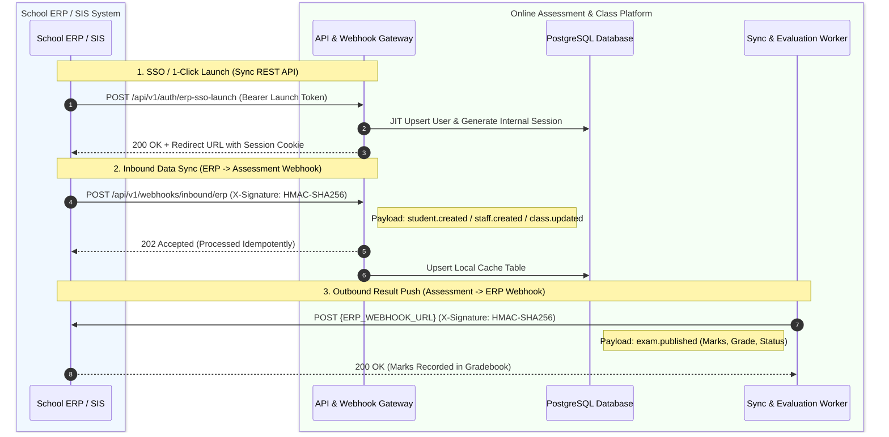

# REST API & Webhook Integration Specification (ERP & 3rd-Party Systems)

> **Document Version:** 1.0  
> **Protocol:** HTTPS REST + Asynchronous Webhooks (JSON Payloads)  
> **Security:** HMAC SHA-256 Signatures, API Keys & Short-Lived JWT Tokens  
> **Reliability:** Idempotent Processing, Dead-Letter Queue (DLQ), Exponential Backoff Retries  

---

## 1. Integration Architecture Overview



---

## 2. Security & Authentication Specification

### 2.1 Webhook Signature Verification (HMAC SHA-256)
Every webhook request (inbound and outbound) must include security headers:

| Header Name | Description | Example |
| :--- | :--- | :--- |
| `X-Webhook-Signature` | Hex-encoded HMAC-SHA256 of the raw JSON body signed with the shared secret | `sha256=d5b9f7a8...` |
| `X-Webhook-Timestamp` | Unix epoch timestamp in seconds to prevent replay attacks (valid within ±300s) | `1772439800` |
| `X-Webhook-Id` | Unique UUID v4 for the event to ensure idempotency | `evt_9b1deb4d-3b7d-4bad` |
| `X-Tenant-Id` | Target school/tenant identifier | `school_al_amal_001` |

#### Signature Verification Formula
$$\text{Signature} = \text{HMAC-SHA256}(\text{RawBody}, \text{SharedSecret})$$

---

## 3. Inbound Webhooks (ERP ➔ Assessment System)

**Endpoint:** `POST https://{ASSESSMENT_HOST}/api/v1/webhooks/inbound/erp`

### 3.1 Event: `student.created` / `student.updated`
Triggered when a student registers or their class/division changes in the ERP.

```json
{
  "event": "student.created",
  "eventId": "evt_st_104829",
  "timestamp": "2026-09-01T10:00:00Z",
  "tenantId": "sch_dubai_01",
  "data": {
    "externalId": "ERP_STU_84920",
    "admissionNo": "ADM-2026-042",
    "fullName": "Zaid Al-Mansoor",
    "email": "zaid.m@school.edu",
    "phone": "+971501234567",
    "academicYear": "2026-2027",
    "classId": "GRADE-08",
    "className": "Grade 8",
    "divisionId": "DIV-A",
    "divisionName": "Division A",
    "rollNo": "14",
    "photoUrl": "https://erp.school.edu/cdn/photos/zaid.jpg",
    "accommodations": {
      "extraTimeMultiplier": 1.25,
      "allowBreaks": true,
      "relaxedProctoring": false
    },
    "status": "active"
  }
}
```

### 3.2 Event: `staff.created` / `staff.updated`
Triggered when a teacher or administrator is registered or assigned subjects.

```json
{
  "event": "staff.created",
  "eventId": "evt_tf_582910",
  "timestamp": "2026-09-01T10:00:00Z",
  "tenantId": "sch_dubai_01",
  "data": {
    "externalId": "ERP_STF_2041",
    "employeeCode": "EMP-9402",
    "fullName": "Sarah Jenkins",
    "email": "s.jenkins@school.edu",
    "role": "teacher",
    "department": "Mathematics",
    "assignedClasses": [
      { "classId": "GRADE-08", "divisionId": "DIV-A", "subjectId": "MATH-08", "subjectName": "Mathematics" },
      { "classId": "GRADE-08", "divisionId": "DIV-B", "subjectId": "MATH-08", "subjectName": "Mathematics" }
    ],
    "status": "active"
  }
}
```

### 3.3 Event: `academic.structure.synced`
Triggered when academic years, classes, divisions, or subjects are added or altered.

```json
{
  "event": "academic.structure.synced",
  "eventId": "evt_ac_392019",
  "timestamp": "2026-09-01T10:00:00Z",
  "tenantId": "sch_dubai_01",
  "data": {
    "academicYear": "2026-2027",
    "classes": [
      {
        "classId": "GRADE-08",
        "className": "Grade 8",
        "divisions": [
          { "divisionId": "DIV-A", "divisionName": "Division A" },
          { "divisionId": "DIV-B", "divisionName": "Division B" }
        ],
        "subjects": [
          { "subjectId": "MATH-08", "subjectName": "Mathematics", "chapters": ["Algebra", "Geometry", "Linear Equations"] },
          { "subjectId": "SCI-08", "subjectName": "General Science", "chapters": ["Motion", "Chemical Reactions", "Cell Biology"] }
        ]
      }
    ]
  }
}
```

---

## 4. Outbound Webhooks (Assessment System ➔ ERP)

**Configured Endpoint:** Configurable per tenant via Settings UI (e.g., `POST https://{ERP_HOST}/api/v1/webhooks/assessment`)

### 4.1 Event: `exam.published` (Pushes Final Grades to ERP Gradebook)
Dispatched when an exam reaches the published stage after teacher review and coordinator sign-off.

```json
{
  "event": "exam.published",
  "eventId": "evt_pub_849201",
  "timestamp": "2026-09-01T14:30:00Z",
  "tenantId": "sch_dubai_01",
  "data": {
    "examId": "EXAM-MAT-G8-2026-001",
    "examTitle": "Mid-Term Mathematics Assessment",
    "examType": "scheduled",
    "subjectId": "MATH-08",
    "classId": "GRADE-08",
    "divisionId": "DIV-A",
    "totalMarks": 50,
    "passMarks": 20,
    "publishedBy": "Coordinator - Dr. Rashid",
    "publishedAt": "2026-09-01T14:30:00Z",
    "studentResults": [
      {
        "externalStudentId": "ERP_STU_84920",
        "admissionNo": "ADM-2026-042",
        "studentName": "Zaid Al-Mansoor",
        "marksObtained": 46.5,
        "maxMarks": 50,
        "percentage": 93.0,
        "grade": "A+",
        "status": "PASS",
        "proctorRiskLevel": "NORMAL",
        "feedback": "Outstanding performance in Algebra section."
      },
      {
        "externalStudentId": "ERP_STU_84921",
        "admissionNo": "ADM-2026-043",
        "studentName": "Sara Tariq",
        "marksObtained": 38.0,
        "maxMarks": 50,
        "percentage": 76.0,
        "grade": "B+",
        "status": "PASS",
        "proctorRiskLevel": "NORMAL",
        "feedback": "Good attempt. Practice linear equations."
      }
    ]
  }
}
```

### 4.2 Event: `live_class.attendance_completed`
Dispatched when a teacher concludes a virtual live classroom session.

```json
{
  "event": "live_class.attendance_completed",
  "eventId": "evt_att_728192",
  "timestamp": "2026-09-01T11:45:00Z",
  "tenantId": "sch_dubai_01",
  "data": {
    "classSessionId": "LIVE-CLS-904",
    "subjectId": "MATH-08",
    "classId": "GRADE-08",
    "divisionId": "DIV-A",
    "teacherId": "ERP_STF_2041",
    "scheduledStartTime": "2026-09-01T11:00:00Z",
    "actualDurationMinutes": 45,
    "spotQuizConducted": true,
    "attendees": [
      {
        "externalStudentId": "ERP_STU_84920",
        "admissionNo": "ADM-2026-042",
        "minutesAttended": 44,
        "attendancePercentage": 97.8,
        "attendanceStatus": "PRESENT",
        "spotQuizScore": 5
      }
    ]
  }
}
```

---

## 5. Synchronous REST APIs

### 5.1 SSO / 1-Click Launch API
- **Route:** `POST /api/v1/auth/erp-sso-launch`
- **Purpose:** User clicks "Assessment" inside ERP ➔ ERP signs launch token ➔ Assessment creates session.

**Request Payload:**
```json
{
  "launchToken": "eyJhbGciOiJIUzI1NiIsInR5cCI6IkpXVCJ9...",
  "tenantId": "sch_dubai_01",
  "targetRoute": "/student/exams/EXAM-MAT-G8-2026-001"
}
```

**Launch Token Decoded Claims:**
```json
{
  "iss": "school-erp-system",
  "sub": "ERP_STU_84920",
  "role": "student",
  "fullName": "Zaid Al-Mansoor",
  "admissionNo": "ADM-2026-042",
  "classId": "GRADE-08",
  "divisionId": "DIV-A",
  "exp": 1772440100
}
```

**Response:**
```json
{
  "success": true,
  "redirectUrl": "https://assessment.school.edu/student/exams/EXAM-MAT-G8-2026-001?session=sess_a982...",
  "accessToken": "eyJhbGciOi...",
  "user": {
    "id": "usr_940218",
    "externalId": "ERP_STU_84920",
    "name": "Zaid Al-Mansoor",
    "role": "student"
  }
}
```

### 5.2 Manual Grade Sync Trigger & Health API
- **Route:** `POST /api/v1/erp/sync/retry-failed-grades`
- **Route:** `GET /api/v1/erp/sync/health`

---

## 6. Resilience, Retries & Dead-Letter Queue (DLQ)

```
[Webhook Event]
       │
       ▼
 [Delivery Attempt 1] ──(Success 200)──► [Mark SYNCED in erp_sync_logs]
       │
    (Failed)
       ▼
 [Exponential Backoff Retries: 1m, 5m, 30m, 2h, 24h]
       │
    (Exceeded 5 Attempts)
       ▼
 [Dead-Letter Queue (DLQ)] ──► [Admin Notification & Manual 1-Click Retry UI]
```

1. **At-Least-Once Delivery:** All outbound webhooks are queued in Redis/BullMQ.
2. **Idempotency Guarantee:** Receiver uses `eventId` to ignore duplicates.
3. **Admin Monitoring Dashboard:** Frontend provides a dedicated **"ERP Sync Logs & Status"** view showing delivered, pending, and failed sync packets with 1-click retry.
