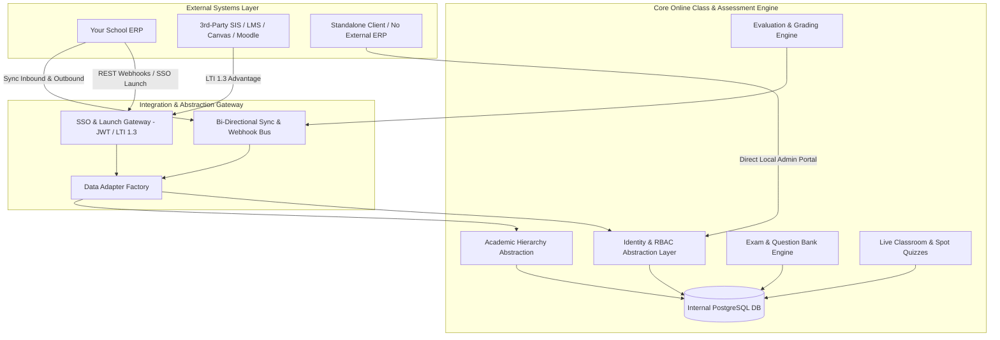
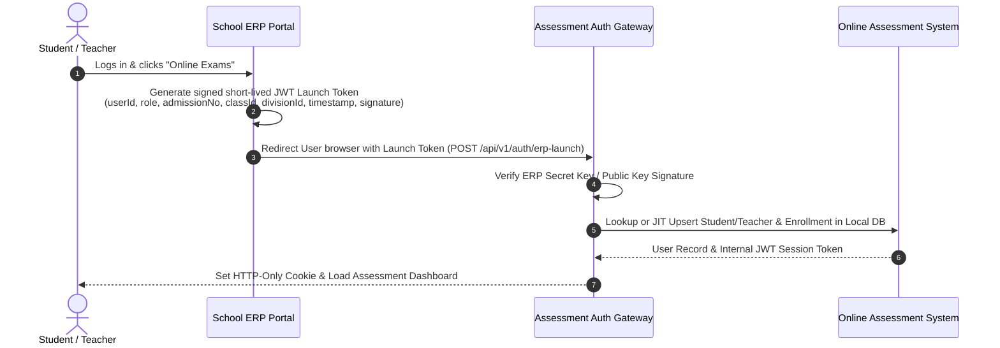

# Standalone vs. Connected ERP Architecture & Universal Integration Strategy

> **Module:** Online Class and Assessment Platform  
> **Target:** Hybrid Dual-Mode Deployment (100% Standalone OR Pluggable Connected ERP / LMS)  
> **Standards:** REST Webhooks, JWT SSO Handshake, LTI 1.3 / LTI Advantage (IMS Global)  

---

## 1. Executive Summary & Core Philosophy

To meet both requirements:
1. **Reusing your existing ERP data** (Student registration, Staff registration, Grades, Divisions, Roles & Permissions, Gradebook).
2. **Operating as a 100% Standalone product** (for institutions without your ERP or running standalone pilots).
3. **Plugging into 3rd-Party systems** (Canvas, Moodle, Google Classroom, or custom school ERPs).

We employ a **Decoupled Adapter Architecture (Hexagonal / Ports & Adapters Pattern)**.



---

## 2. The Three Operating Modes

### Mode 1: Connected to Your Existing ERP (Primary Mode)
- **Zero Duplicate Entry:** Student & staff registrations, grade/division assignments, and academic years are managed in your ERP.
- **Single Sign-On (SSO):** A teacher or student logged into your ERP clicks "Online Exam / Live Class". An encrypted, signed launch token instantly authenticates them into the assessment system without re-entering credentials.
- **Just-In-Time (JIT) Provisioning:** If a student is added in ERP and immediately takes an exam, their profile is synced automatically during SSO handshake or via real-time webhooks.
- **Automated Gradebook Push:** When a teacher/coordinator publishes exam results in the assessment platform, the final marks automatically push to your ERP's Gradebook & Exam Module.

### Mode 2: 100% Standalone Mode (Zero External Dependencies)
- The platform operates as a self-contained SaaS product.
- Schools use built-in management views:
  - **Academic Hierarchy Manager:** Create Academic Years, Classes, Divisions, Subjects, and Chapters.
  - **User & Roster Manager:** Create/import students, teachers, and admins via CSV/Excel.
  - **Internal Auth:** Email/Password, Student Admission PIN, or Google/Microsoft SSO.
  - **Internal Gradebook:** Report cards, tabulation sheets, and performance scorecards generated natively.

### Mode 3: Universal External Connector (LTI 1.3 & Open Webhooks)
- Connects to any 3rd-party LMS/SIS using industry standards:
  - **LTI 1.3 (Learning Tools Interoperability):** Single sign-on and seamless tool embedding.
  - **LTI Advantage AGS (Assignment and Grade Service):** Automatic sync of scores back to Canvas, Moodle, Blackboard, Google Classroom.
  - **LTI Advantage NRPS (Names and Role Provisioning Service):** Auto-sync class rosters and enrollment.
  - **Generic REST Webhook Engine:** Configurable API key + webhook endpoints for other proprietary school software.

---

## 3. Data Flow & Integration Patterns

### 3.1 Single Sign-On (SSO) Launch Handshake Flow



### 3.2 Inbound Data Sync (ERP ➔ Assessment System)
Syncs data when changes occur in the ERP:

| Event in ERP | Webhook Trigger | Assessment Action |
| :--- | :--- | :--- |
| **New Student Enrolled** | `POST /api/v1/webhooks/erp/student.created` | Inserts `users` and `student_profiles` linked by `external_erp_id`. |
| **Student Class Changed** | `POST /api/v1/webhooks/erp/student.transferred` | Updates `class_id` and `division_id` in local roster. |
| **New Teacher Appointed** | `POST /api/v1/webhooks/erp/staff.created` | Provisions teacher user with `teacher` role and subject allocation. |
| **New Subject / Curriculum** | `POST /api/v1/webhooks/erp/curriculum.updated` | Syncs Subject and Chapter lists to assessment academic tables. |

### 3.3 Outbound Result & Attendance Sync (Assessment System ➔ ERP)
Pushes assessment outcomes back to the ERP:

| Assessment Event | ERP Webhook Called | Payload Data |
| :--- | :--- | :--- |
| **Exam Published** | `POST {ERP_BASE_URL}/api/v1/exams/grades-sync` | `{ examId, erpExamCode, studentId, admissionNo, marksObtained, maxMarks, grade, passStatus, publishedAt }` |
| **Live Class Concluded** | `POST {ERP_BASE_URL}/api/v1/attendance/sync` | `{ classId, date, periodNumber, attendees: [{ studentId, presentDurationMinutes, status: 'Present'/'Absent' }] }` |

---

## 4. Software Architecture: The Adapter Pattern

To make the codebase clean and modular, all data access goes through an abstraction interface:

```typescript
// Core Data Provider Interface
export interface IAcademicIntegrationProvider {
  getStudents(classId: string, divisionId?: string): Promise<StudentSummary[]>;
  getTeachers(subjectId?: string): Promise<TeacherSummary[]>;
  getClassesAndDivisions(): Promise<AcademicClass[]>;
  publishGradesToGradebook(examResultPayload: ExamResultSyncPayload): Promise<SyncResult>;
}

// Implementation 1: Standalone Database Provider
export class LocalDatabaseProvider implements IAcademicIntegrationProvider {
  async getStudents(classId: string, divisionId?: string) {
    return prisma.students.findMany({ where: { classId, divisionId } });
  }
  async publishGradesToGradebook(payload: ExamResultSyncPayload) {
    // Save to internal Report Cards table
    return prisma.reportCards.createMany({ data: payload.results });
  }
}

// Implementation 2: ERP Connected Provider
export class ConnectedErpProvider implements IAcademicIntegrationProvider {
  async getStudents(classId: string, divisionId?: string) {
    // Fast-path: Read from replicated local cache synced via ERP webhooks
    return prisma.students.findMany({ where: { classId, divisionId } });
  }
  async publishGradesToGradebook(payload: ExamResultSyncPayload) {
    // Save locally AND push to ERP API
    await prisma.reportCards.createMany({ data: payload.results });
    return erpClient.post('/api/gradebook/sync', payload);
  }
}

// Implementation 3: LTI 1.3 / LMS Provider (Canvas / Moodle)
export class LtiAdvantageProvider implements IAcademicIntegrationProvider {
  async publishGradesToGradebook(payload: ExamResultSyncPayload) {
    return ltiAssignmentGradeService.submitScore(payload);
  }
}
```

---

## 5. Security & Isolation

1. **Idempotent Webhook Processing:**
   - Every inbound webhook payload contains an `eventId` and `timestamp`.
   - The sync worker stores processed IDs in `erp_sync_logs` to prevent duplicate processing if retried.
2. **HMAC Signature Verification:**
   - Inbound requests from your ERP or 3rd-party systems must include an `X-ERP-Signature: sha256(payload, secret_key)` header.
3. **Tenant & School Isolation:**
   - Every record carries a `tenant_id` / `school_id`. An ERP sync job can only alter data belonging to its authorized tenant.
4. **Offline Resilience:**
   - If the ERP is temporarily down or undergoing maintenance, exams and evaluations continue uninterrupted locally. Outbound grade sync jobs are queued in Redis with exponential backoff retries.

---

## 6. How this Fits into the 2-Month Sprint Plan

This hybrid design does **NOT** increase the development timeline because it leverages the same database schema:

| Sprint | Timeline | Integration Deliverables | Standalone Deliverables |
| :--- | :--- | :--- | :--- |
| **Sprint 1** | Weeks 1–2 | • ERP JWT Launch Handshake API (`POST /erp-launch`)<br>• Inbound Roster Sync Webhooks | • Local Student & Academic Hierarchy CRUD<br>• Local Auth & Login View |
| **Sprint 2** | Weeks 3–4 | • ERP Exam Code Linking in Wizard | • Standalone Exam Wizard & Recipient Picker |
| **Sprint 3** | Weeks 5–6 | • ERP Student ID mapping in Proctoring telemetry | • Standalone Exam Lockdown & Proctoring |
| **Sprint 4** | Weeks 7–8 | • Outbound Gradebook Push Webhook & Retry Queue<br>• LTI 1.3 Launch Endpoint stub | • Standalone Digital Report Card Generator |
