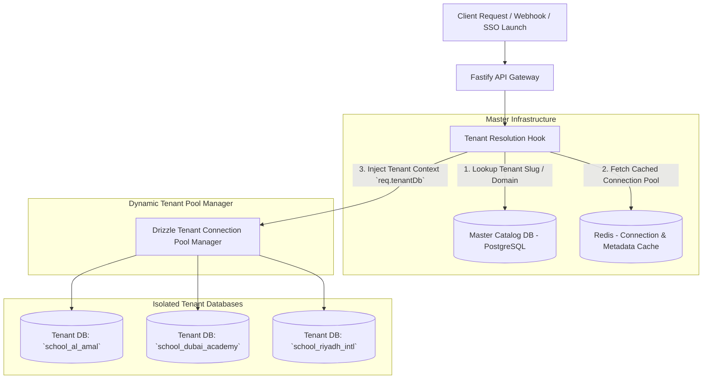
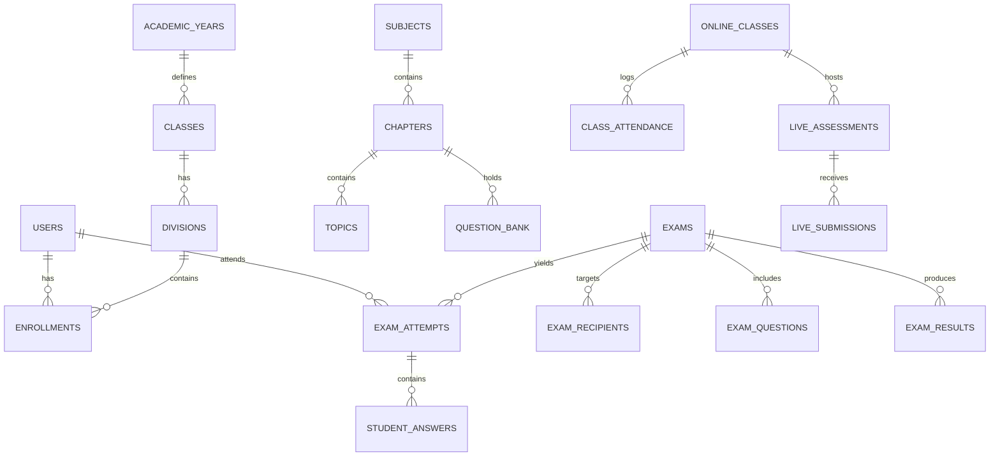
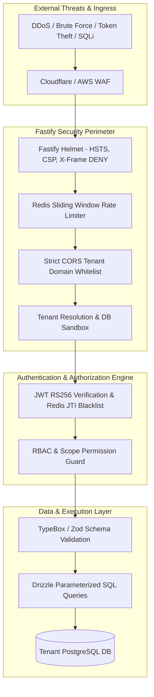

# Backend Product Requirements Document (PRD) & Technical Architecture Spec
## Online Class & Assessment Platform (Enterprise Edition)

> **Document Version:** 1.0  
> **Target Release:** Phase 1 & Enterprise Rollout  
> **Architecture Style:** Decoupled Hexagonal / Micro-modular Modular Monolith  
> **Runtime & Core Stack:** Node.js (LTS), Fastify Framework, TypeScript, PostgreSQL (Database-per-Tenant), Drizzle ORM, Redis (Cluster/Sentinel), BullMQ, WebSockets  
> **Tenancy Model:** Strict Multi-Tenant with Isolated Database per Tenant (`own-db`) + Master Management Catalog DB  
> **Integration Capabilities:** Standalone SaaS, Bi-Directional ERP REST Webhooks (HMAC-SHA256), LTI 1.3 Advantage (IMS Global)  

---

## 1. Executive Summary & Architectural Scope

The Backend of the **Online Class & Assessment Platform** provides the mission-critical foundational services for:
1. **Curriculum & Academic Structure Management:** Academic years, grades, sections, subjects, chapters, topics, and question pools.
2. **Assessment Authoring & Scheduling:** Authoring spot quizzes, term exams, randomized question sets, rubric-driven subjective exams, and PDF-based question papers.
3. **High-Concurrency Exam Delivery:** Resilient exam sessions supporting thousands of simultaneous test-takers with zero data-loss auto-save, server-side authoritative timer countdowns, and offline tolerance.
4. **Live Classrooms & Real-Time In-Class Quizzes:** Audio/video integration (In-App WebRTC, Google Meet, Zoom, MS Teams), live polling, step-ordering proofs, fill-in-the-blanks, and live student attendance tracking.
5. **Evaluation & Result Processing Engine:** Automated scoring (MCQ, MMCQ, matching, ordering), manual rubric grading, visual PDF/image annotation, score override tracking, audit logging, and 4-tier publication approval.
6. **Multi-Tenant Isolation (Database-per-Tenant):** Complete physical database isolation for each educational institution ensuring stringent student data privacy (GDPR, FERPA, COPPA compliance).

---

## 2. Multi-Tenant Database-per-Tenant Architecture

### 2.1 Multi-Tenant Tenancy Model

The system employs a **Master Catalog Database + Dynamic Tenant Database Router** model.



### 2.2 Tenant Identification Strategies
Tenants are resolved at the Fastify preHandler hook level through:
1. **Custom Subdomain:** `school-slug.assessment.domain.com` ➔ `school-slug`
2. **HTTP Header (API/Mobile):** `X-Tenant-ID: school_al_amal_001`
3. **JWT Claim (Authenticated Requests):** Decoded `tenantId` from verified token.
4. **SSO / LTI Launch Payload:** Dynamic tenant identifier verified via issuer certificate.

### 2.3 Master Catalog DB Schema (`master_catalog_db`)
The master catalog holds only institutional tenant metadata, subscriptions, and database credentials (encrypted with AES-256-GCM).

```sql
CREATE TABLE tenants (
    id UUID PRIMARY KEY DEFAULT gen_random_uuid(),
    tenant_slug VARCHAR(64) UNIQUE NOT NULL,
    institution_name VARCHAR(255) NOT NULL,
    status VARCHAR(32) NOT NULL DEFAULT 'active', -- active, suspended, provisioning, maintenance
    db_host VARCHAR(255) NOT NULL,
    db_port INT NOT NULL DEFAULT 5432,
    db_name VARCHAR(128) NOT NULL,
    db_user VARCHAR(128) NOT NULL,
    db_password_encrypted TEXT NOT NULL,
    db_ssl_enabled BOOLEAN NOT NULL DEFAULT true,
    db_max_connections INT NOT NULL DEFAULT 20,
    subscription_tier VARCHAR(64) NOT NULL DEFAULT 'enterprise',
    storage_quota_gb INT NOT NULL DEFAULT 100,
    created_at TIMESTAMPTZ NOT NULL DEFAULT NOW(),
    updated_at TIMESTAMPTZ NOT NULL DEFAULT NOW()
);

CREATE TABLE tenant_domains (
    id UUID PRIMARY KEY DEFAULT gen_random_uuid(),
    tenant_id UUID REFERENCES tenants(id) ON DELETE CASCADE,
    domain VARCHAR(255) UNIQUE NOT NULL,
    is_primary BOOLEAN DEFAULT false,
    verified BOOLEAN DEFAULT true
);

CREATE TABLE tenant_migration_history (
    id UUID PRIMARY KEY DEFAULT gen_random_uuid(),
    tenant_id UUID REFERENCES tenants(id) ON DELETE CASCADE,
    migration_name VARCHAR(255) NOT NULL,
    executed_at TIMESTAMPTZ DEFAULT NOW(),
    batch INT NOT NULL
);
```

### 2.4 Drizzle Dynamic Database Manager Pattern
```typescript
import { drizzle } from 'drizzle-orm/node-postgres';
import { Pool } from 'pg';
import * as tenantSchema from './schema/tenant';

interface TenantConnection {
  pool: Pool;
  db: ReturnType<typeof drizzle<typeof tenantSchema>>;
  lastAccessed: number;
}

export class TenantConnectionManager {
  private static pools: Map<string, TenantConnection> = new Map();
  private static readonly IDLE_TIMEOUT_MS = 15 * 60 * 1000; // 15 mins pool recycling

  static async getTenantDb(tenantId: string, credentials: TenantDbCredentials) {
    const existing = this.pools.get(tenantId);
    if (existing) {
      existing.lastAccessed = Date.now();
      return existing.db;
    }

    const pool = new Pool({
      host: credentials.host,
      port: credentials.port,
      database: credentials.database,
      user: credentials.user,
      password: credentials.password,
      max: credentials.maxConnections || 15,
      idleTimeoutMillis: 30000,
      connectionTimeoutMillis: 5000,
    });

    const db = drizzle(pool, { schema: tenantSchema });
    this.pools.set(tenantId, { pool, db, lastAccessed: Date.now() });
    return db;
  }
}
```

---

## 3. Technology Stack & Architecture Principles

| Layer | Technology | Rationale & Enterprise Responsibility |
| :--- | :--- | :--- |
| **Runtime** | Node.js v20+ LTS | Event-driven, low-latency, memory-efficient execution. |
| **HTTP Framework** | Fastify v4.26+ | 2x-4x throughput of Express; built-in Schema Compilation via `@fastify/type-provider-typebox`, structured JSON logging with Pino. |
| **Database** | PostgreSQL 16+ | ACID transactions, native JSONB support for complex question structures, rubrics, and answer matrices. |
| **ORM & Migrations** | Drizzle ORM + Drizzle Kit | Pure TypeScript, zero runtime overhead, strict typing, migration runner across dynamic multi-tenant databases. |
| **Caching & In-Memory**| Redis 7.2+ Cluster | Session blacklist, distributed locks, rate-limiting, exam active state snapshots, WebSocket pub/sub. |
| **Asynchronous Jobs** | BullMQ + Redis | Auto-submission on timer expiry, PDF text parsing/watermarking, gradebook batch sync, webhook dispatch. |
| **Real-time Protocol** | Fastify WebSocket / Socket.io Redis Adapter | Bi-directional exam state updates, live class student participation, proctoring alert notifications. |
| **Authentication** | JWT (RS256) + Argon2id | Asymmetric public/private key JWTs for stateless API auth; Argon2id for secure password hashing. |
| **File Storage** | AWS S3 / MinIO / Azure Blob | Presigned secure upload URLs for student answer sheets, question papers, and audio/video recordings. |

---

## 4. Tenant Database Schema Specification (Drizzle ORM)

Each institutional tenant database contains complete isolation of the following data tables.



### 4.1 Users, Identity & Accommodations
```typescript
// users table
export const users = pgTable('users', {
  id: uuid('id').defaultRandom().primaryKey(),
  externalId: varchar('external_id', { length: 128 }).unique(), // ERP External User ID
  admissionNo: varchar('admission_no', { length: 64 }),
  employeeCode: varchar('employee_code', { length: 64 }),
  email: varchar('email', { length: 255 }).unique().notNull(),
  passwordHash: text('password_hash'),
  fullName: varchar('full_name', { length: 255 }).notNull(),
  role: varchar('role', { length: 32 }).notNull(), // 'admin' | 'coordinator' | 'teacher' | 'proctor' | 'student' | 'parent'
  avatarUrl: text('avatar_url'),
  smartCardUid: varchar('smart_card_uid', { length: 64 }), // NFC Smart Card ID
  faceEmbedding: jsonb('face_embedding'), // 512-dim facial vector
  status: varchar('status', { length: 32 }).default('active'),
  createdAt: timestamp('created_at', { withTimezone: true }).defaultNow(),
  updatedAt: timestamp('updated_at', { withTimezone: true }).defaultNow(),
});

// student_accommodations (Special education / exam adjustments)
export const studentAccommodations = pgTable('student_accommodations', {
  id: uuid('id').defaultRandom().primaryKey(),
  studentId: uuid('student_id').references(() => users.id, { onDelete: 'cascade' }),
  extraTimeMultiplier: real('extra_time_multiplier').default(1.0), // 1.25x, 1.5x, 2.0x
  relaxedProctoring: boolean('relaxed_proctoring').default(false),
  allowedBreakMinutes: integer('allowed_break_minutes').default(0),
  allowScreenReader: boolean('allow_screen_reader').default(false),
  highContrastTheme: boolean('high_contrast_theme').default(false),
  approvedBy: uuid('approved_by').references(() => users.id),
  createdAt: timestamp('created_at', { withTimezone: true }).defaultNow(),
});
```

### 4.2 Academic Hierarchy & Curriculum
```typescript
export const academicYears = pgTable('academic_years', {
  id: uuid('id').defaultRandom().primaryKey(),
  name: varchar('name', { length: 64 }).notNull(), // e.g., '2026-2027'
  startDate: date('start_date').notNull(),
  endDate: date('end_date').notNull(),
  isCurrent: boolean('is_current').default(false),
});

export const classes = pgTable('classes', {
  id: uuid('id').defaultRandom().primaryKey(),
  academicYearId: uuid('academic_year_id').references(() => academicYears.id),
  name: varchar('name', { length: 64 }).notNull(), // 'Grade 8'
  code: varchar('code', { length: 32 }).notNull(),
});

export const divisions = pgTable('divisions', {
  id: uuid('id').defaultRandom().primaryKey(),
  classId: uuid('class_id').references(() => classes.id, { onDelete: 'cascade' }),
  name: varchar('name', { length: 64 }).notNull(), // 'Division A'
});

export const subjects = pgTable('subjects', {
  id: uuid('id').defaultRandom().primaryKey(),
  name: varchar('name', { length: 128 }).notNull(),
  code: varchar('code', { length: 32 }).notNull(),
  classId: uuid('class_id').references(() => classes.id),
});

export const chapters = pgTable('chapters', {
  id: uuid('id').defaultRandom().primaryKey(),
  subjectId: uuid('subject_id').references(() => subjects.id, { onDelete: 'cascade' }),
  chapterNumber: integer('chapter_number').notNull(),
  title: varchar('title', { length: 255 }).notNull(),
  description: text('description'),
});

export const topics = pgTable('topics', {
  id: uuid('id').defaultRandom().primaryKey(),
  chapterId: uuid('chapter_id').references(() => chapters.id, { onDelete: 'cascade' }),
  title: varchar('title', { length: 255 }).notNull(),
});
```

### 4.3 Question Bank & Pool
```typescript
export const questionBank = pgTable('question_bank', {
  id: uuid('id').defaultRandom().primaryKey(),
  subjectId: uuid('subject_id').references(() => subjects.id),
  chapterId: uuid('chapter_id').references(() => chapters.id),
  topicId: uuid('topic_id').references(() => topics.id),
  type: varchar('type', { length: 32 }).notNull(), // 'mcq', 'mmcq', 'one_word', 'short_answer', 'long_answer', 'essay', 'fill_in_blanks', 'match_following', 'step_ordering'
  difficulty: varchar('difficulty', { length: 32 }).default('Medium'), // Easy, Medium, Hard
  bloomsTaxonomy: varchar('blooms_taxonomy', { length: 32 }), // Remember, Understand, Apply, Analyze, Evaluate, Create
  level: varchar('level', { length: 32 }), // Level 1, Level 2, Level 3, Level 4
  marks: real('marks').notNull(),
  prompt: text('prompt').notNull(),
  explanation: text('explanation'),
  modelAnswer: text('model_answer'),
  options: jsonb('options'), // Array of choices for MCQ/MMCQ
  correctAnswerData: jsonb('correct_answer_data'), // Secure answers (indexes, key-pairs, word bank slots, sequence order)
  rubricCriteria: jsonb('rubric_criteria'), // Rubric criteria array [{ id, criterion, maxScore, description }]
  tags: jsonb('tags').$type<string[]>(),
  createdBy: uuid('created_by').references(() => users.id),
  createdAt: timestamp('created_at', { withTimezone: true }).defaultNow(),
});
```

### 4.4 Exams, Schedules & Question Distribution
```typescript
export const exams = pgTable('exams', {
  id: uuid('id').defaultRandom().primaryKey(),
  examCode: varchar('exam_code', { length: 64 }).unique().notNull(),
  examName: varchar('exam_name', { length: 255 }).notNull(),
  examType: varchar('exam_type', { length: 32 }).notNull(), // 'spot' | 'scheduled'
  academicYearId: uuid('academic_year_id').references(() => academicYears.id),
  subjectId: uuid('subject_id').references(() => subjects.id),
  startDate: date('start_date'),
  startTime: time('start_time'),
  endDate: date('end_date'),
  endTime: time('end_time'),
  durationMinutes: integer('duration_minutes').notNull(),
  totalMarks: real('total_marks').notNull(),
  passMarks: real('pass_marks').notNull(),
  instructions: text('instructions'),
  questionSource: varchar('question_source', { length: 32 }).notNull(), // 'existing_pool' | 'upload_pdf'
  pdfQuestionPaperUrl: text('pdf_question_paper_url'),
  pdfQuestionCount: integer('pdf_question_count'),
  pdfAnswerSubmissionType: varchar('pdf_answer_submission_type', { length: 32 }), // 'omr' | 'text' | 'image_upload' | 'hybrid'
  allowedAttachmentFormats: jsonb('allowed_attachment_formats').$type<string[]>(), // ['pdf', 'jpg', 'png']
  maxAttachmentSizeMb: integer('max_attachment_size_mb').default(10),
  maxAttachmentsPerQuestion: integer('max_attachments_per_question').default(3),
  controls: jsonb('controls').$type<{
    randomizeQuestions: boolean;
    randomizeOptions: boolean;
    preventCopyPaste: boolean;
    fullScreenMode: boolean;
    detectTabSwitching: boolean;
    autoSubmitOnTimeEnd: boolean;
    allowResume: boolean;
    showTimer: boolean;
    allowCalculator: boolean;
    allowReviewBeforeSubmit: boolean;
  }>(),
  status: varchar('status', { length: 32 }).default('draft'), // draft, scheduled, live, completed, cancelled
  createdBy: uuid('created_by').references(() => users.id),
  createdAt: timestamp('created_at', { withTimezone: true }).defaultNow(),
  updatedAt: timestamp('updated_at', { withTimezone: true }).defaultNow(),
});

export const examRecipients = pgTable('exam_recipients', {
  id: uuid('id').defaultRandom().primaryKey(),
  examId: uuid('exam_id').references(() => exams.id, { onDelete: 'cascade' }),
  recipientType: varchar('recipient_type', { length: 32 }).notNull(), // 'class_wise' | 'student_wise'
  classId: uuid('class_id').references(() => classes.id),
  divisionId: uuid('division_id').references(() => divisions.id),
  studentId: uuid('student_id').references(() => users.id), // Used for individual assignments
});

export const examQuestions = pgTable('exam_questions', {
  id: uuid('id').defaultRandom().primaryKey(),
  examId: uuid('exam_id').references(() => exams.id, { onDelete: 'cascade' }),
  questionBankId: uuid('question_bank_id').references(() => questionBank.id),
  sectionName: varchar('section_name', { length: 128 }).default('Section A'),
  sequenceNumber: integer('sequence_number').notNull(),
  marks: real('marks').notNull(),
});
```

### 4.5 Exam Attempts, Live Telemetry & Answer Submissions
```typescript
export const examAttempts = pgTable('exam_attempts', {
  id: uuid('id').defaultRandom().primaryKey(),
  examId: uuid('exam_id').references(() => exams.id, { onDelete: 'cascade' }),
  studentId: uuid('student_id').references(() => users.id, { onDelete: 'cascade' }),
  attemptNumber: integer('attempt_number').default(1),
  startedAt: timestamp('started_at', { withTimezone: true }).defaultNow(),
  endedAt: timestamp('ended_at', { withTimezone: true }),
  scheduledSubmissionTime: timestamp('scheduled_submission_time', { withTimezone: true }).notNull(),
  status: varchar('status', { length: 32 }).default('in_progress'), // 'in_progress', 'submitted', 'auto_submitted', 'terminated'
  ipAddress: varchar('ip_address', { length: 45 }),
  userAgent: text('user_agent'),
  tabSwitchCount: integer('tab_switch_count').default(0),
  fullScreenExitCount: integer('full_screen_exit_count').default(0),
  proctoringRiskScore: integer('proctoring_risk_score').default(0),
  verificationMethod: varchar('verification_method', { length: 32 }), // 'nfc', 'face', 'manual'
});

export const studentAnswers = pgTable('student_answers', {
  id: uuid('id').defaultRandom().primaryKey(),
  attemptId: uuid('attempt_id').references(() => examAttempts.id, { onDelete: 'cascade' }),
  questionId: uuid('question_id').references(() => examQuestions.id, { onDelete: 'cascade' }),
  answerPayload: jsonb('answer_payload'), // { selectedOptionIndex, text, matchedPairs, placedSteps, blankAnswers }
  uploadedFiles: jsonb('uploaded_files').$type<Array<{
    fileId: string;
    fileName: string;
    fileUrl: string;
    fileSize: string;
    uploadedAt: string;
  }>>(),
  status: varchar('status', { length: 32 }).default('answered'), // 'answered', 'marked_for_review', 'unanswered'
  autoScore: real('auto_score'),
  awardedScore: real('awarded_score'),
  teacherRemarks: text('teacher_remarks'),
  rubricScores: jsonb('rubric_scores').$type<Record<string, number>>(),
  annotations: jsonb('annotations').$type<Array<{
    id: string;
    type: 'checkmark' | 'cross' | 'highlight' | 'comment';
    pageNumber: number;
    xPct: number;
    yPct: number;
    commentText?: string;
  }>>(),
  isOverridden: boolean('is_overridden').default(false),
  overrideReason: text('override_reason'),
  lastAutoSavedAt: timestamp('last_auto_saved_at', { withTimezone: true }).defaultNow(),
});
```

### 4.6 Evaluation, 4-Tier Approval Workflow & Final Results
```typescript
export const examResults = pgTable('exam_results', {
  id: uuid('id').defaultRandom().primaryKey(),
  examId: uuid('exam_id').references(() => exams.id, { onDelete: 'cascade' }),
  studentId: uuid('student_id').references(() => users.id, { onDelete: 'cascade' }),
  attemptId: uuid('attempt_id').references(() => examAttempts.id),
  totalMaxMarks: real('total_max_marks').notNull(),
  obtainedObjectiveMarks: real('obtained_objective_marks').default(0),
  obtainedSubjectiveMarks: real('obtained_subjective_marks').default(0),
  obtainedAttachmentMarks: real('obtained_attachment_marks').default(0),
  totalObtainedMarks: real('total_obtained_marks').notNull(),
  percentage: real('percentage').notNull(),
  grade: varchar('grade', { length: 16 }),
  isPassed: boolean('is_passed').notNull(),
  rankInClass: integer('rank_in_class'),
  workflowStep: varchar('workflow_step', { length: 32 }).default('eval_completed'), 
  // 'eval_completed' -> 'teacher_review' -> 'coordinator_approval' -> 'published'
  evaluatorId: uuid('evaluator_id').references(() => users.id),
  teacherApprovedBy: uuid('teacher_approved_by').references(() => users.id),
  teacherApprovedAt: timestamp('teacher_approved_at', { withTimezone: true }),
  coordinatorApprovedBy: uuid('coordinator_approved_by').references(() => users.id),
  coordinatorApprovedAt: timestamp('coordinator_approved_at', { withTimezone: true }),
  publishedAt: timestamp('published_at', { withTimezone: true }),
  resultVisibilityConfig: jsonb('result_visibility_config').$type<{
    showMarks: boolean;
    showPercentage: boolean;
    showGrade: boolean;
    showRank: boolean;
    showAnswerSheet: boolean;
    showCorrectAnswers: boolean;
    showTeacherFeedback: boolean;
  }>(),
  syncedToErp: boolean('synced_to_erp').default(false),
  syncedToErpAt: timestamp('synced_to_erp_at', { withTimezone: true }),
});
```

### 4.7 Online Classrooms & Live Interactive Assessments
```typescript
export const onlineClasses = pgTable('online_classes', {
  id: uuid('id').defaultRandom().primaryKey(),
  title: varchar('title', { length: 255 }).notNull(),
  subjectId: uuid('subject_id').references(() => subjects.id),
  classId: uuid('class_id').references(() => classes.id),
  divisionId: uuid('division_id').references(() => divisions.id),
  instructorId: uuid('instructor_id').references(() => users.id),
  date: date('date').notNull(),
  startTime: time('start_time').notNull(),
  endTime: time('end_time').notNull(),
  durationMinutes: integer('duration_minutes').notNull(),
  platform: varchar('platform', { length: 32 }).notNull(), // 'in_app' | 'google_meet' | 'zoom' | 'ms_teams'
  meetingLink: text('meeting_link').notNull(),
  meetingId: varchar('meeting_id', { length: 128 }),
  passcode: varchar('passcode', { length: 64 }),
  status: varchar('status', { length: 32 }).default('scheduled'), // scheduled, live, completed, cancelled
  permissions: jsonb('permissions').$type<{
    allowStudentMic: boolean;
    allowStudentCamera: boolean;
    allowChat: boolean;
    allowScreenShare: boolean;
    enableWhiteboard: boolean;
    recordSession: boolean;
    requireWaitingRoom: boolean;
    autoAttendance: boolean;
  }>(),
  materials: jsonb('materials'),
  createdAt: timestamp('created_at', { withTimezone: true }).defaultNow(),
});

export const liveInClassAssessments = pgTable('live_in_class_assessments', {
  id: uuid('id').defaultRandom().primaryKey(),
  classId: uuid('class_id').references(() => onlineClasses.id),
  title: varchar('title', { length: 255 }).notNull(),
  topic: varchar('topic', { length: 255 }).notNull(),
  durationSeconds: integer('duration_seconds').default(180), // 0 for untimed
  totalMarks: real('total_marks').notNull(),
  passMarks: real('pass_marks'),
  status: varchar('status', { length: 32 }).default('draft'), // draft, active, closed, published
  launchedAt: timestamp('launched_at', { withTimezone: true }),
  questions: jsonb('questions'),
  createdAt: timestamp('created_at', { withTimezone: true }).defaultNow(),
});

export const liveAssessmentSubmissions = pgTable('live_assessment_submissions', {
  id: uuid('id').defaultRandom().primaryKey(),
  assessmentId: uuid('assessment_id').references(() => liveInClassAssessments.id, { onDelete: 'cascade' }),
  studentId: uuid('student_id').references(() => users.id),
  answers: jsonb('answers'),
  totalScore: real('total_score').notNull(),
  maxMarks: real('max_marks').notNull(),
  percentage: real('percentage').notNull(),
  status: varchar('status', { length: 32 }).default('submitted'), // 'submitted' | 'reviewed'
  teacherFeedback: text('teacher_feedback'),
  verifiedVia: varchar('verified_via', { length: 32 }), // 'nfc' | 'face' | 'both'
  submittedAt: timestamp('submitted_at', { withTimezone: true }).defaultNow(),
});
```

---

## 5. Redis Architecture & Caching Strategy

Redis provides ultra-low latency operations across key subsystems:

```mermaid
graph LR
    subgraph "Redis 7.2 Cache & In-Memory Store"
        R1[Tenant Metadata & Route Cache<br/>`tenant:meta:{slug}`]
        R2[JWT Session Token Blacklist<br/>`auth:blacklist:{jti}`]
        R3[Live Exam Session State & Timer<br/>`exam:{id}:attempt:{studentId}`]
        R4[Distributed Locks (Redlock)<br/>`lock:exam:submit:{attemptId}`]
        R5[Pub/Sub Message Bus<br/>Channels: `live-quiz:{id}`, `proctor:{id}`]
    end
```

### 5.1 Key Namespaces & TTL Policies
1. **Tenant Lookup:** `tenant:meta:{slug}` (TTL: 1 hour, invalidated on tenant update).
2. **Active Exam Attempt Heartbeat & Autosave Buffer:**
   - Key: `exam:{examId}:attempt:{studentId}:answers` (Hash map of questionId ➔ answer payload).
   - TTL: `Duration + 60 minutes`.
   - Batch flushed to PostgreSQL asynchronously every 30 seconds via BullMQ queue to relieve direct DB writes under spike loads.
3. **Authoritative Countdown Timer:**
   - Key: `exam:{examId}:attempt:{studentId}:timer`
   - Stored value: `{ "startedAt": 1772439800, "deadline": 1772443400, "extraMinutes": 15 }`
   - Server calculation is authoritative: `remainingSec = max(0, deadline - unix_now())`.
4. **BullMQ Background Queues:**
   - `queue:auto-submission` (Scheduled delayed job matching exam deadline).
   - `queue:webhook-outbound` (ERP sync dispatch with exponential backoff).
   - `queue:pdf-watermark-split` (Splitting and serving watermarked PDFs).
   - `queue:malpractice-evaluator` (ML audio/video anomaly analysis).

---

## 6. Fastify Plugin & Route Architecture

Fastify is organized into modular functional plugins with strict encapsulated lifecycle hooks:

```
src/
├── plugins/
│   ├── tenant-resolver.plugin.ts  # Inspects host/headers, sets req.tenantDb
│   ├── auth-guard.plugin.ts       # Validates JWT, sets req.user and req.role
│   ├── error-handler.plugin.ts    # RFC 7807 Problem Details serialization
│   ├── rate-limiter.plugin.ts     # Redis-backed sliding window rate limiter
│   └── websocket.plugin.ts        # Fastify WebSocket multiplexer
├── modules/
│   ├── auth/                      # Login, Refresh, Password Reset, ERP Launch SSO
│   ├── academic/                  # Years, Classes, Divisions, Subjects, Chapters
│   ├── question-bank/             # Question Pool CRUD, Bloom's categorization, AI Gen
│   ├── exams/                     # Wizard creation, scheduling, PDF paper, controls
│   ├── exam-delivery/             # Start exam, autosave, ping heartbeat, final submit
│   ├── evaluation/                # Dashboard, auto-marking, rubrics, annotations, approval
│   ├── live-classroom/            # Virtual lecture scheduling, permissions, attendance
│   ├── live-assessment/           # In-class spot assessments, NFC/Face verify, live review
│   ├── proctoring/                # Malpractice events, similarity detection, browser logs
│   ├── reports/                   # Exam tabulation, student scorecards, question analytics
│   └── webhooks/                  # Inbound ERP listeners & outbound publisher
```

### 6.1 Core API Endpoints

#### Authentication & SSO (`/api/v1/auth`)
- `POST /login` - Direct email/password authentication.
- `POST /refresh` - Refresh token rotation.
- `POST /erp-sso-launch` - Ingests signed ERP launch token, provisions user JIT, returns active session cookie.
- `POST /lti/v1p3/launch` - IMS Global LTI 1.3 Advantage launch receiver.

#### Question Pool (`/api/v1/question-pool`)
- `GET /` - Paginated pool search with filters (`subjectId`, `chapterId`, `type`, `difficulty`, `bloomsTaxonomy`).
- `POST /` - Create question with specific options, correct answers, rubrics, and taxonomy tags.
- `POST /ai-generate` - AI-assisted question generation based on subject, chapter, and Bloom's target.

#### Exam Management (`/api/v1/exams`)
- `POST /` - Multi-step exam configuration (Basic details, recipients, academic map, question source, marks distribution, controls).
- `POST /:id/upload-pdf` - Presigned upload URL + paper page metadata extraction.
- `POST /:id/publish` - Transitions exam to `scheduled` or `live` and dispatches notifications.
- `GET /student/available` - Filtered list of upcoming, active, and completed exams for authenticated student.

#### Exam Delivery Engine (`/api/v1/exam-delivery`)
- `POST /:id/start` - Pre-flight eligibility check, records attempt, initializes authoritative timer in Redis.
- `POST /:id/auto-save` - High-frequency autosave endpoint storing incremental answer payloads.
- `POST /:id/heartbeat` - Proctoring telemetry ping (tab switches, full-screen compliance, face presence).
- `POST /:id/submit` - Final lock & attempt submission. Auto-triggers MCQ auto-grader.

#### Evaluation & 4-Step Approval (`/api/v1/evaluation`)
- `GET /dashboard` - Filterable evaluation dashboard (`Not Started`, `In Progress`, `Completed`, `Published`).
- `GET /submissions/:id` - Full evaluation session loading student answers, attachments, rubrics, and model answers.
- `POST /submissions/:id/grade-question` - Score allocation, rubric point award, teacher remarks.
- `POST /submissions/:id/annotations` - Persist visual canvas annotations on student uploaded PDF/images.
- `POST /submissions/:id/override-score` - Admin/coordinator score override with audit justification.
- `POST /exams/:id/workflow-transition` - Moves status: `eval_completed` ➔ `teacher_review` ➔ `coordinator_approval` ➔ `published`.

#### Live Classroom & Real-Time Assessment (`/api/v1/live-classroom`)
- `POST /classes` - Schedule virtual lecture with platform configs (In-App, Meet, Zoom, Teams).
- `POST /classes/:id/launch-assessment` - Push real-time interactive assessment to connected students.
- `POST /assessments/:id/submit` - Ingest student live quiz answer with smart card NFC or Face ID payload.
- `POST /assessments/:id/override` - Teacher live score override and instant score broadcasting.

---

## 7. ERP & 3rd-Party Integration Engine

### 7.1 Inbound Webhook Listener
- **Endpoint:** `POST /api/v1/webhooks/inbound/erp`
- **Security:** HMAC-SHA256 signature verification over raw body using shared institutional secret key.
- **Events Handled:**
  - `student.created` / `student.updated` ➔ Auto-upserts user, class enrollment, and exam accommodations.
  - `staff.created` / `staff.updated` ➔ Auto-upserts teacher role and subject allocations.
  - `academic.class.updated` ➔ Syncs grades and division rosters.

### 7.2 Outbound Gradebook Push Worker
- When an exam reaches `published` state, BullMQ queues an outbound push to the school ERP Gradebook API:
```json
{
  "event": "exam.published",
  "eventId": "evt_out_849201",
  "timestamp": "2026-09-09T10:00:00Z",
  "tenantId": "sch_dubai_01",
  "data": {
    "examCode": "MAT-G8-2026-001",
    "examTitle": "Mathematics Chapter 3 Spot Test",
    "totalMarks": 50,
    "passMarks": 20,
    "academicYear": "2026-2027",
    "classId": "GRADE-08",
    "divisionId": "DIV-A",
    "results": [
      {
        "externalStudentId": "ERP_STU_84920",
        "admissionNo": "ADM-2026-042",
        "obtainedMarks": 44,
        "percentage": 88.0,
        "grade": "A",
        "resultStatus": "pass",
        "rank": 2
      }
    ]
  }
}
```

---

---

## 8. Comprehensive Security Architecture & Hardening

Security is paramount in an educational assessment platform where student data privacy (FERPA, GDPR, COPPA) and exam academic integrity are legally binding.



### 8.1 Authentication & Token Lifecycle
1. **Asymmetric Key Pairs (RS256):**
   - Access tokens are signed with institutional/system private keys and verified with public keys.
   - **Access Token TTL:** 15 minutes (short-lived to prevent stolen token reuse).
   - **Refresh Token TTL:** 7 days, stored exclusively in `HttpOnly`, `Secure`, `SameSite=Strict` cookies.
2. **Refresh Token Rotation & Revocation:**
   - Every refresh request invalidates the old refresh token and issues a new pair.
   - Token family tracking in Redis: If a revoked refresh token is presented, all sessions for that user are immediately purged (mitigating token theft).
   - Immediate logout/revocation checks Redis blacklist: `auth:blacklist:{jti}` with TTL matching the access token lifetime.
3. **ERP Single Sign-On (SSO) Launch Handshake:**
   - External ERP signs launch requests with HMAC-SHA256 or RS256 containing `userId`, `role`, `timestamp`, and `nonce`.
   - Replay protection: Nonces are checked against Redis with a 5-minute TTL.

### 8.2 Role-Based Access Control (RBAC) & Permissions Matrix

The platform enforces a 6-tier governance model with granular privilege separation:

| Permission / Action | Admin | Coordinator | Teacher | Proctor | Student | Parent |
| :--- | :---: | :---: | :---: | :---: | :---: | :---: |
| **Manage Tenant & Subscriptions** | ✅ | ❌ | ❌ | ❌ | ❌ | ❌ |
| **Academic Hierarchy Setup** | ✅ | ✅ | ❌ | ❌ | ❌ | ❌ |
| **User & Roster Management** | ✅ | ✅ | ❌ | ❌ | ❌ | ❌ |
| **Create & Edit Question Pool** | ✅ | ✅ | ✅ | ❌ | ❌ | ❌ |
| **Create & Schedule Exams** | ✅ | ✅ | ✅ | ❌ | ❌ | ❌ |
| **Upload PDF Question Papers** | ✅ | ✅ | ✅ | ❌ | ❌ | ❌ |
| **Live Classroom Hosting** | ❌ | ❌ | ✅ | ❌ | ❌ | ❌ |
| **Launch Live In-Class Assessment** | ❌ | ❌ | ✅ | ❌ | ❌ | ❌ |
| **Live Exam Proctoring & Alerts** | ✅ | ✅ | ✅ | ✅ | ❌ | ❌ |
| **Evaluate Answers & Rubrics** | ❌ | ❌ | ✅ | ❌ | ❌ | ❌ |
| **Override Evaluated Marks** | ✅ | ✅ | ❌ | ❌ | ❌ | ❌ |
| **Approve Exam Results** | ✅ | ✅ | ❌ | ❌ | ❌ | ❌ |
| **Publish Results to Students** | ✅ | ✅ | ❌ | ❌ | ❌ | ❌ |
| **Attend Exams & Submit Answers** | ❌ | ❌ | ❌ | ❌ | ✅ | ❌ |
| **View Published Results** | ✅ | ✅ | ✅ | ❌ | ✅ (Self) | ✅ (Child) |

```typescript
// Fastify RBAC Hook Implementation
export function requirePermissions(...allowedRoles: UserRole[]) {
  return async (req: FastifyRequest, reply: FastifyReply) => {
    if (!req.user || !allowedRoles.includes(req.user.role)) {
      return reply.status(403).send({
        type: 'https://api.platform.edu/errors/forbidden',
        title: 'Forbidden',
        status: 403,
        detail: `User role '${req.user?.role}' does not have sufficient privileges for this endpoint.`,
      });
    }
  };
}
```

### 8.3 Multi-Tenant Database Isolation & Data Leak Prevention
1. **Dynamic Connection Sandboxing:**
   - Every incoming HTTP request resolves the tenant database connection during Fastify's `preHandler` hook.
   - The connection is attached directly to `request.tenantDb`. Handlers never construct ad-hoc connections.
   - If a tenant cannot be securely resolved, the request fails with `400 Bad Request` or `404 Tenant Not Found` before any database queries execute.
2. **Master Catalog Credential Encryption:**
   - All tenant database credentials in `master_catalog_db` are encrypted at rest using AES-256-GCM with master key rotation:
   $$\text{Ciphertext} = \text{AES-256-GCM}(\text{Plaintext}, \text{MasterKey}, \text{IV})$$
3. **Preventing Cross-Tenant Leaks:**
   - Because tenants reside in separate physical PostgreSQL databases, cross-tenant SQL injection or accidental omission of `WHERE tenant_id = ...` is physically impossible.

### 8.4 Threat Modeling & OWASP Top 10 Protections
1. **SQL Injection:** Mitigated 100% via Drizzle ORM's parameterized AST queries. Zero raw string concatenation permitted in queries.
2. **Denial of Service (DoS) & Tiered Rate Limiting:**
   - Redis sliding-window rate limiting via `@fastify/rate-limit`:
     - Login & Auth endpoints: 5 requests / minute per IP.
     - Autosave endpoint: 120 requests / minute per student session.
     - Telemetry heartbeat: 60 requests / minute per student session.
     - General REST endpoints: 100 requests / minute per IP.
3. **Payload Sanitization & Type Enforcement:**
   - All request bodies, query params, and route headers are strictly compiled and validated using `@fastify/type-provider-typebox`.
   - Rich text inputs (e.g. Essay submissions, Teacher remarks) are sanitized using `DOMPurify` to neutralize XSS vectors.
4. **Security Headers (`@fastify/helmet`):**
   - `Content-Security-Policy`: Default strict directives.
   - `X-Frame-Options`: `DENY` (prevents clickjacking, except when embedded in allowed LTI LMS iframes with explicit frame-ancestors).
   - `Strict-Transport-Security`: `max-age=63072000; includeSubDomains; preload`.

---

## 9. Dynamic Tenant Provisioning & Migration Engine

### 9.1 Tenant Provisioning Flow (`POST /api/v1/admin/tenants`)
When a new educational institution subscribes:
1. **Catalog Entry:** Fastify creates a record in `master_catalog_db.tenants`.
2. **Database Provisioning:** Fastify executes a privileged administrative SQL command to create the isolated tenant database:
   ```sql
   CREATE DATABASE school_al_amal_db OWNER app_tenant_user;
   ```
3. **Automated Migration Runner:** Drizzle Kit migrations are applied to initialize the complete tenant schema.
4. **Default Seed Data:** Academic structure template, default grading scales, and administrator account are created.

### 9.2 Multi-Tenant Drizzle Migration Runner Script
```typescript
import { migrate } from 'drizzle-orm/node-postgres/migrator';
import { Pool } from 'pg';
import { drizzle } from 'drizzle-orm/node-postgres';
import { masterDb } from '../core/db/master';
import { tenants } from '../core/db/master/schema';

export async function runMigrationsAcrossAllTenants() {
  const allTenants = await masterDb.select().from(tenants).where(eq(tenants.status, 'active'));

  for (const tenant of allTenants) {
    console.log(`[MIGRATION] Running migrations for tenant: ${tenant.tenantSlug}...`);
    const pool = new Pool({
      host: tenant.dbHost,
      port: tenant.dbPort,
      database: tenant.dbName,
      user: tenant.dbUser,
      password: decryptCredentials(tenant.dbPasswordEncrypted),
    });

    const tenantDb = drizzle(pool);
    await migrate(tenantDb, { migrationsFolder: './drizzle/tenant-migrations' });
    await pool.end();
    console.log(`[MIGRATION] Completed for ${tenant.tenantSlug}`);
  }
}
```

---

## 10. Error Handling, Logging & Observability

### 10.1 RFC 7807 Problem Details Standard
All API errors return RFC 7807 compliant JSON payloads:

```json
{
  "type": "https://api.platform.edu/errors/validation-failed",
  "title": "Unprocessable Entity",
  "status": 422,
  "detail": "Configured question marks total (45) does not match total exam marks (50).",
  "instance": "/api/v1/exams/create",
  "invalidParams": [
    {
      "name": "calculatedTotalMarks",
      "reason": "Must equal totalMarks"
    }
  ]
}
```

### 10.2 Structured Logging with Pino
- Structured JSON logs with automated correlation IDs (`req.id`).
- Sensitive data redaction (`password`, `token`, `smartCardUid`, `faceEmbedding`, `rawAnswerPayload`).

---

## 11. Environment Configuration Specification (`.env.example`)

Developers can copy this exact `.env` file to immediately initialize backend services:

```ini
# ==============================================================================
# SERVER & ENVIRONMENT
# ==============================================================================
NODE_ENV=development
PORT=4000
HOST=0.0.0.0
APP_BASE_URL=http://localhost:4000
CLIENT_BASE_URL=http://localhost:5173

# ==============================================================================
# MASTER CATALOG DATABASE (POSTGRESQL)
# ==============================================================================
MASTER_DB_HOST=localhost
MASTER_DB_PORT=5432
MASTER_DB_NAME=master_catalog_db
MASTER_DB_USER=postgres
MASTER_DB_PASSWORD=postgres_master_secure
MASTER_DB_SSL=false
MASTER_DB_MAX_CONNECTIONS=10

# Master Encryption Key for Stored Tenant DB Credentials (32-byte hex)
TENANT_CREDENTIALS_MASTER_KEY=0123456789abcdef0123456789abcdef0123456789abcdef0123456789abcdef

# ==============================================================================
# REDIS CLUSTER / INSTANCE
# ==============================================================================
REDIS_HOST=localhost
REDIS_PORT=6379
REDIS_PASSWORD=
REDIS_DB_INDEX=0

# ==============================================================================
# AUTHENTICATION & ASYMMETRIC JWT
# ==============================================================================
JWT_ALGORITHM=RS256
JWT_PUBLIC_KEY_PATH=./keys/jwt-public.pem
JWT_PRIVATE_KEY_PATH=./keys/jwt-private.pem
JWT_ACCESS_TOKEN_EXPIRY=15m
JWT_REFRESH_TOKEN_EXPIRY=7d
COOKIE_SECRET=super_secret_cookie_signing_token_change_in_prod

# ==============================================================================
# ERP WEBHOOK & LTI INTEGRATION
# ==============================================================================
DEFAULT_WEBHOOK_SECRET=whsec_staging_school_secret_key_84920
WEBHOOK_TIMESTAMP_TOLERANCE_SEC=300
LTI_KEYSET_URL=https://canvas.school.edu/api/lti/security/jwks

# ==============================================================================
# OBJECT STORAGE (AWS S3 / MINIO)
# ==============================================================================
S3_ENDPOINT=http://localhost:9000
S3_REGION=us-east-1
S3_BUCKET_NAME=school-assessment-storage
S3_ACCESS_KEY=minioadmin
S3_SECRET_KEY=minioadmin
S3_FORCE_PATH_STYLE=true
```

---

## 12. Project Scaffolding & Bootstrap Guide

To start backend development immediately:

### 12.1 Recommended `package.json` Dependencies
```json
{
  "name": "assessment-platform-backend",
  "version": "1.0.0",
  "scripts": {
    "dev": "tsx watch src/server.ts",
    "build": "tsup src/server.ts --format cjs,esm --clean",
    "start": "node dist/server.js",
    "db:master:generate": "drizzle-kit generate:pg --schema=src/core/db/master/schema.ts --out=./drizzle/master",
    "db:master:migrate": "tsx src/core/db/master/migrate.ts",
    "db:tenant:generate": "drizzle-kit generate:pg --schema=src/core/db/tenant/schema.ts --out=./drizzle/tenant",
    "db:tenant:migrate-all": "tsx src/core/db/tenant/migrate-all.ts",
    "test": "vitest run",
    "test:coverage": "vitest run --coverage"
  },
  "dependencies": {
    "@fastify/cors": "^9.0.1",
    "@fastify/helmet": "^11.1.1",
    "@fastify/rate-limit": "^9.1.0",
    "@fastify/type-provider-typebox": "^4.0.0",
    "@fastify/websocket": "^9.0.0",
    "@sinclair/typebox": "^0.32.15",
    "argon2": "^0.40.1",
    "bullmq": "^5.4.1",
    "dotenv": "^16.4.5",
    "drizzle-orm": "^0.30.4",
    "fastify": "^4.26.2",
    "fastify-plugin": "^4.5.1",
    "ioredis": "^5.3.2",
    "jsonwebtoken": "^9.0.2",
    "pg": "^8.11.3",
    "pino": "^8.19.0"
  },
  "devDependencies": {
    "@types/jsonwebtoken": "^9.0.6",
    "@types/node": "^20.11.24",
    "@types/pg": "^8.11.2",
    "drizzle-kit": "^0.20.14",
    "tsup": "^8.0.2",
    "tsx": "^4.7.1",
    "typescript": "^5.3.3",
    "vitest": "^1.3.1"
  }
}
```

---

## 13. High Concurrency, Scalability & Load Management Architecture

Online examinations present an extreme traffic profile: **hours of low baseline activity punctuated by sudden, massive spikes (the "Thundering Herd" problem)** where tens of thousands of students start, save, and submit exams at the exact same minute.

```mermaid
graph TD
    subgraph "Clients (50,000+ Concurrent Students)"
        Students[50k+ Concurrent Test-Takers]
    end

    subgraph "Edge & Ingress (Traffic Smoothing)"
        Students --> CDN[Cloudflare / CloudFront CDN - Static Assets & PDF Papers]
        Students --> ALB[AWS Application Load Balancer / NGINX Ingress]
    end

    subgraph "Stateless Compute Cluster (Autoscaling)"
        ALB --> Pod1[Fastify Pod 1]
        ALB --> Pod2[Fastify Pod 2]
        ALB --> PodN[Fastify Pod N (HPA Autoscaled 5 -> 50 Pods)]
    end

    subgraph "Ultra-Fast In-Memory Layer (100k+ IOPS)"
        Pod1 --> RedisCluster[Redis 7.2 Cluster / Sentinel]
        Pod2 --> RedisCluster
        PodN --> RedisCluster
        RedisCluster -->|Write-Behind Async Buffer| BullMQWorkers[BullMQ Batch Persistence Workers]
    end

    subgraph "Database Connection Pooling Layer"
        Pod1 -.-> PgBouncer[PgBouncer Pooler - Transaction Mode]
        PodN -.-> PgBouncer
        BullMQWorkers --> PgBouncer
    end

    subgraph "Isolated PostgreSQL Databases"
        PgBouncer --> TenantDB1[(Tenant DB: School A)]
        PgBouncer --> TenantDB2[(Tenant DB: School B)]
        PgBouncer --> TenantDBN[(Tenant DB: School N)]
    end
```

### 13.1 Spiky Load Profile Analysis & Mitigation

| Exam Phase | Concurrency Event | Potential Bottleneck | Architectural Solution |
| :--- | :--- | :--- | :--- |
| **Phase 1: Exam Start (T - 2 min)** | 10,000–50,000 students clicking "Start Exam" within 60 seconds. | Auth DB lookup stampede, Master DB connection exhaustion. | **Redis Metadata Caching:** Tenant DB credentials and exam metadata cached in Redis (`TTL: 1h`). Authenticated JWT tokens verified statelessly via RS256 public key without DB read. |
| **Phase 2: Question Delivery (T + 0 min)** | 50,000 simultaneous question paper & PDF downloads. | File storage I/O and network bandwidth saturation. | **CDN Edge Delivery:** Question paper PDFs are cached on CloudFront/Cloudflare with presigned, short-lived URLs. Fastify never streams heavy PDF bytes directly. |
| **Phase 3: Active Exam (T + 1 to 60 min)** | Autosave ping every 10–15s: **~3,300 to 5,000 writes/sec** + proctoring heartbeats. | PostgreSQL disk write I/O collapse and lock contention. | **Redis Write-Behind Buffer:** Answers written exclusively to Redis in <2ms. BullMQ batches changes to PostgreSQL in 30s intervals. Zero direct DB writes during testing. |
| **Phase 4: Exam End (T + 60 min)** | 50,000 auto-submits hitting within 10 seconds. | Deadlocks, connection timeouts, double submissions. | **Redlock Distributed Locking + Async Submission Queue:** Fastify locks attempt ID, writes final state to Redis, returns `200 OK` in <10ms, and queues grading via BullMQ. |

---

### 13.2 Multi-Tenant Database Connection Pooling (PgBouncer Strategy)

In a database-per-tenant architecture, if 20 Fastify pod instances each open 15 connections to 100 tenant databases, PostgreSQL would require:
$$\text{Total Connections} = 20 \times 15 \times 100 = 30,000 \text{ connections}$$
This would cause immediate PostgreSQL memory exhaustion and crash the database server.

#### The Solution: PgBouncer in Transaction Pooling Mode
1. **Transaction Pooling:** PgBouncer holds connections to PostgreSQL and assigns a physical connection to a client **only for the duration of a single database transaction**. Once the query completes, the connection returns to the pool immediately.
2. **Server-Side Connection Cap:**
   - Fastify connects to PgBouncer instead of raw PostgreSQL.
   - Each tenant database in PostgreSQL is allocated a strict physical ceiling of **20–30 physical connections**, comfortably supporting up to **5,000 concurrent students per tenant**.
3. **Application Pool Pruning (LRU Cache):**
   - Fastify's `TenantConnectionManager` maintains an in-memory LRU pool with a 15-minute idle timeout. Unused tenant pools are destroyed automatically.

```ini
# pgbouncer.ini (Transaction Pooling Mode)
[databases]
* = host=postgres-primary port=5432 auth_user=pgbouncer_auth

[pgbouncer]
listen_port = 6432
listen_addr = 0.0.0.0
auth_type = scram-sha-256
pool_mode = transaction
max_client_conn = 10000
default_pool_size = 20
min_pool_size = 5
reserve_pool_size = 5
reserve_pool_timeout = 5
server_idle_timeout = 60
```

---

### 13.3 High-Throughput Write-Behind Autosave Engine

To prevent database disk thrashing during high-volume testing:

```typescript
// 1. Fastify Autosave Route: Sub-5ms Redis Write
fastify.post('/api/v1/exam-delivery/:id/auto-save', async (req, reply) => {
  const { examId, studentId, answers } = req.body;
  const timestamp = Date.now();

  const pipeline = redis.pipeline();

  // Store in Redis Hash (O(1) write)
  pipeline.hset(
    `exam:${examId}:answers:${studentId}`,
    'payload', JSON.stringify(answers),
    'updatedAt', timestamp
  );

  // Add student ID to dirty set for background sync
  pipeline.sadd(`exam:${examId}:dirty_students`, studentId);

  await pipeline.exec();

  return reply.status(200).send({ status: 'buffered', savedAt: timestamp });
});

// 2. BullMQ Worker: Batched PostgreSQL Flushing (Runs every 30s)
export async function flushExamBufferToPostgres(examId: string, tenantId: string) {
  const dirtyStudentIds = await redis.spop(`exam:${examId}:dirty_students`, 100); // 100 students per batch
  if (!dirtyStudentIds.length) return;

  const tenantDb = await TenantConnectionManager.getTenantDb(tenantId);

  const batchUpdates = await Promise.all(
    dirtyStudentIds.map(async (studentId) => {
      const data = await redis.hget(`exam:${examId}:answers:${studentId}`, 'payload');
      return { studentId, examId, payload: JSON.parse(data!) };
    })
  );

  // Single bulk UPSERT query in PostgreSQL
  await tenantDb.transaction(async (tx) => {
    for (const record of batchUpdates) {
      await tx.insert(studentAnswers)
        .values(record)
        .onConflictDoUpdate({
          target: [studentAnswers.attemptId, studentAnswers.questionId],
          set: { answerPayload: record.payload, lastAutoSavedAt: new Date() }
        });
    }
  });
}
```

---

### 13.4 Real-Time WebSockets Scalability & Pub/Sub Fanout

For live classrooms, proctoring telemetry, and in-class spot assessments:
1. **Redis Pub/Sub Adapter:** Fastify WebSocket instances share a distributed Redis Pub/Sub backplane (`@socket.io/redis-adapter` / `ioredis`).
2. **Channel Namespacing:**
   - `tenant:{id}:class:{classId}` - Live classroom audio/video state & chat.
   - `tenant:{id}:exam:{examId}:proctor` - Teacher proctoring alert feed.
   - `tenant:{id}:assessment:{assessmentId}` - Real-time student progress telemetry.
3. **Heartbeat Throttling:** Client pings are limited to 1 ping per 15s. Telemetry bursts (e.g. rapid tab switches) are debounced on the client before network transmission.

---

### 13.5 Kubernetes / Cloud Autoscaling Parameters (HPA)

To ensure elastic capacity during school examination hours:

```yaml
apiVersion: autoscaling/v2
kind: HorizontalPodAutoscaler
metadata:
  name: fastify-assessment-api-hpa
spec:
  scaleTargetRef:
    apiVersion: apps/v1
    kind: Deployment
    name: fastify-assessment-api
  minReplicas: 4      # Baseline capacity for off-peak hours
  maxReplicas: 60     # Elastic ceiling for national examination days
  metrics:
  - type: Resource
    resource:
      name: cpu
      target:
        type: Utilization
        averageUtilization: 65
  - type: Resource
    resource:
      name: memory
      target:
        type: Utilization
        averageUtilization: 75
  behavior:
    scaleUp:
      stabilizationWindowSeconds: 0 # Immediate scale up on spike
      policies:
      - type: Percent
        value: 100                 # Double pods rapidly
        periodSeconds: 15
    scaleDown:
      stabilizationWindowSeconds: 300 # 5-minute cool down to prevent thrashing
```

---

### 13.6 Concurrency Benchmarks & Target Capacity

| Metric | Target SLA / Capacity | Architecture Enabler |
| :--- | :--- | :--- |
| **Simultaneous Active Test-Takers** | **50,000+ Concurrent Students** | Stateless Fastify + HPA (4 ➔ 60 pods). |
| **Autosave Request Latency** | **< 15ms (p99)** | In-memory Redis Hash buffer (sub-millisecond writes). |
| **Question Download Latency** | **< 80ms (Global Edge)** | Cloudflare CDN edge caching for PDF & static assets. |
| **Final Exam Submission Latency** | **< 25ms** | Non-blocking BullMQ job dispatch with Redlock idempotency. |
| **Max Concurrent WebSocket Conns** | **100,000+ Connections** | Fastify WebSocket with Redis Pub/Sub adapter. |
| **PostgreSQL Connection Ceiling** | **Max 30 physical conns / tenant** | PgBouncer transaction pooling. |
| **Data Loss Tolerance (RPO)** | **0 seconds (Zero Loss)** | Redis in-memory persistence + browser IndexedDB local backup. |

---

### 14. Verification & Execution Checklist
- [x] **Tenancy Isolation:** Physical DB per tenant implemented via dynamic connection manager.
- [x] **High Concurrency & Load Smoothing:** PgBouncer transaction pooling + Redis write-behind buffer designed to handle 50,000+ concurrent test-takers.
- [x] **Zero Data Loss:** Redis 50ms buffer + BullMQ async flush to PostgreSQL + client offline backup.
- [x] **Security Hardened:** RS256 JWT, RBAC matrix, Rate-limiting, HMAC-SHA256 webhooks, and Helmet CSP headers.
- [x] **Authoritative Clock:** Countdown managed exclusively by Redis deadline calculations.
- [x] **Complete Drizzle Schema:** Fully specified with tables for Users, Accommodations, Academics, Question Bank, Exams, Attempts, Submissions, Evaluation, Live Classes, and Spot Assessments.
- [x] **Environment Configs & Bootstrap:** Complete `.env.example`, `package.json`, and dynamic migration runners documented.


