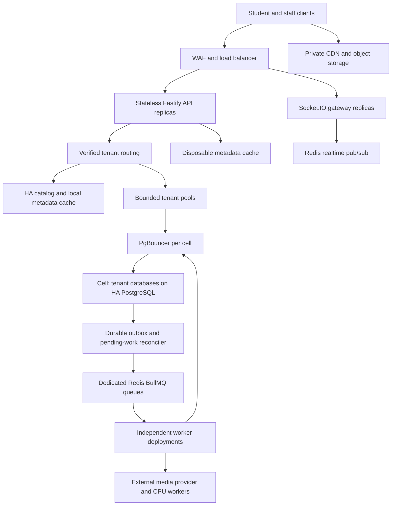
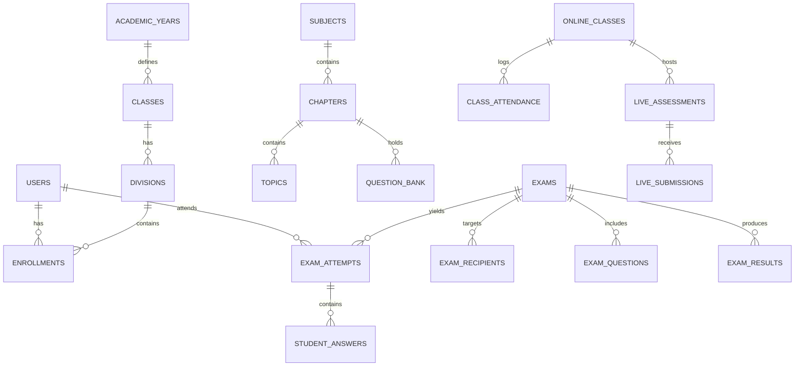

# Backend Product Requirements Document & Technical Architecture
## Online Class & Assessment Platform

> **Version:** 2.0 — architecture revision, 2026-09-09\
> **Status:** Implementation specification; capacity and recovery targets require verification.\
> **Architecture:** Modular monolith with independently deployed API, realtime gateway, and worker processes.\
> **Tenancy:** Database per institution, placed across bounded PostgreSQL clusters (“cells”).\
> **Runtime:** Node.js 24 LTS, Fastify 5, TypeScript, Drizzle, PostgreSQL, PgBouncer, Redis, BullMQ, Socket.IO.\
> **Durability:** PostgreSQL commit before acknowledging answers or final submission. Redis is never the only copy of an acknowledged answer.

## 1. Scope, Priorities & Capacity Contract

Support curriculum, question pools, exam authoring and delivery, accommodations, objective and manual grading, four-stage result publication, live quizzes, attendance, file annotations, ERP integration, and LTI 1.3. Preserve these domain modules in one codebase with explicit service interfaces. API handlers must not execute PDF rendering, video processing, bulk reports, or grading loops.

Priority order: tenant/attempt authorization, acknowledged answer durability, consistent submission, availability, then latency and operating cost. Database-per-tenant is retained; it does not imply dedicated hardware or automatic regulatory compliance.

Capacity is specified as **active exam attempts**, not total registered accounts or open browser tabs. Initial qualification is 1,000 active attempts; subsequent gates are 10,000 and 50,000 across multiple tenants/cells. A single 50,000-student tenant is a separate qualification, not implied by aggregate capacity. Section 13 defines the workload and release tests. No tier is certified by this PRD alone.

## 2. Deployment, Tenancy & Connection Architecture



### 2.1 Cell placement and failure boundaries

A cell owns a defined set of tenant databases, PostgreSQL primary/standby, poolers, and worker budgets. Catalog fields: `tenant_id`, slug, status, verified domains, `cell_id`, writer endpoint reference, database name, runtime secret reference, credential version, schema version, placement generation, and storage/concurrency quotas. Store secret references in the catalog; retrieve credentials from a secret manager using workload identity. Keep no plaintext credentials in Redis.

Place new tenants using measured CPU, WAL, storage latency, database connection demand, and forecast exam concurrency. Add cells before existing cells exceed their tested envelope. Dedicated cells are available for unusually large institutions. Read replicas serve explicitly stale-tolerant reports only; they do not increase primary write capacity. Start/resume/save/submit and immediate result reads use the writer.

Tenant relocation requires a resumable runbook: copy and catch up, drain writes, fence old routing generation, verify consistency, atomically switch catalog placement, invalidate caches/pools, resume, and verify. Prefer moves outside exams; never allow two writable authorities. Document a rollback boundary after target writes begin.

### 2.2 Tenant and identity resolution

Resolve a candidate tenant from an allowlisted hostname or explicit tenant identifier; verify proxy headers only from trusted ingress. For authenticated requests verify JWT signature, issuer, audience, expiry, user/session status, then require tenant claim and candidate to agree. Reject conflicts. Do not create a tenant pool based on arbitrary unauthenticated headers. Login may access only a verified active tenant with bounded admission.

Derive `studentId` from the authenticated principal. Validate attempt ownership, exam eligibility, role scope (assigned teacher/class, linked parent/child), and tenant for every HTTP request, job, object access, and socket subscription. A role check alone is insufficient. LTI tenant resolution uses registered issuer + client ID + deployment ID, not an untrusted launch claim.

Catalog cache: bounded local cache keyed by tenant and placement/credential generation, short configurable expiry, jittered refresh, single-flight lookup, and explicit invalidation on changes. Do not use Redis to cache live connection objects. During catalog outages, already validated routes may continue for at most the configured 60-second metadata freshness window; unknown/stale routes fail closed. Session revocation has the separate policy in Section 8.

### 2.3 Pool and connection budgets

Use PgBouncer transaction pooling. Backend connections remain allocated for the whole transaction. Avoid session-local assumptions, session advisory locks, and temporary state across transactions. Verify prepared-statement support against the pinned pooler/driver versions; migrations use a separately limited direct connection.

Each process has a bounded LRU registry of tenant pools with reference counts, small per-tenant pool size, total connection semaphore, bounded wait queue, and deadline. Initial settings for testing: 2 connections per tenant pool, 32 live pools per process, and 16 total active/connecting database connections per process. These are starting limits, not capacity promises. Retire idle pools after 15 minutes only when no operation holds a lease; call `pool.end()`. Credential/placement changes retire old pools safely. Release leases in `finally`; close all pools during shutdown. Workers count toward the same cell budget.

PgBouncer `default_pool_size` is per database/user pair, not a host-wide cap. Multiple poolers multiply server connection allowances. `max_client_conn` limits clients, not PostgreSQL backend connections. Use explicit database mappings and per-database caps rather than an unrestricted wildcard.

For each host maintain:

`sum(all poolers' database/user caps, including reserves) + direct operational connections <= tested host connection budget < max_connections`.

Illustrative admission budget for a host tested with `max_connections=150`: allocate at most 100 pooled server connections in total, 20 direct operational connections, and 30 headroom. With ten tenants and two active poolers, five server connections per tenant per pooler consume the full 100. Adding tenants requires rebalancing or a new cell, not multiplying the allowance. One pooler failure may reduce throughput; remaining capacity must satisfy the degraded-mode test. PgBouncer replicas do not coordinate these limits automatically.

Example fragment for **one tenant on one pooler**; generate and validate the complete inventory against the host budget:

```ini
[databases]
tenant_example = host=cell-writer.internal port=5432 dbname=tenant_example pool_size=5 min_pool_size=0 reserve_pool_size=0 max_db_connections=5

[pgbouncer]
pool_mode = transaction
max_client_conn = 500
min_pool_size = 0
reserve_pool_size = 0
query_wait_timeout = 2
auth_type = scram-sha-256
client_tls_sslmode = require
server_tls_sslmode = verify-full
; Mount authentication material, TLS certificates and trusted CA separately.
```

Do not fix PostgreSQL `work_mem` at 32–64 MB globally based only on host RAM: it can be consumed by multiple operations per query and concurrent sessions. Start conservatively, measure, and use bounded worker-specific overrides. Tune WAL, checkpoints, autovacuum, disk headroom, and connection limits from representative tests.

## 3. Technology & Process Boundaries

| Component | Decision | Responsibility |
| :--- | :--- | :--- |
| API | Node.js 24 LTS / Fastify 5 / TypeScript | Validation, authorization, short transactions |
| Persistence | Supported PostgreSQL 17 or 18 minor, pinned per deployment; Drizzle | Authoritative answers, deadlines, receipts, outbox, audits |
| Pooling | PgBouncer, tested/pinned version | Bounded transaction multiplexing per cell |
| Cache | Dedicated disposable Redis deployment | Metadata and derived views; safe eviction |
| Jobs | BullMQ with separate durable Redis deployment | Retryable background work; reconstructable from DB |
| Realtime | Socket.IO with its Redis adapter | Authorized notifications and presence, not answer durability |
| Storage | Private S3-compatible storage + authenticated CDN | Direct uploads/downloads; no media bytes through API |
| Media | Managed WebRTC SFU/TURN provider initially | Audio/video/recording; distinct concurrency and egress budget |

Keep separate API, realtime, exam-critical workers, integration workers, and CPU-heavy workers. They may share domain packages, but deploy and scale independently. Tenant quotas and separate queue concurrency protect exam persistence from reports, PDFs, and integrations. Benchmark framework behavior; do not promise throughput multipliers or “zero ORM overhead.”

Pin exact dependency versions in a backend lockfile and verify Fastify plugin compatibility, Node support, Drizzle migration commands, pooler behavior, and Redis topology in CI. Node 20/Fastify 4 are not the production baseline. Repository scaffolding is a future implementation deliverable, not supplied by these domain snippets.

## 4. Tenant Database Schema Specification (Drizzle ORM)

These Drizzle fragments describe domain fields, not a standalone executable schema. Section 4.8 supplies mandatory constraints and additional tables; both must be implemented together. Separate databases isolate SQL namespaces and permissions, while tenants on a host share its resources and failure domain.



### 4.1 Users, Identity & Accommodations
```typescript
// users table
export const users = pgTable('users', {
  id: uuid('id').defaultRandom().primaryKey(),
  externalId: varchar('external_id', { length: 128 }).unique(), // ERP External User ID
  admissionNo: varchar('admission_no', { length: 64 }),
  employeeCode: varchar('employee_code', { length: 64 }),
  email: varchar('email', { length: 255 }).unique().notNull(),
  passwordHash: text('password_hash'),
  fullName: varchar('full_name', { length: 255 }).notNull(),
  role: varchar('role', { length: 32 }).notNull(), // 'admin' | 'coordinator' | 'teacher' | 'proctor' | 'student' | 'parent'
  avatarUrl: text('avatar_url'),
  smartCardUid: varchar('smart_card_uid', { length: 64 }), // NFC Smart Card ID
  biometricReference: text('biometric_reference'), // Optional restricted encrypted biometric store; disabled by default
  status: varchar('status', { length: 32 }).default('active'),
  createdAt: timestamp('created_at', { withTimezone: true }).defaultNow(),
  updatedAt: timestamp('updated_at', { withTimezone: true }).defaultNow(),
});

// student_accommodations (Special education / exam adjustments)
export const studentAccommodations = pgTable('student_accommodations', {
  id: uuid('id').defaultRandom().primaryKey(),
  studentId: uuid('student_id').references(() => users.id, { onDelete: 'restrict' }),
  extraTimeMultiplier: real('extra_time_multiplier').default(1.0), // 1.25x, 1.5x, 2.0x
  relaxedProctoring: boolean('relaxed_proctoring').default(false),
  allowedBreakMinutes: integer('allowed_break_minutes').default(0),
  allowScreenReader: boolean('allow_screen_reader').default(false),
  highContrastTheme: boolean('high_contrast_theme').default(false),
  approvedBy: uuid('approved_by').references(() => users.id),
  createdAt: timestamp('created_at', { withTimezone: true }).defaultNow(),
});
```

### 4.2 Academic Hierarchy & Curriculum
```typescript
export const academicYears = pgTable('academic_years', {
  id: uuid('id').defaultRandom().primaryKey(),
  name: varchar('name', { length: 64 }).notNull(), // e.g., '2026-2027'
  startDate: date('start_date').notNull(),
  endDate: date('end_date').notNull(),
  isCurrent: boolean('is_current').default(false),
});

export const classes = pgTable('classes', {
  id: uuid('id').defaultRandom().primaryKey(),
  academicYearId: uuid('academic_year_id').references(() => academicYears.id),
  name: varchar('name', { length: 64 }).notNull(), // 'Grade 8'
  code: varchar('code', { length: 32 }).notNull(),
});

export const divisions = pgTable('divisions', {
  id: uuid('id').defaultRandom().primaryKey(),
  classId: uuid('class_id').references(() => classes.id, { onDelete: 'restrict' }),
  name: varchar('name', { length: 64 }).notNull(), // 'Division A'
});

export const subjects = pgTable('subjects', {
  id: uuid('id').defaultRandom().primaryKey(),
  name: varchar('name', { length: 128 }).notNull(),
  code: varchar('code', { length: 32 }).notNull(),
  classId: uuid('class_id').references(() => classes.id),
});

export const chapters = pgTable('chapters', {
  id: uuid('id').defaultRandom().primaryKey(),
  subjectId: uuid('subject_id').references(() => subjects.id, { onDelete: 'restrict' }),
  chapterNumber: integer('chapter_number').notNull(),
  title: varchar('title', { length: 255 }).notNull(),
  description: text('description'),
});

export const topics = pgTable('topics', {
  id: uuid('id').defaultRandom().primaryKey(),
  chapterId: uuid('chapter_id').references(() => chapters.id, { onDelete: 'restrict' }),
  title: varchar('title', { length: 255 }).notNull(),
});
```

### 4.3 Question Bank & Pool
```typescript
export const questionBank = pgTable('question_bank', {
  id: uuid('id').defaultRandom().primaryKey(),
  subjectId: uuid('subject_id').references(() => subjects.id),
  chapterId: uuid('chapter_id').references(() => chapters.id),
  topicId: uuid('topic_id').references(() => topics.id),
  type: varchar('type', { length: 32 }).notNull(), // 'mcq', 'mmcq', 'one_word', 'short_answer', 'long_answer', 'essay', 'fill_in_blanks', 'match_following', 'step_ordering'
  difficulty: varchar('difficulty', { length: 32 }).default('Medium'), // Easy, Medium, Hard
  bloomsTaxonomy: varchar('blooms_taxonomy', { length: 32 }), // Remember, Understand, Apply, Analyze, Evaluate, Create
  level: varchar('level', { length: 32 }), // Level 1, Level 2, Level 3, Level 4
  marks: numeric('marks', { precision: 10, scale: 2 }).notNull(),
  prompt: text('prompt').notNull(),
  explanation: text('explanation'),
  modelAnswer: text('model_answer'),
  options: jsonb('options'), // Array of choices for MCQ/MMCQ
  correctAnswerData: jsonb('correct_answer_data'), // Secure answers (indexes, key-pairs, word bank slots, sequence order)
  rubricCriteria: jsonb('rubric_criteria'), // Rubric criteria array [{ id, criterion, maxScore, description }]
  tags: jsonb('tags').$type<string[]>(),
  createdBy: uuid('created_by').references(() => users.id),
  createdAt: timestamp('created_at', { withTimezone: true }).defaultNow(),
});
```

### 4.4 Exams, Schedules & Question Distribution
```typescript
export const exams = pgTable('exams', {
  id: uuid('id').defaultRandom().primaryKey(),
  examCode: varchar('exam_code', { length: 64 }).unique().notNull(),
  examName: varchar('exam_name', { length: 255 }).notNull(),
  examType: varchar('exam_type', { length: 32 }).notNull(), // 'spot' | 'scheduled'
  academicYearId: uuid('academic_year_id').references(() => academicYears.id),
  subjectId: uuid('subject_id').references(() => subjects.id),
  startsAt: timestamp('starts_at', { withTimezone: true }).notNull(),
  endsAt: timestamp('ends_at', { withTimezone: true }).notNull(),
  displayTimezone: varchar('display_timezone', { length: 64 }).notNull(), // IANA timezone
  publishedVersionId: uuid('published_version_id'), // FK to immutable exam_versions
  durationMinutes: integer('duration_minutes').notNull(),
  totalMarks: numeric('total_marks', { precision: 10, scale: 2 }).notNull(),
  passMarks: numeric('pass_marks', { precision: 10, scale: 2 }).notNull(),
  instructions: text('instructions'),
  questionSource: varchar('question_source', { length: 32 }).notNull(), // 'existing_pool' | 'upload_pdf'
  pdfQuestionPaperObjectKey: text('pdf_question_paper_object_key'), // Private immutable key
  pdfQuestionCount: integer('pdf_question_count'),
  pdfAnswerSubmissionType: varchar('pdf_answer_submission_type', { length: 32 }), // 'omr' | 'text' | 'image_upload' | 'hybrid'
  allowedAttachmentFormats: jsonb('allowed_attachment_formats').$type<string[]>(), // ['pdf', 'jpg', 'png']
  maxAttachmentSizeMb: integer('max_attachment_size_mb').default(10),
  maxAttachmentsPerQuestion: integer('max_attachments_per_question').default(3),
  controls: jsonb('controls').$type<{
    randomizeQuestions: boolean;
    randomizeOptions: boolean;
    preventCopyPaste: boolean;
    fullScreenMode: boolean;
    detectTabSwitching: boolean;
    autoSubmitOnTimeEnd: true; // Timed attempts always close on the server at their deadline
    allowResume: boolean;
    showTimer: boolean;
    allowCalculator: boolean;
    allowReviewBeforeSubmit: boolean;
  }>(),
  status: varchar('status', { length: 32 }).default('draft'), // draft, scheduled, live, completed, cancelled
  createdBy: uuid('created_by').references(() => users.id),
  createdAt: timestamp('created_at', { withTimezone: true }).defaultNow(),
  updatedAt: timestamp('updated_at', { withTimezone: true }).defaultNow(),
});

export const examRecipients = pgTable('exam_recipients', {
  id: uuid('id').defaultRandom().primaryKey(),
  examId: uuid('exam_id').references(() => exams.id, { onDelete: 'restrict' }),
  recipientType: varchar('recipient_type', { length: 32 }).notNull(), // 'class_wise' | 'student_wise'
  classId: uuid('class_id').references(() => classes.id),
  divisionId: uuid('division_id').references(() => divisions.id),
  studentId: uuid('student_id').references(() => users.id), // Used for individual assignments
});

export const examQuestions = pgTable('exam_questions', {
  id: uuid('id').defaultRandom().primaryKey(),
  examId: uuid('exam_id').references(() => exams.id, { onDelete: 'restrict' }),
  questionBankId: uuid('question_bank_id').references(() => questionBank.id),
  sectionName: varchar('section_name', { length: 128 }).default('Section A'),
  sequenceNumber: integer('sequence_number').notNull(),
  examVersionId: uuid('exam_version_id').notNull(), // FK to exam_versions
  contentSnapshot: jsonb('content_snapshot').notNull(), // Immutable prompt, stable option IDs, rubric and grading key; student DTO excludes secrets
  marks: numeric('marks', { precision: 10, scale: 2 }).notNull(),
});
```

### 4.5 Exam Attempts, Live Telemetry & Answer Submissions
```typescript
export const examAttempts = pgTable('exam_attempts', {
  id: uuid('id').defaultRandom().primaryKey(),
  examId: uuid('exam_id').references(() => exams.id, { onDelete: 'restrict' }),
  studentId: uuid('student_id').references(() => users.id, { onDelete: 'restrict' }),
  attemptNumber: integer('attempt_number').default(1).notNull(),
  examVersionId: uuid('exam_version_id').notNull(),
  revision: integer('revision').default(0).notNull(),
  sessionEpoch: integer('session_epoch').default(1).notNull(), // Fences replaced devices
  deliveryManifest: jsonb('delivery_manifest').notNull(), // Persisted question/option order
  accommodationSnapshot: jsonb('accommodation_snapshot').notNull(),
  submittedRevision: integer('submitted_revision'),
  submissionReceiptId: uuid('submission_receipt_id').unique(),
  startedAt: timestamp('started_at', { withTimezone: true }).defaultNow(),
  endedAt: timestamp('ended_at', { withTimezone: true }),
  scheduledSubmissionTime: timestamp('scheduled_submission_time', { withTimezone: true }).notNull(),
  status: varchar('status', { length: 32 }).default('in_progress'), // 'in_progress', 'submitted', 'auto_submitted', 'terminated'
  ipAddress: varchar('ip_address', { length: 45 }),
  userAgent: text('user_agent'),
  tabSwitchCount: integer('tab_switch_count').default(0),
  fullScreenExitCount: integer('full_screen_exit_count').default(0),
  proctoringRiskScore: integer('proctoring_risk_score').default(0),
  verificationMethod: varchar('verification_method', { length: 32 }), // 'nfc', 'face', 'manual'
});

export const studentAnswers = pgTable('student_answers', {
  id: uuid('id').defaultRandom().primaryKey(),
  attemptId: uuid('attempt_id').notNull().references(() => examAttempts.id, { onDelete: 'restrict' }),
  questionId: uuid('question_id').notNull().references(() => examQuestions.id, { onDelete: 'restrict' }),
  answerPayload: jsonb('answer_payload'), // Stable optionId, text, matchedPairs, placedSteps, blankAnswers
  revision: integer('revision').default(0).notNull(),
  uploadedFiles: jsonb('uploaded_files').$type<Array<{
    fileId: string;
    fileName: string;
    objectKey: string; // Private object reference; generate read URL after authorization
    fileSize: string;
    uploadedAt: string;
  }>>(),
  status: varchar('status', { length: 32 }).default('answered'), // 'answered', 'marked_for_review', 'unanswered'
  autoScore: numeric('auto_score', { precision: 10, scale: 2 }),
  awardedScore: numeric('awarded_score', { precision: 10, scale: 2 }),
  teacherRemarks: text('teacher_remarks'),
  rubricScores: jsonb('rubric_scores').$type<Record<string, string>>(), // Decimal score strings
  annotations: jsonb('annotations').$type<Array<{
    id: string;
    type: 'checkmark' | 'cross' | 'highlight' | 'comment';
    pageNumber: number;
    xPct: number;
    yPct: number;
    commentText?: string;
  }>>(),
  isOverridden: boolean('is_overridden').default(false),
  overrideReason: text('override_reason'),
  lastAutoSavedAt: timestamp('last_auto_saved_at', { withTimezone: true }).defaultNow(),
});
```

### 4.6 Evaluation, 4-Tier Approval Workflow & Final Results
```typescript
export const examResults = pgTable('exam_results', {
  id: uuid('id').defaultRandom().primaryKey(),
  examId: uuid('exam_id').references(() => exams.id, { onDelete: 'restrict' }),
  studentId: uuid('student_id').references(() => users.id, { onDelete: 'restrict' }),
  attemptId: uuid('attempt_id').references(() => examAttempts.id),
  totalMaxMarks: numeric('total_max_marks', { precision: 10, scale: 2 }).notNull(),
  obtainedObjectiveMarks: numeric('obtained_objective_marks', { precision: 10, scale: 2 }).default('0'),
  obtainedSubjectiveMarks: numeric('obtained_subjective_marks', { precision: 10, scale: 2 }).default('0'),
  obtainedAttachmentMarks: numeric('obtained_attachment_marks', { precision: 10, scale: 2 }).default('0'),
  totalObtainedMarks: numeric('total_obtained_marks', { precision: 10, scale: 2 }).notNull(),
  percentage: numeric('percentage', { precision: 7, scale: 4 }).notNull(),
  grade: varchar('grade', { length: 16 }),
  isPassed: boolean('is_passed').notNull(),
  rankInClass: integer('rank_in_class'),
  workflowStep: varchar('workflow_step', { length: 32 }).default('eval_completed'),
  // 'eval_completed' -> 'teacher_review' -> 'coordinator_approval' -> 'published'
  evaluatorId: uuid('evaluator_id').references(() => users.id),
  teacherApprovedBy: uuid('teacher_approved_by').references(() => users.id),
  teacherApprovedAt: timestamp('teacher_approved_at', { withTimezone: true }),
  coordinatorApprovedBy: uuid('coordinator_approved_by').references(() => users.id),
  coordinatorApprovedAt: timestamp('coordinator_approved_at', { withTimezone: true }),
  publishedAt: timestamp('published_at', { withTimezone: true }),
  resultVisibilityConfig: jsonb('result_visibility_config').$type<{
    showMarks: boolean;
    showPercentage: boolean;
    showGrade: boolean;
    showRank: boolean;
    showAnswerSheet: boolean;
    showCorrectAnswers: boolean;
    showTeacherFeedback: boolean;
  }>(),
  syncedToErp: boolean('synced_to_erp').default(false),
  syncedToErpAt: timestamp('synced_to_erp_at', { withTimezone: true }),
});
```

### 4.7 Online Classrooms & Live Interactive Assessments
```typescript
export const onlineClasses = pgTable('online_classes', {
  id: uuid('id').defaultRandom().primaryKey(),
  title: varchar('title', { length: 255 }).notNull(),
  subjectId: uuid('subject_id').references(() => subjects.id),
  classId: uuid('class_id').references(() => classes.id),
  divisionId: uuid('division_id').references(() => divisions.id),
  instructorId: uuid('instructor_id').references(() => users.id),
  startsAt: timestamp('starts_at', { withTimezone: true }).notNull(),
  endsAt: timestamp('ends_at', { withTimezone: true }).notNull(),
  displayTimezone: varchar('display_timezone', { length: 64 }).notNull(),
  durationMinutes: integer('duration_minutes').notNull(),
  platform: varchar('platform', { length: 32 }).notNull(), // 'in_app' | 'google_meet' | 'zoom' | 'ms_teams'
  meetingLink: text('meeting_link'), // Required only for external meeting providers
  meetingId: varchar('meeting_id', { length: 128 }),
  passcode: varchar('passcode', { length: 64 }),
  status: varchar('status', { length: 32 }).default('scheduled'), // scheduled, live, completed, cancelled
  permissions: jsonb('permissions').$type<{
    allowStudentMic: boolean;
    allowStudentCamera: boolean;
    allowChat: boolean;
    allowScreenShare: boolean;
    enableWhiteboard: boolean;
    recordSession: boolean;
    requireWaitingRoom: boolean;
    autoAttendance: boolean;
  }>(),
  materials: jsonb('materials'),
  createdAt: timestamp('created_at', { withTimezone: true }).defaultNow(),
});

export const liveInClassAssessments = pgTable('live_in_class_assessments', {
  id: uuid('id').defaultRandom().primaryKey(),
  classId: uuid('class_id').references(() => onlineClasses.id),
  title: varchar('title', { length: 255 }).notNull(),
  topic: varchar('topic', { length: 255 }).notNull(),
  durationSeconds: integer('duration_seconds').default(180), // 0 for untimed
  totalMarks: numeric('total_marks', { precision: 10, scale: 2 }).notNull(),
  passMarks: numeric('pass_marks', { precision: 10, scale: 2 }),
  status: varchar('status', { length: 32 }).default('draft'), // draft, active, closed, published
  launchedAt: timestamp('launched_at', { withTimezone: true }),
  questions: jsonb('questions'),
  createdAt: timestamp('created_at', { withTimezone: true }).defaultNow(),
});

export const liveAssessmentSubmissions = pgTable('live_assessment_submissions', {
  id: uuid('id').defaultRandom().primaryKey(),
  assessmentId: uuid('assessment_id').references(() => liveInClassAssessments.id, { onDelete: 'restrict' }),
  studentId: uuid('student_id').references(() => users.id),
  answers: jsonb('answers'),
  totalScore: numeric('total_score', { precision: 10, scale: 2 }).notNull(),
  maxMarks: numeric('max_marks', { precision: 10, scale: 2 }).notNull(),
  percentage: numeric('percentage', { precision: 7, scale: 4 }).notNull(),
  status: varchar('status', { length: 32 }).default('submitted'), // 'submitted' | 'reviewed'
  teacherFeedback: text('teacher_feedback'),
  verifiedVia: varchar('verified_via', { length: 32 }), // 'nfc' | 'face' | 'both'
  submittedAt: timestamp('submitted_at', { withTimezone: true }).defaultNow(),
});
```

---

### 4.8 Mandatory constraints, indexes and supporting tables

The snippets above require the following schema work before implementation is complete. Generate reviewed migrations; do not copy the fragments as a finished schema. Use database constraints in addition to request validation.

| Entity | Required fields / invariants / indexes |
| :--- | :--- |
| `exam_versions` | `(id, exam_id, version, published_at, policy_snapshot)`; unique `(exam_id, version)`; immutable after publication |
| `exam_questions` | FK `exam_version_id`; immutable content and grading snapshot; unique `(exam_version_id, sequence_number)` and `(exam_version_id, id)`; prohibit mutation/deletion once used |
| `exam_attempts` | Required exam/student/version FKs; unique `(exam_id, student_id, attempt_number)`; partial unique `(exam_id, student_id) WHERE status='in_progress'`; valid states; deadline not before start; index `(status, scheduled_submission_time, id)` for expiry scans |
| `student_answers` | Required attempt/question FKs; unique `(attempt_id, question_id)`; nonnegative revision; verify question belongs to attempt version inside locked transaction; index supports loading all attempt answers |
| `request_receipts` | `(attempt_id, idempotency_key, actor_id, session_epoch, operation, canonical_request_hash, response_json, created_at)`; unique `(attempt_id, idempotency_key)`; recorded in same transaction as mutation |
| `outbox_events` | `(id, event_type, aggregate_id, aggregate_revision, payload, created_at, available_at, lease_until, lease_owner, dispatched_at, completed_at, retry_count, last_error)`; unique semantic event key; index on incomplete/available work |
| `processed_events` | Unique `(consumer_name, event_id)` committed with consumer side effects; safe handling of duplicate dispatch |
| `exam_results` | Unique `attempt_id`; `grading_version`, `source_revision`; decimal scores with configured rounding; optimistic version checks for grading and approval |
| `enrollments` | Required user, academic year, class, division references; unique active membership as defined by school policy; eligibility query indexes |
| `teacher_assignments`, `parent_student_links` | Explicit relationships for object authorization; unique relationship tuples |
| `class_attendance` | Unique `(online_class_id, student_id)`; first/last seen, attendance duration and source; distinct append-only attendance events if audit required |
| `live_assessment_submissions` | Unique `(assessment_id, student_id)` for single-attempt policy; immutable assessment question version and stable option IDs; receipt/revision protocol for resubmission |
| `attachments` | Owner/tenant/attempt/question IDs, object key, checksum, byte size, media type, scan state, upload expiry, finalization time; unique object key; private storage |
| `audit_events` | Actor, scope, action, before/after references, reason, request ID and timestamp; append-only permissions and retention |
| `integration_inbox` | Unique `(integration_id, external_event_id)`; payload hash, received/processed timestamps and failure status |
| `refresh_sessions` | Hashed refresh token, family, tenant/user, expiry, revoked time, rotation linkage; durable source of session revocation |
| `exam_schedule_projection` (catalog) | Tenant, exam, version, starts/ends timestamps, expected participants, placement generation, updated time; unique `(tenant_id, exam_id)`; indexes on starts/ends |

Set `.notNull()` on required relationships/statuses and use enum/check constraints for state transitions, nonnegative durations, score bounds, and recipient shapes (class assignment versus individual assignment). Allow nullable FKs only for explicitly optional relationships. Add uniqueness for one current academic year and one active accommodation record per student. Use a role mapping table if users may have multiple roles. Archive users/exams; retention deletion is a separate audited workflow, not cascading deletion of attempt evidence.

Use `numeric` or integer scaled points for marks; application calculations use a decimal library or scaled integers, never binary float accumulation. Accommodation multipliers are validated and snapshotted into an absolute attempt deadline. Apply explicit rounding when converting duration to seconds. Schedule timestamps are UTC instants with an IANA display timezone; validate daylight-saving ambiguities at authoring time.

Question search needs measured composite indexes (subject/chapter/type/difficulty) and full-text/GIN indexes only for actual query patterns. Add FK lookup indexes where needed; PostgreSQL does not create them automatically. Paginate lists with bounded limits and stable cursors. Test query plans using realistic tenant data; do not add every possible index to the hot answer table. Large telemetry/audit tables may use time partitioning and retention; partitioning is not a substitute for measured query design.

## 5. Durable Exam Delivery & Concurrency Protocol

### 5.1 Durability and failure contract

For production, commit answer/receipt transactions with PostgreSQL WAL fsync enabled and synchronous replication to at least one eligible standby in a separate availability zone (`synchronous_commit=on` and an appropriate synchronous standby configuration, or verified equivalent managed-service guarantees). Acknowledge only after commit returns. Failover must fence the former primary and promote a standby containing acknowledged commits. If the required replica is unavailable, writes may block/fail within the request deadline; never silently downgrade durability. See the [PostgreSQL synchronous replication documentation](https://www.postgresql.org/docs/current/warm-standby.html#SYNCHRONOUS-REPLICATION).

The target RPO is **zero acknowledged transactions lost for a covered single primary/AZ failure**. This is not a guarantee for total regional destruction, operator deletion, compromised credentials, or edits never received by the server. Regional disaster recovery uses separately stated backup/replication RPO/RTO in Section 12. Local development can use a single database but cannot advertise production durability.

`200 saved` means the server committed the answer and its receipt. `200 submitted` means a final attempt snapshot is committed; grading may still be pending. Redis success, queue acceptance, and browser storage are not durable server receipts. An ambiguous timeout may occur after commit: retry the same request ID to obtain the original result. No Redis write-behind answer buffer is used in this design.

### 5.2 Start, deadline and immutable delivery

`POST /api/v1/exam-delivery/:examId/start` verifies enrollment, schedule and allowed attempts in a short transaction. A start idempotency key and uniqueness constraints prevent duplicate attempts. Return an existing in-progress attempt rather than allocating another on duplicate start. Under the exam policy, compute `deadline = min(exam.endsAt, startedAt + accommodated_duration)`; an approved extension beyond the exam window must explicitly override that cap and be audited. Persist question selection, stable option IDs/order, exam version, accommodation snapshot, deadline and session epoch. Do not regenerate randomization on resume or return correct answers/rubrics intended only for graders.

Server time and the persisted deadline govern acceptance. Client countdown is a display periodically synchronized with server time. Workers are reminders, not the clock authority. An authenticated administrator may extend an active deadline in a locked transaction with audit/outbox update; terminal attempts require an explicit audited reopen policy and a new grading revision.

### 5.3 Delta-save request and transaction

`POST /api/v1/exam-delivery/:attemptId/auto-save`, with `Idempotency-Key` header:

```json
{
  "sessionEpoch": 1,
  "baseRevision": 12,
  "changes": [
    { "questionId": "uuid", "baseAnswerRevision": 3, "answerPayload": { "optionId": "option-b" }, "status": "answered" }
  ]
}
```

Initial limits: 50 changed questions, 256 KiB request body, 64 KiB text answer, no attachment bytes. Exam policies may set smaller limits; larger accommodations require a reviewed configuration and payload load test. Return a clear validation error, never silently truncate. Send completed attachment IDs only; server validates ownership and finalized upload state.

Transaction sequence (normative algorithm, not copy-paste application code):

1. Authenticate, validate shape/body size, acquire a bounded tenant pool lease, and begin transaction. All mutation paths acquire the attempt row lock first (`SELECT ... FOR UPDATE`), including takeover, extension, expiry, and submission.
2. Verify principal ownership and tenant. If a receipt exists for the same key/operation/actor and canonical request hash, return its stored response without repeating the mutation. A reused key with different content returns `409 IDEMPOTENCY_KEY_REUSED`.
3. After lock acquisition, check current database wall-clock time, active state, session epoch and `baseRevision`. Do not use transaction-start time to authorize a request that waited past the deadline. Reject expired/terminal attempts and stale epochs. Bound lock waits so rejected work does not consume the whole exam window.
4. Validate every question against the attempt's persisted manifest/version and every base answer revision. Reject the whole request on a conflict (`409 REVISION_CONFLICT` with current revisions and reload instructions); never silently overwrite.
5. Perform one parameterized multi-row `INSERT ... ON CONFLICT (attempt_id, question_id) DO UPDATE` for the changed rows, increment answer revisions and the attempt revision once. Every writer uses this locking/revision protocol; request handlers cannot bypass it.
6. Insert the receipt containing request hash, resulting attempt/answer revisions, and server timestamp in the same transaction. Commit with the required durability policy, then return the response. Release the lease in `finally`.

```json
{
  "status": "saved",
  "attemptRevision": 13,
  "answerRevisions": { "uuid": 4 },
  "savedAt": "2026-09-09T10:00:00Z"
}
```

Receipts remain available throughout the attempt and at least seven days after submission; configure longer retention if the supported retry horizon requires it. Expired keys cannot mutate a terminal attempt. Save transactions must be short, with no external calls while holding locks. Use a consistent lock order across all related rows. Retry transient serialization/deadlock failures within a bounded deadline, preserving the same idempotency key.

### 5.4 Submission, expiry and grading

Manual submission accepts `sessionEpoch`, `baseRevision`, and optional final `changes` in the same shape/limits as save. The client serializes saves and submission. In one locked transaction, validate/apply final changes, transition the attempt from `in_progress` to `submitted`, freeze `submittedRevision`, create a stable receipt ID, and insert a uniquely keyed grading outbox event. Subsequent authenticated submissions return the existing terminal receipt; they never reapply supplied changes. A crash before response is recovered through the receipt/resume endpoint. Late manual requests return the server's expired/auto-submitted outcome, not a false successful manual submission.

Deadline sweeper: poll indexed due attempts per tenant with bounded batches and leases/`SKIP LOCKED`. Lock each attempt, recheck its current deadline, atomically transition to `auto_submitted`, freeze the last committed revision, and insert the same class of unique grading event. Delayed BullMQ jobs can accelerate this but are not required for correctness. Maintain a tenant scan cursor so every active tenant is checked; resume after worker crashes. Recovery scans catch missed deadlines. An on-access expiry check may perform the same transition. Late sweeper execution never permits late answer writes.

For deadline adjudication, the accepted transaction is one that acquired the attempt lock and passed the database clock check before the deadline; its commit may complete just afterward. Requests still queued at the deadline are rejected. Configure a short transaction deadline and document this rule to students. Never trust a client-supplied timestamp to admit offline edits.

Grading reads only the committed submitted revision and immutable question snapshots. Consumers are idempotent by event ID and grading version; commit score changes and the processed-event marker together. Manual grading/overrides and four-stage approval use optimistic versions and append-only audit events. Only a published result emits a gradebook event; a corrected publication creates a newer revision, not a duplicate unversioned push.

### 5.5 Offline and multiple-device behavior

Client writes edits to tenant/user/attempt-scoped IndexedDB, debounces changed questions for 3 seconds with a 10-second maximum wait during continuous typing, and keeps one mutation request in flight per attempt. Clear only the exact local edit versions acknowledged by the server; newer local edits remain dirty. Explicit clear-answer operations must be represented, not omitted. Retry network/503/429 responses with exponential backoff, jitter, and `Retry-After`; reuse the same key and body for an ambiguous request.

On resume, fetch the authoritative snapshot and receipt before sending queued work. Resolve ambiguous requests first. Revision conflict requires rebase/review of local edits; never blind last-write-wins. An explicit device takeover increments `sessionEpoch`; older devices become read-only and cannot overwrite newer work. On same-device reload retain the persisted queue/epoch and reconcile it with the server.

Display “Saved on this device”, “Syncing”, “Saved to server”, and “Submission pending” distinctly. Preserve unsent work after network failure. Once the deadline has passed, quarantine late local edits for an auditable administrator review workflow; do not auto-merge or claim they were accepted. Upload/offline failure must be visible. Clear local copies after a confirmed receipt and the configured recovery period, or on explicit secure-device cleanup; warn before deleting unsent work.

## 6. Fastify Plugin & Route Architecture

Fastify is organized into modular functional plugins with strict encapsulated lifecycle hooks:

```
src/
├── plugins/
│   ├── tenant-resolver.plugin.ts  # Inspects host/headers, sets req.tenantDb
│   ├── auth-guard.plugin.ts       # Validates JWT, sets req.user and req.role
│   ├── error-handler.plugin.ts    # RFC 7807 Problem Details serialization
│   ├── rate-limiter.plugin.ts     # Redis-backed sliding window rate limiter
│   └── websocket.plugin.ts        # Socket.IO gateway integration
├── modules/
│   ├── auth/                      # Login, Refresh, Password Reset, ERP Launch SSO
│   ├── academic/                  # Years, Classes, Divisions, Subjects, Chapters
│   ├── question-bank/             # Question Pool CRUD, Bloom's categorization, AI Gen
│   ├── exams/                     # Wizard creation, scheduling, PDF paper, controls
│   ├── exam-delivery/             # Start exam, autosave, ping heartbeat, final submit
│   ├── evaluation/                # Dashboard, auto-marking, rubrics, annotations, approval
│   ├── live-classroom/            # Virtual lecture scheduling, permissions, attendance
│   ├── live-assessment/           # In-class spot assessments, NFC/Face verify, live review
│   ├── proctoring/                # Malpractice events, similarity detection, browser logs
│   ├── reports/                   # Exam tabulation, student scorecards, question analytics
│   └── webhooks/                  # Inbound ERP listeners & outbound publisher
```

### 6.1 Core API Endpoints

#### Authentication & SSO (`/api/v1/auth`)
- `POST /login` - Direct email/password authentication.
- `POST /refresh` - Refresh token rotation.
- `POST /erp-sso-launch` - Ingests signed ERP launch token, provisions user JIT, returns active session cookie.
- `POST /lti/v1p3/launch` - IMS Global LTI 1.3 Advantage launch receiver.

#### Question Pool (`/api/v1/question-pool`)
- `GET /` - Paginated pool search with filters (`subjectId`, `chapterId`, `type`, `difficulty`, `bloomsTaxonomy`).
- `POST /` - Create question with specific options, correct answers, rubrics, and taxonomy tags.
- `POST /ai-generate` - AI-assisted question generation based on subject, chapter, and Bloom's target.

#### Exam Management (`/api/v1/exams`)
- `POST /` - Multi-step exam configuration (Basic details, recipients, academic map, question source, marks distribution, controls).
- `POST /:id/upload-pdf` - Presigned upload URL + paper page metadata extraction.
- `POST /:id/publish` - Transitions exam to `scheduled` or `live` and dispatches notifications.
- `GET /student/available` - Filtered list of upcoming, active, and completed exams for authenticated student.

#### Exam Delivery Engine (`/api/v1/exam-delivery`)
- `POST /:examId/start` - Idempotent eligibility check and durable attempt/deadline/manifest creation; returns existing active attempt on retry.
- `POST /:attemptId/auto-save` - Versioned delta save; acknowledges only after database commit (Section 5).
- `POST /:attemptId/heartbeat` - Proctoring telemetry ping (tab switches, full-screen compliance, face presence).
- `POST /:attemptId/submit` - Atomic final delta + submission receipt + grading outbox event (Section 5).
- `GET /:attemptId` - Authoritative resume snapshot, deadline, session epoch, revisions, manifest, and submission receipt.
- `POST /:attemptId/takeover` - Explicit authenticated device takeover; increments session epoch under the attempt lock.

#### Evaluation & 4-Step Approval (`/api/v1/evaluation`)
- `GET /dashboard` - Filterable evaluation dashboard (`Not Started`, `In Progress`, `Completed`, `Published`).
- `GET /submissions/:id` - Full evaluation session loading student answers, attachments, rubrics, and model answers.
- `POST /submissions/:id/grade-question` - Score allocation, rubric point award, teacher remarks.
- `POST /submissions/:id/annotations` - Persist visual canvas annotations on student uploaded PDF/images.
- `POST /submissions/:id/override-score` - Admin/coordinator score override with audit justification.
- `POST /exams/:id/workflow-transition` - Moves status: `eval_completed` ➔ `teacher_review` ➔ `coordinator_approval` ➔ `published`.

#### Live Classroom & Real-Time Assessment (`/api/v1/live-classroom`)
- `POST /classes` - Schedule virtual lecture with platform configs (In-App, Meet, Zoom, Teams).
- `POST /classes/:id/launch-assessment` - Push real-time interactive assessment to connected students.
- `POST /assessments/:id/submit` - Ingest student live quiz answer with smart card NFC or Face ID payload.
- `POST /assessments/:id/override` - Teacher live score override and instant score broadcasting.

---

## 7. Asynchronous Work & Integration Reliability

### 7.1 Transactional outbox and reconciliation

Store domain state and its outbox event in the same tenant database transaction. An independently deployed dispatcher claims committed events in bounded batches with expiring leases and publishes deterministic job IDs containing tenant/event identity. Mark dispatch only after queue acknowledgement. A crash around acknowledgement may duplicate delivery; it cannot justify skipping an event.

Queue contents are not the durable work ledger. Reconcile all incomplete events periodically, including events marked dispatched whose completion has not arrived within their processing SLA; re-enqueue missing/stalled jobs. Workers commit `processed_events` and domain effects together, then record completion. Duplicate jobs return the committed result. Use a separate consumer marker per destination when an event has multiple consumers. Retain ledger records beyond the queue retention/retry horizon.

External APIs cannot participate in the database transaction. Use stable external idempotency keys where supported, persist delivery attempts and responses, and reconcile remote state after ambiguous timeouts. Where the provider lacks idempotency/reconciliation, flag uncertain delivery for operator review rather than claiming exactly-once behavior. Define exponential retry limits, dead-letter records, alerts, and replay tools.

### 7.2 Queue isolation and fairness

Separate exam-critical (expiry, grading), integration, reports/PDF, and media/proctoring workloads into independently bounded deployments/queues. Dispatcher and worker concurrency is constrained by each cell's connection budget; queue autoscaling must not overwhelm the database. Apply per-tenant admission, fair scheduling, job size limits, timeouts, and circuit breakers for slow external services. Store large job inputs in private object storage; put references in jobs.

Use dedicated Redis for BullMQ with `maxmemory-policy=noeviction`, AOF, replicas/failover, memory headroom and alerts on failed writes. Persistence supports recovery but the outbox remains the authoritative replay source. Configure/test BullMQ connections, reconnect behavior, shutdown and Lua/cluster key placement against its [production guidance](https://docs.bullmq.io/guide/going-to-production). Cache workloads must not evict jobs. Sentinel provides HA; Redis Cluster also shards data. Choose a documented topology per deployment, not the ambiguous label “Cluster/Sentinel.” If clustering queues, enforce same-slot queue keys/hash tags and distribute queues deliberately; one queue does not automatically span shards.

### 7.3 ERP and LTI contract

Retain inbound `/api/v1/webhooks/inbound/erp` events for student/staff upserts and academic class updates. Verify HMAC over raw bounded request bytes with the correct tenant integration secret, signed timestamp tolerance, and replay protection. Persist a unique inbox record before returning acceptance; process asynchronously. Reject an existing event ID with a different payload hash. Enforce source revisions/order so stale updates cannot undo newer enrollment or role changes.

Outbound `exam.published` includes event ID, tenant, exam/version, publication revision, and paginated/chunked results with stable chunk IDs. Retry with the same identity. Do not construct one unbounded 50,000-result webhook. A later correction emits a newer revision. Integrations use per-tenant credentials and allowlisted destinations with SSRF protections.

LTI 1.3 requires registered issuer/client/deployment mappings, OIDC state/nonce validation, audience and signature verification with controlled JWKS refresh, and scoped service credentials for advantage services. ERP SSO verifies signature, timestamp and single-use nonce before JIT provisioning; roles are mapped through configured policy. Integration failure must not block existing exam saves. Validate these contracts against the dedicated integration documents during implementation; this PRD governs exam durability and tenant routing if older examples conflict.

## 8. Security, Privacy & File Delivery

JWT access tokens use RS256, issuer/audience validation, key rotation and a 15-minute lifetime. Refresh tokens are random, hashed in durable session records, rotated transactionally with token-family revocation and replay detection. Handle concurrent refresh through client serialization and a documented server retry policy. Default cookies: `HttpOnly`, `Secure`, `SameSite=Lax` or Strict where the flow permits; LTI embedding requires a separately tested cross-site session flow with CSRF defenses and browser cookie restrictions accounted for.

Use a distinct revocation cache backed by durable session state, with at most 60-second validity and invalidation on revocation. Cache outage falls back to bounded durable checks; if freshness cannot be established, fail authenticated mutations closed. Include refresh/revocation traffic in load tests. Do not silently bypass auth to keep exams running.

Permissions: administrators manage institutional configuration; coordinators approve/publish; assigned teachers author and grade; assigned proctors monitor; students access their own attempts; linked parents see published child results. Tenant provisioning is a platform-operator permission, not an institutional-admin privilege. All scope checks are server-side, including socket room joins and file URLs.

Rate limits must support schools sharing a NAT IP. Starting account protection: five failed logins/minute per tenant/account with progressive delay and a separately sized aggregate IP abuse limit; do not cap all successful school logins at five/minute/IP. Autosave: 120/minute per active attempt with a small bounded burst and tenant/global admission limits. General routes use user/tenant limits plus high aggregate IP abuse thresholds. Document behavior during limiter outages; keep local emergency caps, and require durable auth checks for sensitive operations. Return 429 with retry guidance. Measure credential hashing CPU/memory independently and bound login concurrency.

Validate schemas and lengths at ingress and service boundaries; parameterize SQL, including bulk writes. Sanitize rendered rich text with a maintained server-compatible sanitizer and safe output handling. Security headers and tenant CORS allowlists are explicit. For approved LMS embedding use route-specific CSP `frame-ancestors` and compatible frame headers; do not send contradictory `X-Frame-Options: DENY` on the embedded route. Protect cookie-authenticated mutations against CSRF.

Private files: issue short-lived presigned upload URLs bound to tenant/user/attempt, type and size policy. Finalize by verifying object metadata, checksum and ownership; quarantine until malware/type checks complete. A timely finalized file reference may be committed with scan pending, but graders cannot open it until scan passes; scan rejection creates a visible remediation/audit event. Presign expiry is not exam-deadline authorization. Late finalization cannot modify a terminal attempt automatically. Run orphan upload cleanup after a recovery grace period.

Store immutable object keys, not expiring URLs, in domain records. Signed CDN authorization must occur on every request before cache delivery; cache by immutable object version with a reviewed signature/cookie cache policy. Block public origin access and cross-tenant cache leakage. Never include grading keys in student payloads. Watermarked papers are pre-generated/background jobs and use distinct cache keys. Recordings use separate retention, authorization, encryption, storage and egress budgets.

Use workload identity and secret manager/KMS, TLS with certificate verification, least-privilege per-tenant DB roles, and no CREATE DATABASE permission in API pods. Revoke unintended database CONNECT/PUBLIC permissions and test cross-tenant access. Keep privileged provisioning/migrations in isolated jobs. Redact tokens, credentials, answer contents and biometric data from logs. Biometrics/proctoring media are disabled until retention, access, consent and deletion requirements are explicitly approved by the institution; database layout alone establishes no compliance certification.

## 9. Tenant Lifecycle & Migrations

Provisioning is an asynchronous operator-authorized state machine: `requested → provisioning → migrating → seeding → active`, with `failed` and resumable step records. Use an idempotent tenant ID, restricted runtime role, secret creation, selected cell, reviewed schema and initial admin setup. Activate routing only after validation; compensate partial resources safely. Domain ownership verification defaults to false until proven.

Migrate through a bounded orchestrator: canary tenant, per-tenant migration lock, schema-version tracking, retry/failure records, `try/finally` connection cleanup, and controlled concurrency per cell. Stop rollout on migration error/latency regression. Use expand/backfill/contract compatible with old and new app revisions; defer destructive operations until all readers migrate. Long backfills run in small resumable batches. Schedule locks/index changes outside active exams where possible; use lock/statement timeouts and validate rollback or forward-repair procedures.

Catalog and tenant schema versions are independent. Routing rejects unsupported schema versions without corrupting data. Tenant restore is performed to a separate database/cluster, verified, then switched through the fenced placement procedure. PITR of a shared cluster affects all its databases; individual tenant restore usually requires restoring a temporary cluster and extracting that tenant. Test this workflow with attachments and outbox reconciliation, not just SQL rows.

## 10. Realtime & Media Scaling

Use Socket.IO end-to-end with compatible server/client and Redis adapter versions. Use WebSocket transport initially; if HTTP long-polling fallback is enabled, configure/test sticky sessions. The Redis adapter does not provide connection-state recovery; clients reconnect and fetch durable state using sequence/revision cursors. See the [Socket.IO Redis adapter documentation](https://socket.io/docs/v4/redis-adapter/).

Rooms: `tenant:{tenantId}:class:{classId}`, `tenant:{tenantId}:exam:{examId}:proctor`, and `tenant:{tenantId}:assessment:{assessmentId}`. Reauthorize joins and token refresh; never accept arbitrary client-supplied room membership. Persist critical quiz launch/close decisions before broadcasting and support snapshot resync; ephemeral presence may be lost. Pub/sub interruption affects live updates, not committed answers.

Use event sequence IDs, bounded per-socket buffers, client ACK/resync policy for critical notifications, payload limits, and slow-consumer disconnection. Coalesce teacher progress updates to at most one aggregate/class/second initially; do not broadcast every student's heartbeat to every student. Heartbeats have jittered 15-second cadence and server-side enforcement. Gateway autoscaling uses active connections, event-loop lag, egress, and fanout queue depth; reconnects use exponential jitter. Drain gateways by removing readiness, notifying clients, and allowing bounded reconnection before close.

Audio/video does not travel through Fastify, Redis pub/sub or BullMQ. Use a managed SFU and TURN service initially; qualify participants/room, concurrent publishers/viewers, bitrate, TURN relay ratio, recording workers and regional egress separately. External Meet/Zoom/Teams adapters require tested provider capabilities and credentials; do not assume every provider supports iframe embedding. Media outages must leave exam delivery available.

## 11. Scheduled and Reactive Scaling

Publish schedule changes through a tenant outbox into the catalog's `exam_schedule_projection`; periodically reconcile to repair missing projections. Store absolute start/end times and participant estimates resolved from recipient/enrollment snapshots. Accommodations, active attempts, spot exams and extensions update capacity forecasts. Stale or missing forecasts trigger conservative headroom and alerts.

Example projection query (catalog SQL, not tenant-schema SQL):

```sql
SELECT tenant_id, exam_id, expected_participants, starts_at, ends_at
FROM exam_schedule_projection
WHERE starts_at <= NOW() + INTERVAL '20 minutes'
  AND ends_at >= NOW() - INTERVAL '30 minutes';
```

Plan for overlapping exams, login/start ramps and late sessions. Pre-warm nodes, API/gateway pods, poolers and verified metadata 15–20 minutes before a scheduled peak, based on measured provisioning time. Initial baseline: at least two on-demand API replicas across zones, separate redundant critical workers/realtime gateways as required. Replica count is computed from measured safe throughput per pod and cell limits, not a fixed students-to-pods ratio.

A single scaling authority combines scheduled minimum capacity and reactive demand (for example an HPA/KEDA setup with one owner for replica count). Do not have a cron scaler and independent HPA overwrite each other. Set resource requests/limits and provision nodes; HPA alone cannot create capacity on full nodes. Reactive signals: request rate/p99, CPU/event-loop lag, pool waits, gateway connections, queue age and backlog. Queue scale-out is capped by database and downstream budgets.

Use Spot only for interruptible surplus with on-demand fallback; maintain sufficient tested on-demand capacity for active exams. Warmup is conditional on verified ready capacity; if unavailable, alert and activate the admission/incident plan. No claim that all traffic is scheduled or that boot is always under three seconds.

Scale down only when active attempts/connections and critical work permit it. Stop admission/readiness, drain in-flight requests, close leases/pools, and handle ambiguous commits through receipts. Worker leases expire/retry after termination. Use disruption budgets, topology spread and a termination grace period longer than the bounded request duration. Retain standby capacity for reconnect bursts and unscheduled quizzes.

Admission control: per-attempt single mutation, bounded per-tenant/process queues, cell-wide pool caps, statement/lock timeouts and circuit breakers. Prefer shedding reports/imports and delaying new starts to interrupting active saves. Return 503/429 with jittered retry advice before unbounded memory/connection growth. If service failure crosses a deadline, preserve local edits and require an audited extension/recovery decision; do not silently change timestamps.

## 12. Availability, Observability & Recovery

| Failure | Required behavior and recovery |
| :--- | :--- |
| API crash / lost response | Retry same key; return committed receipt or execute once |
| PostgreSQL primary/AZ loss | Fence old primary; promote eligible synchronous replica; reconnect through writer endpoint; no acknowledged loss within covered failure model |
| Required synchronous replica unavailable | Bounded write unavailability, visible retry state; no automatic asynchronous durability downgrade |
| Queue Redis unavailable/lost | Saves/submissions still commit; DB outbox accumulates; expiry database sweeper continues; reconstruct jobs when recovered |
| Cache/pubsub unavailable | Bounded authoritative lookup fallback; realtime resync; protect DB from cache-miss stampede |
| Worker crash / duplicate job | Expiring claim, replay, idempotent effect + completion transaction |
| Catalog unavailable | Existing fresh verified routes only within freshness policy; no unknown tenant access |
| Region loss / operator error | Execute independently tested backup/PITR and object restore runbook |

Initial engineering targets: covered DB failover RTO ≤5 minutes; regional recovery RPO ≤5 minutes and RTO ≤4 hours. These are acceptance targets, not inherited guarantees from choosing a cloud product. Qualify backup/WAL/object replication and network topology to achieve them; otherwise publish the measured weaker tier before deployment. Maintain encrypted daily base backups plus continuous WAL archiving and at least 35-day PITR retention, with separate-region/account protection. Object versioning/replication and application retention must align. Test restoration quarterly and before material topology changes; record results and integrity checks for receipts, answers and attachments.

Instrument request IDs and traces across HTTP, transactions, outbox, queue, and webhooks. Collect save/submit/start latency histograms and errors, lock/pool waits, active attempts/connections, WAL/fsync latency, disk/IOPS/headroom, autovacuum lag, synchronous replica health, outbox oldest age, overdue submissions, worker retries/dead letters, Redis memory/rejections, event-loop lag, reconnect rate and CDN/media egress. Avoid unbounded user/attempt metric labels; use sampled traces and controlled tenant drill-down.

Alert on any acknowledged-answer mismatch, unhealthy required replica, outbox age >60 seconds, overdue expiry >30 seconds, persistent pool wait, disk exhaustion forecast and sustained latency/error-budget burn. Provide runbooks, escalation ownership, tenant blast-radius view and pre-exam readiness checks. `/health/live` tests process health only; `/health/ready` uses cached bounded dependency/writer-route checks and shutdown state, not a database query to every tenant. Redis queue outages must not unnecessarily remove healthy answer API pods.

## 13. Capacity Model & Qualification Gates

### 13.1 Workload inputs

Before sizing, capture tenants and largest-tenant share, question/essay mix, answer bytes, changed questions per save, edit cadence, heartbeat frequency, attempt length, start/submit burst width, reconnect rate, session refresh, login hashing cost, report demand, file size and media participation. Delta saves reduce writes only for unchanged answers; no fixed percentage reduction is assumed.

Planning equations:

- `save_requests_per_second = active_attempts × fraction_editing / mean_save_interval_seconds`.
- `answer_rows_per_second = save_requests_per_second × mean_changed_questions_per_request` (plus attempt and receipt writes; include WAL/index amplification).
- `heartbeat_requests_per_second = connected_students / heartbeat_interval_seconds`.
- `start_or_submit_peak = affected_attempts / burst_window_seconds`.
- `required_connections ≈ DB_transactions_per_second × mean_connection_hold_seconds`, then apply measured headroom and validate p99 wait; this is a planning estimate, not a sizing guarantee.
- `API_replicas = ceil(peak_request_rate / measured_safe_rate_per_replica)`, additionally constrained by cell/connection budgets and one-failure capacity.

Stress envelope at 50,000 active attempts: all clients change an answer every 10 seconds → 5,000 save requests/sec; 15-second heartbeats → about 3,333 heartbeat requests/sec; starts in 60 seconds → about 833 starts/sec; submissions in 10 seconds → 5,000 submissions/sec. Test a sustained 3-second editing interval as a separate severe case (~16,667 saves/sec). Include two changed questions/save, realistic essay payload percentiles, auth refresh, retry bursts and concurrent teacher activity. Drain final submission bursts within the latency/error limits; queueing grading does not remove submission database work.

### 13.2 SLOs under the qualified envelope

| Metric | Initial acceptance target |
| :--- | :--- |
| Save server latency (ingress through durable commit) | p95 ≤250 ms; p99 ≤750 ms |
| Start / final submission server latency | p99 ≤1 second |
| Browser-observed save confirmation | p99 ≤2 seconds in the declared regional network test profile; excludes offline periods |
| Unexpected save/submit errors | <0.1% in healthy steady-state/burst tests; report overload and retry rates separately |
| Exam-window API availability | 99.9% monthly target; include real dependency failures; report incident recovery separately |
| Automatic expiry completion | p99 ≤30 seconds after deadline; acceptance cutoff still enforced at the deadline |
| Objective grading | p99 ≤5 minutes for the declared exam/question mix after submit; manual grading excluded |
| Data correctness | No missing acknowledged revisions, stale overwrites, duplicate terminal transitions or cross-tenant access |
| Realtime capacity | 100,000 connections is a separate test target with specified rooms/fanout/egress, not automatically certified by HTTP tests |

Report latency from ingress including pool waits; report retries, dropped/rejected requests, successful throughput and client-observed latency so load shedding cannot conceal failure. Capacity gates: 1k → 10k → 50k only after each passes on a recorded topology. Measure both balanced tenant distribution and a hot tenant using at least 50% of load. A tenant beyond its qualified quota must be placed/upgraded explicitly.

### 13.3 Required test scenarios

1. Representative full exam duration plus post-exam grading, then a 4-hour soak with large retained tenant datasets; monitor vacuum/WAL/disk and memory growth.
2. Synchronized login/start, continuous edits, large essays, manual and automatic final submission, overlapping exams, teacher reports and shared-school NAT limits.
3. Randomized out-of-order/duplicate requests, crash after commit before response, conflicting tabs/device takeover, clear-answer deltas and retries after receipt retrieval.
4. Save/submit/expiry race including lock wait across deadline, deadline extensions, offline reconnect after cutoff, and pending attachment scan.
5. Kill API/worker/pooler; fail over PostgreSQL and Redis; lose queue contents; interrupt pub/sub; exhaust bounded queues; delay catalog; remove Spot nodes. Verify correctness and measured recovery, not just throughput.
6. Tenant routing/header/JWT mismatch, DB-role isolation, unauthorized socket/file access, answer-key leakage and idempotency-key payload mismatch.
7. Restore a tenant and a cell, reconcile outbox/external effects, and verify every acknowledged receipt against restored answers. Test migration canary failure and compatible rolling upgrade during active attempts.

CI runs meaningful transaction/authorization integration tests against PostgreSQL and queue replay tests. Dedicated environments run load/failure/restore suites before capacity claims. Record scripts/seed, commit, dependency versions, region, instance/node topology, data volume, workload parameters, cost, percentiles and integrity assertions in a versioned report. No completed verification checkboxes until evidence exists.

## 14. Infrastructure Planning & Cost

The following are starting architectures for measurement, not guaranteed hardware sizing:

| Gate | Starting architecture | Promotion condition |
| :--- | :--- | :--- |
| Development | Single API/PostgreSQL/Redis allowed; synthetic data | Functional tests only; no HA claim |
| 1,000 active attempts | Two on-demand API replicas across zones, separate critical workers, HA PostgreSQL cell, budgeted redundant poolers, separate cache/queue Redis, private storage/CDN | Full burst, durability and failover suite passes |
| 10,000 | Increase measured API/worker capacity, split hot tenant cells, isolate reports, add realtime capacity independently | Pass 10k mixed-load and hot-tenant suite with failure headroom |
| 50,000 aggregate | Multiple independently budgeted cells, pre-warmed node capacity, fair worker allocation and tested tenant placement | Pass 50k sustained/burst/failure suite; explicit largest-tenant quota |

For an initial 1k benchmark, test API replicas at 2 vCPU/4 GiB each and PostgreSQL primary/standby at 4 vCPU/16 GiB each with provisioned SSD storage. Size workers and Redis from measured jobs/bytes and headroom; these numbers are experiments, not purchase commitments. Increase/decrease only from observed latency, saturation and one-failure results. Do not place all production dependencies on a single VM.

Estimate monthly cost from region-specific current quotes and measured duty cycles: always-on API/gateway/workers, primary/standby/read replicas, Redis nodes and persistence, poolers, Kubernetes/control plane if used, load balancers/NAT, storage/IOPS, backups/cross-region replication, CDN and internet egress, logs/traces, SFU/TURN/recording, and support. Spot discounts apply only to eligible compute hours. Scheduled API scaling does not remove always-on database/HA cost. Keep estimates with date, provider, region, assumptions and range; no fixed 65–75% savings or unsupported monthly totals.

## 15. Implementation Plan & Release Checklist

1. Implement schema constraints/snapshots, verified tenant routing, bounded pools and migrations; document the cell budget.
2. Implement transaction/receipt save and submission protocol, IndexedDB client reconciliation, device fencing and deadline sweeper.
3. Implement outbox/inbox/consumer idempotency, grading, publication, audit and private attachment finalization.
4. Deploy isolated workers/cache/queues, realtime resync and managed media integration; configure TLS, secret rotation and operator provisioning.
5. Add telemetry, scheduled/reactive scaling, failover, backup/restore automation and load qualification reports.

Backend build deliverables: distinct `server`, `realtime`, `worker-critical`, `worker-integration`, `worker-cpu`, `migrate`, and `provision` entrypoints; reviewed lockfile; generated/reviewed migrations; container resource requests/limits; versioned deployment/connection-budget configuration. Store non-secret examples for catalog endpoint, secret-manager references, cache/queue/pubsub endpoints, object bucket/CDN settings, JWT issuer/audience/key references, pool limits, request deadlines and region. Production startup must reject placeholder credentials, insecure TLS, unsupported schema versions and missing required durability configuration. Do not embed sample production passwords or a universal webhook secret.

- [ ] Schema migrations and transactional save/submit invariants implemented and tested.
- [ ] Frontend retry/offline/conflict/receipt UI verified against the same API contract.
- [ ] Tenant placement, secret rotation, pool pruning and host-wide connection budget tested.
- [ ] Outbox reconstruction, duplicate workers and missed-deadline recovery verified.
- [ ] Tenant/role/file/socket isolation and integration replay tests passed.
- [ ] HA failover and tenant/region restore evidence recorded with measured RPO/RTO.
- [ ] 1k capacity gate passed; 10k/50k enabled only after their independent qualification.
- [ ] Cost model and operational runbooks reviewed for the deployed topology.

## 16. Technical References

Implementation must pin and test the chosen versions. References checked during this revision:

- [Node.js release status](https://nodejs.org/en/about/previous-releases): Node 24 LTS baseline.
- [Fastify LTS policy](https://fastify.dev/docs/latest/Reference/LTS/): use supported Fastify 5 and compatible plugins.
- [PgBouncer configuration](https://www.pgbouncer.org/config.html): per-pool/per-database limits and transaction pooling.
- [PostgreSQL synchronous replication](https://www.postgresql.org/docs/current/warm-standby.html#SYNCHRONOUS-REPLICATION): commit/failover durability assumptions.
- [BullMQ production guidance](https://docs.bullmq.io/guide/going-to-production): Redis policy, connections and worker operations.
- [Socket.IO Redis adapter](https://socket.io/docs/v4/redis-adapter/): transport, routing and recovery constraints.
