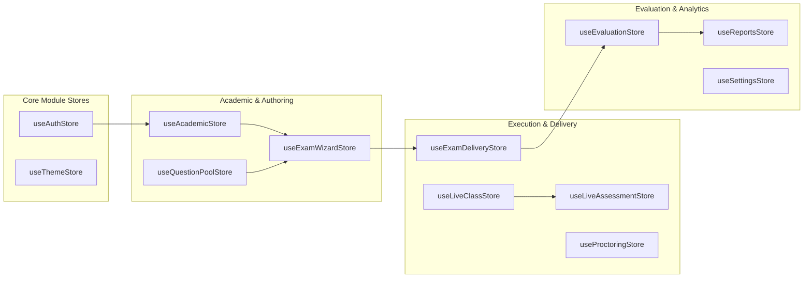
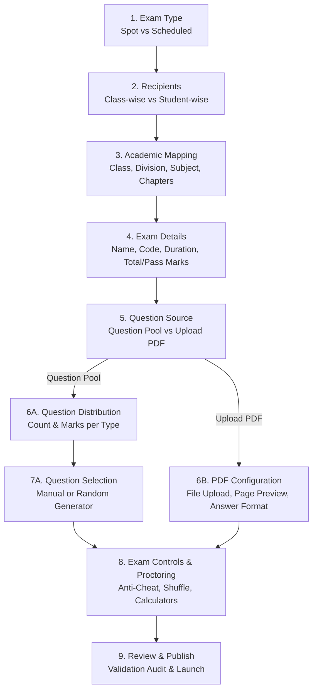
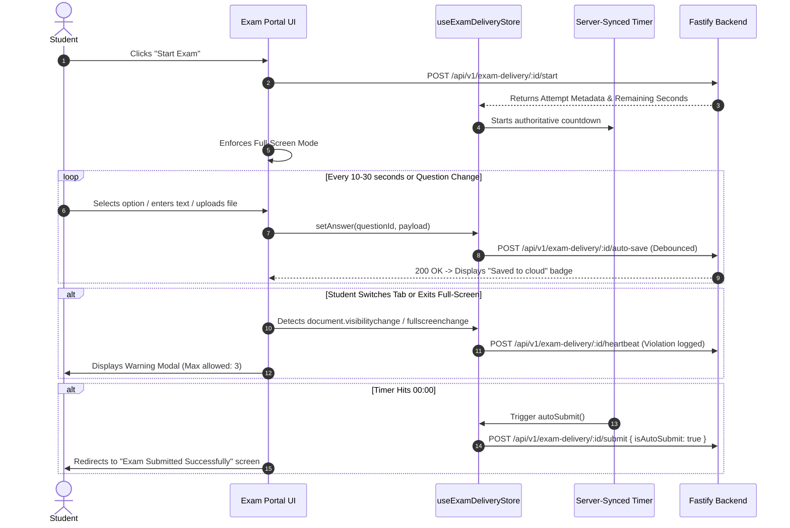

# Frontend Product Requirements Document (PRD) & Client Architecture Spec
## Online Class & Assessment Platform (Enterprise Edition)

> **Document Version:** 1.0  
> **Target Release:** Phase 1 & Enterprise Rollout  
> **Client Architecture:** Single Page Application (SPA) / Modular Micro-Frontend Ready  
> **Core Framework:** React (v18.3+ / React 19) + TypeScript  
> **State Management:** Zustand (Modular Domain Stores with DevTools & LocalStorage Persistence)  
> **Styling & Design System:** Vanilla Tailwind CSS + CSS Custom Properties Design Tokens ("EduDrive" Aesthetic: Warm Amber `#f39223` / Slate Neutrals)  
> **Icons & Graphics:** Lucide React (`lucide-react`)  
> **Client Real-Time Engine:** WebSockets (`socket.io-client` / native WebSocket) with Exponential Reconnection  
> **Target Devices:** Desktop (Primary for Teachers/Admins/High-Stakes Exams), Tablets (Proctoring/In-Class Quizzes), Mobile (Student/Parent Dashboard)  

---

## 1. Executive Summary & Design Philosophy

The Frontend of the **Online Class & Assessment Platform** provides an ultra-responsive, highly engaging, and foolproof interface for all educational stakeholders:
1. **Teachers & Instructors:** Frictionless exam authoring wizards, dynamic question pools, automated mark calculation, real-time in-class live quiz launchers, and rubric-based grading suites with visual PDF annotations.
2. **Students:** Distraction-free, high-stakes examination delivery environments featuring server-authoritative countdown timers, automatic zero-loss answer saving, multi-format question renderers, and pre-exam hardware readiness checks.
3. **Academic Coordinators & Administrators:** Real-time exam session monitoring, multi-tier result approval workflows, and centralized academic hierarchy configuration.
4. **Parents:** Unified multi-child performance tracking, exam scorecards, and live class schedules.

### Design Principles ("EduDrive" Theme)
- **Warm Enterprise Aesthetic:** Professional warm amber/orange primary accent (`#f39223`) balanced by clean Slate neutrals (`#111827`, `#6b7280`, `#f8f7f5`).
- **5-Part Semantic Status System:** Every status (Success, Warning, Error, Info, Pending) enforces consistent 5-token styling (background, border, text, icon, icon-bg) for visual clarity.
- **Micro-Animations & Feedback:** Subtle transitions on state changes, optimistic UI updates, and clear network status badges.
- **Fail-Safe Interaction Design:** Critical student actions (exam submission, question navigation with unsaved inputs) are safeguarded with confirmation modals and auto-save indicators.

---

## 2. Zustand State Management Architecture

State is cleanly decoupled into focused, single-responsibility Zustand stores. No giant monolithic states.

```mermaid
graph TD
    subgraph "Zustand Stores Architecture"
        AuthStore["useAuthStore<br/>(User, Token, Role, Tenant)"]
## 2. Modular Architecture & Directory Structure (1:1 Backend Parity)

The Frontend strictly mirrors the Backend's domain-modular architecture. Each functional domain is encapsulated into a self-contained feature module containing its own **API services, Zustand stores, custom hooks, components, page views, and types**. Cross-cutting concerns and primitive design tokens reside in `src/core/`.

```
src/
├── core/                                # Shared Cross-Cutting Infrastructure
│   ├── api/                             # Base HTTP & WebSocket Client
│   │   ├── httpClient.ts                # Axios/Fetch client with tenant injection (`X-Tenant-ID`)
│   │   ├── socketClient.ts              # Multiplexed WebSocket client with auto-reconnect
│   │   └── interceptors.ts              # Auth token attachment, 401 refresh token rotation
│   ├── theme/                           # "EduDrive" Design Tokens & Styling
│   │   ├── tokens.css                   # Custom CSS properties (5-part status system)
│   │   └── useThemeStore.ts             # Light/Dark mode state
│   ├── components/                      # Design System Primitives
│   │   ├── Button/                      # Variant: primary, secondary, destructive, outline
│   │   ├── Modal/                       # Accessible dialog with backdrop blur
│   │   ├── Badge/                       # 5-part status badges (Success, Warning, Danger, Info)
│   │   ├── Tabs/                        # Animated tab switches
│   │   ├── Table/                       # Virtualized / paginated data table
│   │   ├── StatCard/                    # Metric highlight card with trend indicator
│   │   └── Dropdown/                    # Accessible select and popover menus
│   ├── layout/                          # App Shell & Navigation
│   │   ├── AppLayout.tsx                # Main container layout
│   │   ├── Sidebar.tsx                  # Role-aware sidebar with tenant branding
│   │   ├── Header.tsx                   # Tenant info, search, alerts, user profile
│   │   ├── RoleSwitcher.tsx             # Quick switch between 5 roles
│   │   └── TenantBranding.tsx           # Institutional logo and color accent override
│   └── types/                           # Global Core Types
│       ├── tenant.types.ts              # Tenant metadata & configuration
│       └── api.types.ts                 # Standard API response & pagination wrapper
│
├── modules/                             # Domain Feature Modules (1:1 with Backend)
│   │
│   ├── auth/                            # Module 1: Identity, RBAC & SSO Launch
│   │   ├── api/authApi.ts               # Login, refresh, ERP SSO handshake, LTI launch
│   │   ├── stores/useAuthStore.ts       # User identity, JWT tokens, active role, tenant slug
│   │   ├── components/RoleGuard.tsx     # Route authorization wrapper
│   │   ├── views/LoginPage.tsx          # Direct institution login view
│   │   └── types/auth.types.ts          # UserRole, PortalMode, TokenPayload
│   │
│   ├── academic/                        # Module 2: Curriculum & Hierarchy
│   │   ├── api/academicApi.ts           # Years, classes, divisions, subjects, chapters
│   │   ├── stores/useAcademicStore.ts   # Cached hierarchy trees and active selections
│   │   ├── components/                  # HierarchyCascader, SubjectSelect, ChapterMultiPicker
│   │   └── types/academic.types.ts      # Class, Division, Subject, Chapter, Topic
│   │
│   ├── question-bank/                   # Module 3: Question Pool & AI Generator
│   │   ├── api/questionBankApi.ts       # Pool CRUD, search, AI generation endpoint
│   │   ├── stores/useQuestionPoolStore.ts # Bank query filters, active tags, pool items
│   │   ├── components/                  # QuestionCard, BloomsBadge, AIQuestionGeneratorModal
│   │   ├── views/QuestionPoolView.tsx   # Comprehensive question bank browser
│   │   └── types/questionBank.types.ts  # PoolQuestion, BloomsTaxonomy, QuestionLevel
│   │
│   ├── exams/                           # Module 4: Exam Authoring & Scheduling
│   │   ├── api/examsApi.ts              # Exam CRUD, recipient assignment, PDF upload
│   │   ├── stores/useExamWizardStore.ts # 9-step wizard draft state & validations
│   │   ├── components/                  # Steps 1-9 (Recipients, AcademicMap, MarksTable, PdfUploader)
│   │   ├── views/                       # CreateClassAssessmentView, OnlineClassAssessmentsView
│   │   └── types/exams.types.ts         # ExamBasicDetails, RecipientSelection, ControlsConfig
│   │
│   ├── exam-delivery/                   # Module 5: High-Stakes Student Exam Delivery
│   │   ├── api/deliveryApi.ts           # Start exam, debounced autosave, heartbeat, submit
│   │   ├── stores/useExamDeliveryStore.ts # Active attempt, server timer, answers map, offline queue
│   │   ├── hooks/                       # useAuthoritativeTimer, useAutosaveSync, useAntiCheat
│   │   ├── components/                  # ExamHeader, QuestionPalette, Renderers (MCQ, MMCQ, DragBlank, Ordering, Text, Upload)
│   │   ├── views/                       # StudentExamPortalView, PreFlightCheckView
│   │   └── types/delivery.types.ts      # ExamAttempt, StudentAnswerPayload, QuestionStatus
│   │
│   ├── evaluation/                      # Module 6: Grading, Rubrics & 4-Step Approval
│   │   ├── api/evaluationApi.ts         # Submission queue, question grading, annotations, approval transitions
│   │   ├── stores/useEvaluationStore.ts # Active grading session, rubrics, canvas marks, workflow state
│   │   ├── components/                  # CanvasAnnotationToolbar, RubricSlider, OverrideReasonModal, ApprovalTimeline
│   │   ├── views/                       # EvaluationDashboardView, AnswerEvaluationView, AttachmentEvaluationView, ResultCalculationReviewView
│   │   └── types/evaluation.types.ts    # StudentSubmission, AnnotationMark, RubricScore, ResultSettings
│   │
│   ├── live-classroom/                  # Module 7: Virtual Lectures & Synchronous Class
│   │   ├── api/liveClassApi.ts          # Meeting creation, platform links, attendance logging
│   │   ├── stores/useLiveClassStore.ts  # Active session, attendee roster, media permissions
│   │   ├── components/                  # VideoStageEmbed, WhiteboardCanvas, PermissionsDrawer, MaterialsDrawer
│   │   ├── views/                       # OnlineClassesListView, CreateOnlineClassView, LiveClassroomView
│   │   └── types/liveClass.types.ts     # OnlineClass, ClassroomPermissions, AttendanceLog
│   │
│   ├── live-assessment/                 # Module 8: Real-Time In-Class Spot Quizzes
│   │   ├── api/liveAssessmentApi.ts     # Launch quiz, push question, submit answer, override mark
│   │   ├── stores/useLiveAssessmentStore.ts # Connected students telemetry, live progress, review session
│   │   ├── components/                  # LiveQuizLauncherModal, LiveAssessmentStudentOverlay, LiveAssessmentTeacherReviewModal, SmartCardNfcModal
│   │   └── types/liveAssessment.types.ts# LiveInClassAssessment, LiveProgressRecord, SmartCard
│   │
│   ├── proctoring/                      # Module 9: AI Telemetry & Malpractice Detection
│   │   ├── api/proctoringApi.ts         # Violation event dispatch, telemetry metrics
│   │   ├── stores/useProctoringStore.ts # Risk score summary, violation log, hardware readiness
│   │   ├── components/                  # SystemReadinessModal, WebcamFaceMonitor, ViolationBanner, SimilarityMatrix
│   │   └── types/proctoring.types.ts    # ProctoringEventCode, RiskScoreTier, MalpracticeAlert
│   │
│   ├── reports/                         # Module 10: Academic Tabulation & Analytics
│   │   ├── api/reportsApi.ts            # Scorecard queries, class tabulation export
│   │   ├── stores/useReportsStore.ts    # Filter states, chart metrics, export formats
│   │   ├── components/                  # TabulationTable, ScorecardPDFGenerator, DifficultyDiscriminationChart
│   │   ├── views/ReportsAnalyticsView.tsx # Central analytics & performance portal
│   │   └── types/reports.types.ts       # ExamReport, StudentScorecard, ItemAnalysis
│   │
│   └── settings/                        # Module 11: Configuration Center
│       ├── api/settingsApi.ts           # System configs, grading rules, accommodations
│       ├── stores/useSettingsStore.ts   # Institutional settings and proctoring rules
│       ├── views/ConfigurationCenterView.tsx # Multi-tab administration center
│       └── types/settings.types.ts      # RuleSetting, GradeRule, StudentAccommodation
│
├── App.tsx                              # Modular Route Registry & Global Providers
└── main.tsx                             # Application Entry Point
```

---

## 3. Zustand State Management Store Specifications

Each module owns its Zustand store with strict isolation, optional localStorage synchronization, and devtools integration.



### 3.1 Primary Domain Stores Detail

#### 1. `modules/auth/stores/useAuthStore.ts`
- **State:** `user`, `role` (`admin | coordinator | teacher | proctor | student | parent`), `tenantId`, `tenantSlug`, `token`, `isAuthenticated`.
- **Actions:** `login()`, `logout()`, `switchRole()`, `handleErpLaunchSession()`, `setTenantContext()`.

#### 2. `modules/exam-delivery/stores/useExamDeliveryStore.ts` (Mission-Critical Student Store)
- **State:**
  - `activeExam`: Full exam metadata, instructions, sections, and question list.
  - `attemptId`: Current active attempt identifier.
  - `answers`: Record map `Record<questionId, StudentAnswerState>`.
  - `questionStatusMap`: Visual status for question palette (`not_visited`, `visited`, `answered`, `not_answered`, `marked_for_review`, `answered_and_marked`).
  - `currentQuestionIndex`: Active question pointer.
  - `remainingSeconds`: Server-synchronized countdown timer.
  - `isSyncing`: Boolean indicating network autosave in flight.
  - `lastSavedAt`: Timestamp of last successful server persistence.
  - `offlineQueue`: Array of unsaved answer payloads queued during network dropouts.
  - `violationCount`: Tab switch and fullscreen exits detected.
- **Actions:**
  - `initializeAttempt(examData, attemptData)`
  - `setAnswer(questionId, payload)`
  - `markForReview(questionId)`
  - `navigateQuestion(index)`
  - `syncAnswersToServer()` (Throttled/Debounced 10s auto-save)
  - `handleServerTimerTick(serverRemainingSec)`
  - `submitExam(isAutoSubmit)`

#### 3. `modules/live-assessment/stores/useLiveAssessmentStore.ts` (Real-Time In-Class Quiz)
- **State:** `activeAssessment`, `connectedStudents`, `liveProgress` (who has answered, time spent), `teacherReviewSubmission`, `isTimerRunning`.
- **Actions:** `launchAssessment()`, `recordStudentProgress()`, `overrideScore()`, `broadcastResults()`.

#### 4. `modules/evaluation/stores/useEvaluationStore.ts` (Teacher Evaluation & Approval)
- **State:** `currentSubmission`, `evaluatedQuestions`, `activeQuestionIndex`, `visualAnnotations`, `workflowStep`, `isSubmittingGrade`.
- **Actions:** `loadSubmission()`, `setQuestionScore()`, `setRubricCriteriaScore()`, `addAnnotation()`, `removeAnnotation()`, `transitionWorkflow()`.

---

## 4. Detailed View & User Flow Specifications

### 4.1 Teacher Assessment Creation Wizard (`CreateClassAssessmentView`)
The creation process is broken down into 9 intuitive, validated steps:



#### Step Details & Validation Rules
- **Step 1 – Exam Type:** Choose between **Spot Test** (immediate or short-window access) and **Scheduled Test** (specific start/end timestamp).
- **Step 2 – Recipient Selection:**
  - *Class-wise:* Multi-select Academic Year, Class, and Division. Auto-resolves all active enrolled students.
  - *Student-wise:* Searchable data-table with individual student checkboxes, admission numbers, and division tags.
- **Step 3 – Academic Configuration:**
  - Dynamic cascade: Selecting Class loads assigned Subjects; selecting Subject queries curriculum chapters and topics.
  - Supports multi-chapter selection or "Select All Chapters".
- **Step 4 – Exam Basic Details:**
  - Exam Name, unique Exam Code (auto-generated or manual entry, e.g., `MAT-G8-2026-001`), Duration (minutes), Total Marks, Pass Marks, and Rich Student Instructions.
- **Step 5 & 6 – Question Source & Distribution:**
  - *Mode A (Existing Pool):* Configurable distribution table defining question count and marks-per-question across:
    - **MCQ** (Single Choice)
    - **MMCQ** (Multiple Choice)
    - **One Word** (Short text)
    - **Short Answer** (1-2 paragraphs)
    - **Long Answer / Essay** (Extended text)
  - Real-time validation: `Sum(Questions * Marks) MUST EQUAL Total Marks`. The wizard prevents advancing until marks match 100%.
  - *Mode B (Upload PDF):* Drag-and-drop PDF question paper, configure total marks, question count, and submission format (OMR, text entry, image upload, or hybrid).
- **Step 7 – Question Selection:**
  - Filter question bank by Bloom's Taxonomy, difficulty (Easy, Medium, Hard), and topics.
  - Select questions manually or trigger automated random generation with difficulty balancing.
- **Step 8 – Controls, Anti-Cheat & Accommodations:**
  - Toggles: Randomize question sequence, randomize MCQ options, disable copy/paste, enforce full-screen mode, detect tab switching, auto-submit on time expiry, enable scientific calculator, review before submission.
- **Step 9 – Comprehensive Review & Launch:**
  - Summary scorecard of all configurations with instant publish or draft saving.

---

### 4.2 High-Stakes Student Exam Delivery Engine (`StudentExamPortalView`)



#### Student Interface Features
1. **Persistent Header:** Exam title, student name, admission number, camera active indicator, and bold countdown timer (`MM:SS`) changing from neutral to amber (<10 mins) to pulsing red (<3 mins).
2. **Question Canvas:**
   - Section tabs (e.g. Section A: Objective, Section B: Subjective).
   - Question number, marks badge, clear question prompt.
   - Question format renderer (drag-to-blank slots, sequence reordering handles, rich text editor with word counter).
3. **Question Status Matrix (Side Palette):**
   - Visual grid of question numbers colored by state:
     - ⚪ Grey: Not Visited
     - 🔵 Blue: Visited / In Progress
     - 🟢 Green: Answered
     - 🔴 Amber: Not Answered
     - 🟣 Purple: Marked for Review
     - 🟣/🟢 Purple + Green Check: Answered & Marked for Review
4. **Pre-Submission Review Modal:**
   - Pops up when student clicks "Submit Exam".
   - Shows summary: e.g., `"You have answered 18 of 20 questions. 2 questions are unanswered."`
   - Unanswered questions are highlighted as clickable chips to jump directly to them.

---

### 4.3 Live Classroom & Interactive Spot Assessment (`LiveClassroomView`)

Designed for synchronous hybrid learning:
- **Main Stage:** Live video stream (In-app WebRTC, Google Meet/Zoom embed) or digital whiteboard.
- **Student Participation Sidebar:** Attendance roster with microphone/camera status, hand-raising queue, and in-class chat.
- **In-Class Assessment Launcher:** Teacher clicks "Launch Spot Assessment" ➔ Selects or generates a 3-minute quiz.
- **Real-Time Student Screen:** Instant modal overlay pops up for students with countdown timer.
- **Smart Card / Face ID Attendance:** Students can tap their NFC smart card or authenticate via webcam face scan to register verified attendance.
- **Teacher Review Modal (`LiveAssessmentTeacherReviewModal`):**
  - Displays live telemetry bar: Submissions count, Average score, Not-started count.
  - Question-by-question response breakdown.
  - Teacher can override scores on the fly and click "Publish Results to Students".

---

### 4.4 Teacher Evaluation & Visual Annotation Suite

#### 1. Evaluation Dashboard (`EvaluationDashboardView`)
- Filterable queue: `All Exams`, `Subject`, `Class/Division`, and status tabs:
  - **Not Started** (Submissions pending evaluation)
  - **In Progress** (Partially scored)
  - **Completed** (Scoring complete, awaiting review)
  - **Published** (Grades released)
- Student card displays: Student photo, roll number, submission timestamp, objective auto-score, subjective status, and evaluator action button.

#### 2. Interactive Answer Evaluation Screen (`AnswerEvaluationView`)
- **Left Panel (Question & Model Answer):** Displays question prompt, max marks, model answer, and scoring rubric criteria.
- **Middle Panel (Student Response):** Displays student typed answer or high-res image/PDF attachment.
- **Right Panel (Grading Panel):**
  - Objective questions: Auto-graded badge with correctness indicator.
  - Subjective questions: Rubric criteria sliders/inputs, manual score input (`0` to `MaxMarks`), teacher feedback box.
  - Score override toggle with mandatory audit justification field.

#### 3. Visual Attachment Annotation Tool (`AttachmentEvaluationView`)
- Built on HTML5 Canvas / SVG overlay over student uploaded PDF answer sheets:
  - **Toolbar:** Checkmark (green ✓), Cross mark (red ✗), Highlighter pen (yellow transparent), Sticky Comment Pin.
  - **Multi-page Navigation:** Page selector for multi-page handwritten student papers.
  - **Audit Logging:** Every mark placed is stored as normalized coordinate percentages (`xPct`, `yPct`, `pageNumber`), making annotations device-resolution independent.

#### 4. Result Calculation & 4-Step Approval Workflow (`ResultCalculationReviewView`)
Enforces institutional governance before releasing grades:
- **Step 1: Evaluation Completed** (Teacher scores all questions).
- **Step 2: Teacher Review & Sign-Off** (Teacher verifies grade distribution, applies bonus/deductions).
- **Step 3: Academic Coordinator Approval** (Coordinator audits high/low outliers and approves publication).
- **Step 4: Published to Gradebook & Students** (Grades push to ERP via outbound webhook; students can view results according to configured visibility toggles).

---

## 5. Design System & CSS Variable Specification

Add this foundational design system directly to the frontend (`src/index.css` or design tokens file):

```css
:root {
  /* Brand Warm Colors ("EduDrive") */
  --primary: #f39223;
  --primary-light: #ffedd5;
  --primary-hover: #ea580c;

  /* Surfaces & Backgrounds */
  --bg-sidebar: #ffffff;
  --bg-main: #fcfcfc;
  --bg-main-light: #f8f7f5;
  --bg-card: #ffffff;

  /* Typography */
  --text-primary: #111827;
  --text-secondary: #6b7280;
  --text-muted: #9ca3af;
  --border-color: #e5e7eb;

  /* 5-Part Status Tokens */
  --status-success-bg: #ecfdf3;
  --status-success-border: #bbf7d0;
  --status-success-text: #166534;
  --status-success-icon: #15803d;
  --status-success-icon-bg: #dcfce7;

  --status-warning-bg: #fff7ed;
  --status-warning-border: #fed7aa;
  --status-warning-text: #c2410c;
  --status-warning-icon: #b45309;
  --status-warning-icon-bg: #ffedd5;

  --status-error-bg: #fef2f2;
  --status-error-border: #fecaca;
  --status-error-text: #b91c1c;
  --status-error-icon: #dc2626;
  --status-error-icon-bg: #fee2e2;
}

[data-theme='dark'] {
  --primary: #f39223;
  --primary-light: #2d1a0b;
  --primary-hover: #fb923c;

  --bg-sidebar: #111827;
  --bg-main: #030712;
  --bg-main-light: #030712;
  --bg-card: #1f2937;

  --text-primary: #f9fafb;
  --text-secondary: #d1d5db;
  --text-muted: #9ca3af;
  --border-color: #374151;

  --status-success-bg: #0f2318;
  --status-success-border: #1f5136;
  --status-success-text: #7ad39a;
  --status-success-icon: #4ade80;
  --status-success-icon-bg: #163322;

  --status-warning-bg: #2a1d0f;
  --status-warning-border: #5b3a16;
  --status-warning-text: #f8b770;
  --status-warning-icon: #f59e0b;
  --status-warning-icon-bg: #3b2711;

  --status-error-bg: #2f1414;
  --status-error-border: #5f2323;
  --status-error-text: #f7a8a8;
  --status-error-icon: #f87171;
  --status-error-icon-bg: #3b1919;
}
```

---

## 6. Client Reliability, Offline Autosave & Accessibility

### 6.1 IndexedDB / LocalStorage Backup Engine
During an exam, every keystroke and selection is immediately mirrored to `localStorage` under `backup_attempt_{attemptId}` before network transmission. If the browser is accidentally closed, reloaded, or internet cuts out:
1. React on mount checks `localStorage` for cached unsaved answers.
2. Restores state instantly.
3. Automatically resumes background sync once connection returns.

### 6.2 Accessibility (WCAG 2.1 AA Compliance)
- **High Contrast Support:** Dedicated high-contrast mode for visually impaired students.
- **Keyboard Navigation:** Full tab-indexing and keyboard shortcuts for question switching (`Alt + N` for Next, `Alt + P` for Previous, `Alt + M` for Mark for Review).
- **Screen Reader Compatibility:** Proper ARIA labels on all custom question controls, blank slots, and matching lists.
- **Font Scaling:** Dynamic typography scaling without layout breakage.
