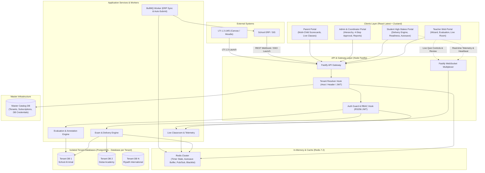

# Online Class & Assessment Platform — Master PRD & Architecture Index

> **Platform:** Enterprise Online Class & Assessment System  
> **Backend Architecture:** Node.js + Fastify, PostgreSQL (Database-per-Tenant), Redis, Drizzle ORM, BullMQ, WebSockets  
> **Frontend Architecture:** React (Latest / v18+ / 19), TypeScript, Zustand Store Architecture, Tailwind CSS ("EduDrive" Design System)  
> **Integration Mode:** Standalone SaaS + Pluggable Connected School ERP / SIS (HMAC-SHA256 Webhooks, SSO Launch, LTI 1.3 Advantage)  

---

## Document Navigation

| Document | Target Layer | Key Contents & Tech Specs |
| :--- | :--- | :--- |
| **[Backend PRD](file:///home/arshad/Workspace/demo/online-class%20and%20assesment-phase1/docs/PRD_BACKEND.md)** | Backend & Data Layer | Node Fastify, Database-per-tenant (`own-db`), Drizzle ORM schema, PgBouncer pooling, Redis write-behind buffer (50k+ concurrent test-takers), BullMQ worker queues, Zero-data loss autosave, API specifications. |
| **[Frontend PRD](file:///home/arshad/Workspace/demo/online-class%20and%20assesment-phase1/docs/PRD_FRONTEND.md)** | Frontend & Client App | React Latest, 1:1 Domain-Modular Structure matching Backend (`src/modules/*`), Zustand modular stores, EduDrive design tokens, 9-step Exam Wizard, Student Delivery Engine, Live Classroom & Quiz Studio, Teacher Evaluation with Canvas Annotations. |
| **[API & Webhook Spec](file:///home/arshad/Workspace/demo/online-class%20and%20assesment-phase1/docs/API_AND_WEBHOOK_INTEGRATION_SPEC.md)** | Integration Layer | Bi-directional REST webhooks, HMAC-SHA256 signatures, JIT user provisioning, automatic gradebook sync back to ERP. |
| **[ERP & Standalone Architecture](file:///home/arshad/Workspace/demo/online-class%20and%20assesment-phase1/docs/ERP_INTEGRATION_AND_STANDALONE_ARCHITECTURE.md)** | Architecture Layer | Hexagonal decoupled adapter pattern, dual-mode deployment (100% Standalone vs Connected ERP), LTI 1.3 Advantage specifications. |

---

## High-Level System Architecture

