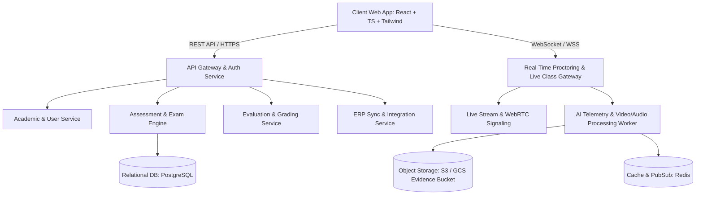

# Online Class and Assessment System — Complete Project Development Task List

> **Document Version:** 1.0  
> **Target Systems:** Modern Responsive Web Application (Desktop / Tablet / Mobile)  
> **Architecture:** Microservices / Modular Monolith Backend + React/TypeScript Modern SPA Frontend + WebSocket Real-Time Gateway + AI Proctoring Worker Pipeline  

---

## 1. Executive Summary & Architecture Overview

The **Online Class and Assessment Platform** is an enterprise-grade digital education solution designed to manage the entire lifecycle of virtual classrooms and online evaluations. It supports:
- Multi-tenant school/university academic hierarchies (Years, Classes, Divisions, Subjects, Chapters).
- Multi-format exams (Spot Tests vs Scheduled Windowed Tests; Question Bank Pool vs Uploaded PDF papers).
- Interactive Live Classes with in-class spot assessments and automated attendance logging.
- AI-assisted + Human-in-the-loop Proctoring with real-time risk scoring, violation logging, and evidence capture.
- Subjective & Objective Answer Evaluation with blind grading, digital PDF annotations, and a 4-tier Result Approval Workflow.
- Plagiarism / Answer Similarity Analysis, Comprehensive Analytics, and School ERP Sync.



---

## 2. User Roles & Granular RBAC Permissions Matrix

### 2.1 User Roles
1. **Super Administrator (SA):** Full system governance, school tenant onboarding, global security policies, audit logs.
2. **Academic Administrator / Coordinator (AC):** Academic calendar, curriculum mapping, exam approvals, coordinator sign-off for results, department reports.
3. **Teacher / Evaluator (TE):** Create/manage exams, question bank curation, conduct live classes, trigger spot tests, grade student submissions, provide feedback.
4. **Proctor / Invigilator (PR):** Live monitoring of exam sessions, handling malpractice alerts, issuing warnings, pausing sessions, recording evidence.
5. **Student (ST):** Attend live classes, take scheduled/spot exams, upload answers/attachments, view verified results, track performance history.
6. **Parent (PA):** View student attendance, exam schedule, report cards, teacher feedback, and academic performance metrics.

### 2.2 Permissions Matrix

| Feature / Action | Super Admin | Academic Coordinator | Teacher | Proctor | Student | Parent |
| :--- | :---: | :---: | :---: | :---: | :---: | :---: |
| **Manage Academic Structure (Years/Classes/Divisions)** | ✅ | ✅ | ❌ | ❌ | ❌ | ❌ |
| **Manage Subjects & Chapters/Curriculum** | ✅ | ✅ | ✏️ (Subject) | ❌ | ❌ | ❌ |
| **Create & Edit Question Banks** | ✅ | ✅ | ✅ | ❌ | ❌ | ❌ |
| **Create & Schedule Exams (Spot / Scheduled)** | ✅ | ✅ | ✅ | ❌ | ❌ | ❌ |
| **Upload PDF Question Papers & Set Sections** | ✅ | ✅ | ✅ | ❌ | ❌ | ❌ |
| **Live Classroom Hosting & Spot Quizzing** | ✅ | ✅ | ✅ | ❌ | ❌ | ❌ |
| **Attend Live Classes & Take Exams** | ❌ | ❌ | ❌ | ❌ | ✅ | ❌ |
| **Live Invigilation & Proctoring Grid** | ✅ | ✅ | ✅ | ✅ | ❌ | ❌ |
| **Issue Warnings / Pause / Terminate Exam** | ✅ | ✅ | ✅ | ✅ | ❌ | ❌ |
| **Answer Evaluation (Manual / Rubric / PDF pen)** | ✅ | ✅ | ✅ | ❌ | ❌ | ❌ |
| **Result Approval Workflow Sign-off** | ✅ | ✅ (Coordinator) | ✏️ (Submit) | ❌ | ❌ | ❌ |
| **Publish Results to Students & Parents** | ✅ | ✅ | ❌ | ❌ | ❌ | ❌ |
| **View Result Scorecard & Analytics** | ✅ | ✅ | ✅ | ❌ | ✅ (Self) | ✅ (Ward) |
| **Plagiarism & Similarity Analysis Review** | ✅ | ✅ | ✅ | ✅ | ❌ | ❌ |
| **ERP Data Sync & Integration Config** | ✅ | ❌ | ❌ | ❌ | ❌ | ❌ |

---

## 3. Project Delivery Phases Summary

* **Phase 1: Foundation, RBAC, Academic Master Data & Authentication**
* **Phase 2: Question Bank Management & Curriculum Pool**
* **Phase 3: Comprehensive Exam Creation & Wizard Workflow**
* **Phase 4: Live Classroom & In-Class Spot Assessment Engine**
* **Phase 5: Student Secure Assessment Portal & Pre-Check Workflow**
* **Phase 6: Real-time Proctoring, Telemetry & Plagiarism Detection**
* **Phase 7: Evaluation Engine, Blind Grading & 4-Tier Approval Workflow**
* **Phase 8: Analytics, Parent/Student Dashboards, ERP Sync & Audit**

---

# 4. FRONTEND TASK LIST (Phase by Phase)

```
================================================================================
FRONTEND TASKLIST
================================================================================
```

### Phase 1: Foundation, Design System & User/RBAC Management
- [ ] **FE-101: Core UI Design System & Component Library**
  - Implement responsive Layout system (Sidebar, Header, Breadcrumbs, Notification Drawer, User Avatar menu).
  - Build atomic UI kit: Buttons, Inputs, Dropdowns, Date-Time pickers, Badges, Modals, Skeleton loaders, Toast notifications.
  - Implement dynamic Theme provider with light/dark and high-contrast accessibility mode.
- [ ] **FE-102: Authentication & Role Switcher Portal**
  - Login view with Email/Password, SSO (Google/Microsoft), and Student Admission No + OTP/QR login.
  - Role-based route guard and Dynamic Portal Switcher (`Teacher`, `Admin`, `Coordinator`, `Proctor`, `Student`, `Parent`).
  - Active session expiration modal and silent JWT refresh mechanism.
- [ ] **FE-103: Academic Hierarchy Management Views**
  - Academic Year selector and configuration screens.
  - Class and Division/Section management with bulk student import view.
  - Subject and Chapter/Topic mapping views with reordering and status flags.
- [ ] **FE-104: Student Roster & Accommodations View**
  - Searchable/filterable student roster table with admission number, class, division, and status.
  - Student Special Accommodations modal (Extra time multiplier: 1.25x/1.5x/2.0x, relaxed proctor sensitivity, break allowance, screen reader toggle).

### Phase 2: Question Bank Management & Content Pool
- [ ] **FE-201: Question Bank Explorer & Filter UI**
  - Tree-based filter (Subject -> Class -> Chapter -> Question Type -> Difficulty Level).
  - Rich question card preview showing tags, marks, usage count, bloom level, and author.
- [ ] **FE-202: Multi-Type Question Authoring Editor**
  - Single-choice and Multiple-choice MCQ editor with option reordering and explanation fields.
  - One-Word / Fill-in-the-blanks editor with multiple accepted synonym answers.
  - Short and Long answer authoring with model answer reference and keyword matching hints.
  - Essay question authoring with customizable scoring rubric matrix.
  - Mathematical Equation Editor using KaTeX / MathQuill and Rich Text formatting.
- [ ] **FE-203: Question Bank Bulk Import & Export UI**
  - Drag-and-drop CSV/Excel/Word/QTI question upload with live client-side validation and syntax error highlighting.
  - Export question pool to PDF / Word worksheet with answer key toggle.

### Phase 3: Exam Creation Engine & Multi-Step Wizard
- [ ] **FE-301: Step 1 – Basic Exam Details & Timing**
  - Exam type selector: `Spot Test` (instant/open) vs `Scheduled Test` (strict window).
  - Form fields: Exam Title, Code (auto-generated or manual), Duration, Total Marks, Pass Marks, Instructions.
  - Availability toggles: "Make Immediately Available", "Allow Late Entry (Grace period)".
- [ ] **FE-302: Step 2 – Recipient Selection**
  - `Class-Wise` selection mode: Academic Year, Class, Divisions (single, multiple, or all).
  - `Student-Wise` selection mode: Multi-select table with search, class filtering, and selection summary chips.
  - Exclusion list tab (e.g. absent or exempted students).
- [ ] **FE-303: Step 3 – Academic & Curriculum Mapping**
  - Subject selection with dynamic Chapter/Topic checklist.
  - "Select All Chapters", "Weightage per Chapter" distribution UI.
- [ ] **FE-304: Step 4 – Question Source Selector**
  - Mode choice cards: `Option A: Existing Question Bank Pool` vs `Option B: Upload Question Paper PDF`.
- [ ] **FE-305: Step 5A – Question Pool Selection & Marks Matrix**
  - Question type & marks distribution table (MCQ, One Word, Short, Long, Essay).
  - Dynamic calculations for total marks vs exam total marks with instant validation warnings.
  - Manual Question Selector modal with filter, preview, and add/remove chips.
  - Random Question Selection mode config (e.g., Pick 10 random MCQs from 50 available in pool).
- [ ] **FE-306: Step 5B – PDF Question Paper Upload & Section Setup**
  - PDF Upload with inline PDF.js preview renderer.
  - Section Breakdown Configurator: Define Section A/B/C, number of questions, marks per section, and optional question rules (e.g., "Answer any 5 out of 8").
- [ ] **FE-307: Step 6 – Answer Submission Format & Security Settings**
  - Allowed student submission formats: Online Rich Text, Code snippet, File attachment (PDF/Image), Mobile Camera Scan.
  - Security & Proctoring config toggles: Browser Fullscreen enforcement, Tab switch limit, Webcam/Mic requirement, Calculator enablement, Question shuffle, Option shuffle.
- [ ] **FE-308: Step 7 – Review, Summary & Publish Wizard**
  - Consolidated preview of all 6 steps with validation checklist.
  - "Save as Draft", "Schedule Exam", and "Publish & Notify Students" actions with confirmation modal.

### Phase 4: Live Classroom & In-Class Spot Assessment Engine
- [ ] **FE-401: Teacher Live Classroom Interface**
  - Embedded Video Grid / Google Meet / WebRTC classroom panel with mic, camera, screen-share controls.
  - Real-time Student Attendance Sidebar with join/leave timestamps and active engagement status.
  - Live Chat, Q&A, and Hand-raise management queue.
- [ ] **FE-402: Live In-Class Spot Assessment Launcher (Teacher View)**
  - Quick Spot Quiz creation modal (1-click question from bank or rapid instant MCQ/Poll).
  - Time limit countdown trigger (e.g., 60s, 3m, 5m).
  - Live response monitor: Bar chart of option selections updating in real-time.
  - Instant Answer Reveal and Leaderboard display.
- [ ] **FE-403: Student Live Classroom & In-Class Quiz Modal**
  - Student classroom viewer with interactive screen/stream.
  - Floating Live Spot Quiz overlay prompt with timer, submission button, and instant feedback.

### Phase 5: Student Secure Assessment Portal
- [ ] **FE-501: Student Exams List & Schedule View**
  - Categorized tabs: `Upcoming Exams`, `Live / Active Now`, `Under Evaluation`, `Completed / Results Available`.
  - Exam card with countdown timer, duration, subject, syllabus, and "Start System Check" action.
- [ ] **FE-502: Pre-Exam System Readiness Check Wizard**
  - Step 1: Camera & Microphone permission verification and audio level meter.
  - Step 2: AI Face Detection & Identi-check (capture reference photo).
  - Step 3: Browser & Network latency benchmark (ping, bandwidth, fullscreen test).
  - Step 4: Exam Code / Rules Acknowledgement & "Enter Exam" CTA.
- [ ] **FE-503: Secure Exam Execution Workspace**
  - Locked-down Fullscreen interface with warning banner on escape attempts.
  - Header: Exam title, Remaining Countdown Timer (with accommodation extra-time support), Network health icon, Auto-save status indicator.
  - Question Palette (Grid of Question numbers with color codes: `Answered`, `Not Answered`, `Marked for Review`, `Visited`).
  - Question Content Area: Rich text question, formula rendering, image zoom.
  - Multi-format Input Canvas:
    * Single & Multi MCQ radio/checkbox buttons.
    * One-word short input.
    * Rich text area with character/word counter.
    * Math formula palette.
    * File Upload dropzone for handwritten sheets + QR code to scan and upload via mobile phone camera.
  - "Previous", "Next", "Mark for Review", "Clear Response" buttons.
  - Comprehensive Final Submit Confirmation Dialog with answered/unanswered summary breakdown.

### Phase 6: Real-Time Proctoring, Telemetry & Plagiarism Detection
- [ ] **FE-601: Invigilator Live Monitoring Grid View**
  - Multi-student grid view (4x4, 6x6 tiles) displaying live student webcam thumbnails and risk score badges.
  - Real-time filter by Risk Tier: `All`, `Critical (76-100)`, `Suspicious (51-75)`, `Monitor (21-50)`, `Normal (0-20)`.
  - Student Tile quick actions: "View Stream", "Send Warning", "Force Fullscreen", "Pause Exam", "Terminate".
- [ ] **FE-602: Student Session Detail & Live Evidence Feed**
  - Live dual-stream preview (Webcam feed + Screen share thumbnail).
  - Violation event timeline stream (Tab switch, Face missing, Multiple faces, Audio spike).
  - Direct 1-to-1 secure proctor messaging chat.
- [ ] **FE-603: Malpractice Alerts & Evidence Locker View**
  - Filterable list of logged violations across exams.
  - Evidence review modal: Synchronized webcam snapshot, screen capture, audio clip, confidence percentage, and audit trail.
  - Action buttons: "Confirm Violation & Penalize", "Dismiss as False Positive", "Escalate to Coordinator".
- [ ] **FE-604: Answer Similarity & Plagiarism Analysis UI**
  - Pairwise similarity matrix and high-risk pair cards.
  - Side-by-side student answer comparison viewer: Highlighting matching text, identical wrong options, submission time delta, and shared IP/device detection.

### Phase 7: Evaluation Engine, Blind Grading & Approval Workflow
- [ ] **FE-701: Teacher Evaluation Dashboard**
  - Exam selector with submission stats: `Total Submissions`, `Auto-Graded (MCQ)`, `Pending Manual Review`, `Completed`.
  - Student submission list with grading progress bar, total score, and status.
  - Filter by Class, Division, or "Ungraded Only".
- [ ] **FE-702: Question-by-Question / Student-by-Student Grading Workspace**
  - Side-by-side view: Student's answer vs Model Answer / Rubric.
  - Mark award input with max-marks validation, step-mark breakdown, and private teacher feedback box.
  - Blind Evaluation Toggle (Mask student names and admission numbers with anonymous tokens like `Candidate #104`).
- [ ] **FE-703: On-Screen PDF & Handwritten Attachment Grading Tool**
  - Integrated PDF & Image Annotation Canvas: Zoom, Rotate, Freehand Pen, Checkmark, Crossmark, Text comment, and Score stamp.
  - Auto-calculation of marks from annotated pages into the total exam score.
- [ ] **FE-704: Multi-Tier Result Approval & Moderation View**
  - 4-step progress tracker: `1. Evaluation Done` ➔ `2. Teacher Review` ➔ `3. Coordinator Sign-off` ➔ `4. Published`.
  - Moderation adjustments table: Bulk grace marks, normalization formula runner, pass/fail threshold adjustment.
  - Official Result Publishing button with batch email/SMS notification trigger.

### Phase 8: Analytics, Portals, ERP Sync & Audit Logs
- [ ] **FE-801: Student & Parent Results & Scorecard Portal**
  - Digital Report Card view with Subject breakdowns, Pass/Fail status, Class Rank, and Grade.
  - Question-level review modal: View correct answer, student response, marks earned, and teacher comments (if published by school).
  - Historical performance charts: Topic-wise strengths/weaknesses radar chart and semester trend line.
- [ ] **FE-802: Academic Analytics & Reports Dashboard**
  - Class-wise performance comparison, Question discrimination index, and Bloom's taxonomy achievement heatmaps.
  - Export tools: Download Master Tabulation Sheet (Excel), Official Report Cards (Batch PDF), CBSE/State Board format.
- [ ] **FE-803: System Settings & ERP Configuration UI**
  - ERP Integration status dashboard (Student sync, Teacher sync, Gradebook sync).
  - Proctoring Sensitivity rules configurator (Thresholds for face detection, audio levels, tab switches).
  - Global Audit Log viewer with user action history and IP tracking.

---

# 5. BACKEND TASK LIST (Phase by Phase)

```
================================================================================
BACKEND TASKLIST
================================================================================
```

### Phase 1: Foundation, DB Architecture, Auth & RBAC
- [ ] **BE-101: Database Architecture & Core Data Models (PostgreSQL + Prisma/TypeORM/GORM)**
  - Design & migrate schemas:
    * `Tenants`, `Schools`, `AcademicYears`, `Classes`, `Divisions`, `Subjects`, `Chapters`, `Topics`.
    * `Users`, `Roles`, `UserRoles`, `Permissions`, `StudentProfiles`, `TeacherProfiles`, `ParentProfiles`.
    * `StudentAccommodations` (multiplier, breaks, sensitivity flags).
  - Setup database indexing, foreign key constraints, and soft-delete conventions.
- [ ] **BE-102: Authentication, JWT & RBAC Middleware**
  - REST Endpoints: `POST /api/v1/auth/login`, `POST /api/v1/auth/refresh`, `POST /api/v1/auth/logout`, `POST /api/v1/auth/student-pin-login`.
  - Implement access token (short-lived 15m) + secure HTTP-only refresh token (7d) rotation.
  - Role & Permission middleware: `@RequirePermission('EXAM_CREATE')`, `@RequireRole(['teacher', 'admin'])`.
  - Multi-tenant tenant isolation filter in database queries.
- [ ] **BE-103: Academic Hierarchy CRUD Services**
  - Endpoints:
    * `GET /api/v1/academic/years`, `POST /api/v1/academic/years`
    * `GET /api/v1/academic/classes`, `POST /api/v1/academic/classes`
    * `GET /api/v1/academic/classes/{id}/divisions`
    * `GET /api/v1/academic/subjects`, `POST /api/v1/academic/subjects`
    * `GET /api/v1/academic/subjects/{id}/chapters`, `POST /api/v1/academic/chapters`
- [ ] **BE-104: Student & Teacher Roster Management API**
  - Endpoints: `GET /api/v1/users/students`, `POST /api/v1/users/students/bulk-import`, `GET /api/v1/users/students/{id}/accommodations`, `PUT /api/v1/users/students/{id}/accommodations`.
  - CSV/Excel streaming parser for 5,000+ student records with transactional rollback on schema errors.

### Phase 2: Question Bank Service & Curation Engine
- [ ] **BE-201: Question Bank Data Model & Storage**
  - Schemas: `Questions`, `QuestionOptions`, `QuestionRubrics`, `QuestionTags`, `QuestionRevisions`.
  - Support columns for Rich Text (HTML/Markdown), LaTeX/Math, Bloom's Taxonomy Level, Difficulty (`Easy`, `Medium`, `Hard`), and Media URLs.
- [ ] **BE-202: Question Bank REST APIs**
  - Endpoints:
    * `GET /api/v1/questions` (Full-text search, filters by subject, chapter, type, difficulty, tags).
    * `POST /api/v1/questions` (Create question with options/rubric).
    * `PUT /api/v1/questions/{id}` (Update & increment revision).
    * `DELETE /api/v1/questions/{id}` (Soft delete).
    * `POST /api/v1/questions/bulk-upload` (Async processing with progress polling).
    * `POST /api/v1/questions/export` (Stream generated CSV/QTI).
- [ ] **BE-203: Dynamic Question Pool Randomizer Algorithm**
  - Service to dynamically select $N$ random non-repeating questions matching subject, chapter, difficulty weights, and mark constraints.

### Phase 3: Exam Engine, Scheduling & Lifecycle Service
- [ ] **BE-301: Exam Management Data Models**
  - Schemas:
    * `Exams`, `ExamRecipients` (Class-wise vs Student-wise), `ExamChapters`.
    * `ExamQuestions` (Order, Section, Marks, Mandatory flag).
    * `ExamSections` (Name, Duration, MaxMarks, ChoiceRules).
    * `ExamSecuritySettings` (Proctoring mode, Fullscreen strictness, Shuffling).
- [ ] **BE-302: Exam CRUD & Multi-Step Configuration APIs**
  - Endpoints:
    * `POST /api/v1/exams` (Create draft exam basic details).
    * `PUT /api/v1/exams/{id}/recipients` (Set class-wise or student list).
    * `PUT /api/v1/exams/{id}/academic-mapping` (Set subjects & chapters).
    * `PUT /api/v1/exams/{id}/marks-distribution` (Set question counts & marks per category).
    * `PUT /api/v1/exams/{id}/questions` (Attach question IDs or trigger random pool).
    * `POST /api/v1/exams/{id}/upload-pdf` (Multipart PDF upload to S3/GCS + section definitions).
    * `PUT /api/v1/exams/{id}/security-rules` (Configure proctoring & browser locks).
    * `POST /api/v1/exams/{id}/publish` (Validate entire exam schema integrity and schedule).
- [ ] **BE-303: Exam Scheduler & State Machine Worker**
  - Background scheduler (Cron / BullMQ / Celery) managing exam transitions:
    * `DRAFT` ➔ `SCHEDULED` ➔ `ACTIVE` ➔ `EVALUATING` ➔ `PUBLISHED` ➔ `ARCHIVED`.
  - Instant dispatch worker for `Spot Tests` to notify active students via WebSockets/Push.

### Phase 4: Live Classroom & Spot Assessment Gateway
- [ ] **BE-401: Live Classroom Session Management**
  - Schemas: `LiveClasses`, `LiveClassAttendees`, `LiveClassEvents`.
  - Integration with Video Provider (WebRTC SFU / Zoom SDK / Google Meet REST APIs).
  - Endpoints: `POST /api/v1/live-classes`, `GET /api/v1/live-classes/{id}/attendance`, `POST /api/v1/live-classes/{id}/end`.
- [ ] **BE-402: Live Class WebSocket Gateway (Socket.io / WS Server)**
  - Room management: `join_class`, `leave_class`, `chat_message`, `hand_raise`.
  - Real-time attendance heartbeat (Pings every 30s to compute exact minutes present).
- [ ] **BE-403: Spot Assessment Real-Time Dispatch & Aggregator**
  - Teacher triggers `spot_quiz_start` with question data and time limit.
  - Gateway broadcasts to all connected students in the room.
  - Redis-backed in-memory response collector for millisecond-latency aggregation.
  - Broadcast live results & leaderboard `spot_quiz_leaderboard` on timer expiry.

### Phase 5: Student Exam Runtime, Resilient Auto-Save & Submission
- [ ] **BE-501: Student Pre-Check & Session Initialization API**
  - Endpoints:
    * `GET /api/v1/student/exams` (List available exams for authenticated student).
    * `POST /api/v1/student/exams/{id}/start-session` (Validate time window, student eligibility, generate encrypted session token).
    * `POST /api/v1/student/exams/{id}/verify-readiness` (Log device, browser specs, IP, and reference selfie URL).
- [ ] **BE-502: Resilient Auto-Save & Sync Engine (Redis + DB Pipeline)**
  - Schemas: `ExamSessions`, `StudentAnswers`, `AnswerAttachments`.
  - Endpoint: `POST /api/v1/student/exams/{id}/answers/save-batch`.
  - High-throughput Redis caching layer: Buffer student keystrokes and option choices, async flush to Postgres every 10s.
  - Collision & Out-of-order resolution using monotonically increasing sequence numbers and timestamps.
- [ ] **BE-503: Attachment & Mobile Scan Upload Service**
  - Endpoint: `POST /api/v1/student/exams/{id}/upload-attachment` (Presigned S3/GCS URL for PDF/images).
  - Mobile QR Handshake: Generate short-lived OTP/QR code. Student uploads photos via mobile browser directly to their active exam question session.
- [ ] **BE-504: Exam Final Submit & Auto-Close Daemon**
  - Endpoint: `POST /api/v1/student/exams/{id}/submit`.
  - Server-side strict timer validation: Automatically locks and auto-submits any session where `TimeElapsed > (DurationMinutes * Multiplier + GracePeriod)`.
  - Immediate trigger of Auto-Grading Worker for objective questions.

### Phase 6: Real-Time Proctoring, AI Telemetry & Plagiarism Services
- [ ] **BE-601: Invigilation WebSocket Service & Real-Time Event Bus**
  - WebSocket namespaces: `/proctor-feed` and `/student-telemetry`.
  - Ingestion of client telemetry: `FACE_NOT_DETECTED`, `MULTIPLE_FACES`, `TAB_SWITCH`, `FULLSCREEN_EXIT`, `AUDIO_ANOMALY`.
  - Proctor control events: `SEND_WARNING`, `PAUSE_STUDENT_EXAM`, `RESUME_EXAM`, `TERMINATE_SESSION`.
- [ ] **BE-602: Dynamic Risk Scoring & Malpractice Pipeline**
  - Schema: `MalpracticeAlerts`, `ExamAuditLogs`, `EvidenceFiles`.
  - Streaming Rule Engine: Calculate dynamic risk score (0-100) per student based on frequency, duration, and severity of violations.
  - S3 Evidence Archiver: Securely store encrypted webcam frame snapshots and audio snippets linked to violation timestamps.
- [ ] **BE-603: Plagiarism & Similarity Detection Engine**
  - Schema: `SimilarityAnalysisPairs`, `AnswerComparisons`.
  - Post-exam background analysis job:
    * Compare submission timestamps, IP addresses, and user-agent matches.
    * Compute text cosine similarity & Levenshtein distance on descriptive answers.
    * Identify identical wrong-answer distribution clusters across MCQs.

### Phase 7: Evaluation Engine, Blind Grading & Result Approval Workflow
- [ ] **BE-701: Automated Evaluation Service**
  - Worker to grade MCQ (single & multi-select) and One-Word (case-insensitive regex and synonyms).
  - Negative marks calculation logic based on exam settings.
- [ ] **BE-702: Manual Evaluation & Annotation API**
  - Endpoints:
    * `GET /api/v1/evaluation/exams/{id}/submissions`
    * `GET /api/v1/evaluation/submissions/{id}/answers`
    * `POST /api/v1/evaluation/answers/{id}/grade` (Assign marks, rubric criteria, feedback).
    * `POST /api/v1/evaluation/attachments/{id}/annotations` (Store vector/JSON layer for pen drawings & remarks).
  - Blind grading mode: Mask personal identifiable information (PII) for evaluators when enabled.
- [ ] **BE-703: 4-Tier Result Approval State Machine**
  - Schemas: `ExamResultApprovals`, `ApprovalHistory`, `ModerationLogs`.
  - Endpoints:
    * `POST /api/v1/results/{examId}/submit-review` (Teacher completes grading).
    * `POST /api/v1/results/{examId}/coordinator-approve` (Coordinator signs off).
    * `POST /api/v1/results/{examId}/apply-moderation` (Add grace marks / formula adjustments).
    * `POST /api/v1/results/{examId}/publish` (Make results visible to students/parents).

### Phase 8: Analytics, Notifications, ERP Integration & Data Retention
- [ ] **BE-801: Analytics & Report Generation Engine**
  - Endpoints: `GET /api/v1/reports/exams/{id}/summary`, `GET /api/v1/reports/classes/{id}/performance`, `GET /api/v1/reports/students/{id}/report-card`.
  - Async PDF report card generator (Puppeteer / PDFKit) for batch generation.
- [ ] **BE-802: Multi-Channel Notification Dispatcher**
  - Integrated with SMS Gateway (Twilio / Gupshup), WhatsApp Business API, and Email (SendGrid / SES).
  - Event triggers: Exam scheduled, Exam starting in 15 mins, Result published, High-risk malpractice escalation.
- [ ] **BE-803: ERP Bi-directional Sync Adapter**
  - Sync Inbound: Students, Teachers, Classes, Divisions, Timetable.
  - Sync Outbound: Final published exam marks and attendance records pushed back to School ERP Gradebook.
  - REST Webhooks + idempotent sync log table (`ErpSyncLogs`).
- [ ] **BE-804: Data Retention & Audit Trail Service**
  - Automated archival of heavy proctoring video/evidence to cold storage after 90 days.
  - Tamper-proof immutable audit logging for all mark overrides and approvals.

---

---

## 6. Optimized 2-Month Production Implementation Schedule (1 FE + 1 BE + 1 QA)

> **Team Constraints:**
> - **1 Frontend Engineer:** 40 Mandays total (8 weeks @ 5 days/week)
> - **1 Backend Engineer:** 40 Mandays total (8 weeks @ 5 days/week)
> - **1 QA / Automation Engineer:** 40 Mandays total (8 weeks @ 5 days/week)
> - **Total Budget / Window:** **Under 2 Months (8 Weeks / 120 Mandays Total)**

```mermaid
gantt
    title 2-Month Delivery Roadmap (1 FE + 1 BE + 1 QA)
    dateFormat  YYYY-MM-DD
    section Sprint 1 (Weeks 1–2)
    BE: DB Schemas, JWT Auth & Academic APIs       :b1, 2026-09-01, 10d
    FE: UI Shell, Auth Views, Academic & QB UI     :f1, 2026-09-01, 10d
    QA: Test Framework, Auth & CRUD Test Suites   :q1, 2026-09-01, 10d
    section Sprint 2 (Weeks 3–4)
    BE: Exam Engine APIs, PDF S3, WebSockets      :b2, after b1, 10d
    FE: 7-Step Exam Wizard & Live Class UI        :f2, after f1, 10d
    QA: Wizard Validations & WS Latency Testing   :q2, after q1, 10d
    section Sprint 3 (Weeks 5–6)
    BE: Session Init, Redis Auto-Save & Proctor Bus:b3, after b2, 10d
    FE: Pre-Check Wizard, Exam Workspace & Monitor:f3, after f2, 10d
    QA: Auto-Save Dropout Resilience & Anti-Cheat :q3, after q2, 10d
    section Sprint 4 (Weeks 7–8)
    BE: Auto-Grading, 4-Tier Approval & Reports   :b4, after b3, 10d
    FE: Evaluation Dashboard, PDF Pen & Portals   :f4, after f3, 10d
    QA: Full Regression, Pentest & Go-Live Sign-Off:q4, after q3, 10d
```

### Sprint-by-Sprint Work Allocation

| Sprint | Timeline | Frontend Track (10 MD) | Backend Track (10 MD) | QA Track (10 MD) | Sprint Milestone / Deliverable |
| :--- | :--- | :--- | :--- | :--- | :--- |
| **Sprint 1** | **Weeks 1–2** | • Global UI Shell & Design System (3d)<br>• Multi-Role Login Views (2d)<br>• Academic Hierarchy UI (2d)<br>• Question Bank Explorer & Authoring (3d) | • PostgreSQL Schema & Migrations (3d)<br>• JWT Auth & RBAC Middleware (3d)<br>• Academic CRUD APIs (2d)<br>• Question Bank CRUD & Randomizer (2d) | • Test Framework & CI Pipeline (3d)<br>• Auth & RBAC Test Cases (3d)<br>• Academic & QB API Automation (4d) | **Working Foundation & Question Bank Repository** |
| **Sprint 2** | **Weeks 3–4** | • 7-Step Exam Wizard (Pool + PDF Upload) (6d)<br>• Live Classroom UI & Attendance (4d) | • Exam Engine Models & Scheduler (4d)<br>• PDF Upload & Section Setup (2d)<br>• Live Class WebSockets & Spot Aggregator (4d) | • Exam Wizard Field Validation Suite (4d)<br>• PDF Upload Edge Cases (2d)<br>• Real-time WebRTC & WS Stress Test (4d) | **Functional Exam Creator & Live Class Gateway** |
| **Sprint 3** | **Weeks 5–6** | • 4-Step Pre-Exam Readiness Check (3d)<br>• Secure Locked-Down Exam Workspace (4d)<br>• Invigilator Monitoring Grid & Alerts (3d) | • Student Session Init & Tokens (2d)<br>• Resilient Redis Auto-Save & S3 Sync (4d)<br>• Proctoring Telemetry Bus & Risk Scoring (4d) | • Auto-Save Offline Recovery Testing (4d)<br>• Lockdown Bypass & Security Checks (3d)<br>• 50+ Concurrent Proctor Event Simulation (3d) | **Student Exam Experience & Live Proctoring** |
| **Sprint 4** | **Weeks 7–8** | • Teacher Evaluation & PDF Pen Grading (4d)<br>• 4-Tier Result Approval & Moderation UI (2d)<br>• Student/Parent Scorecard Portals (4d) | • Auto-Grading & Vector Annotations (4d)<br>• 4-Tier Approval State Machine (3d)<br>• PDF Generator & ERP Webhooks (3d) | • End-to-End Grading & Mark Calculation QA (4d)<br>• Security Pentest & OWASP Top 10 (3d)<br>• Final User Acceptance Testing & Go-Live (3d) | **Production Release & Deployment Sign-Off** |

---

## 7. Definition of Done (DoD) Quality Checklist

For any task to be marked as complete:
1. **Frontend:**
   - [ ] All UI states handled: *Loading*, *Empty*, *Error*, *Success*, and *Disabled*.
   - [ ] Form validation implemented with immediate inline error feedback.
   - [ ] Fully responsive on Mobile (375px+), Tablet (768px+), and Desktop (1280px+).
   - [ ] WCAG 2.1 AA accessibility compliant (Keyboard navigability, ARIA labels, contrast ratio).
2. **Backend:**
   - [ ] REST API endpoints documented with OpenAPI / Swagger specifications.
   - [ ] Granular RBAC permission checks applied on every route.
   - [ ] Unit & Integration test coverage > 85%.
   - [ ] Database queries optimized with appropriate indexes and pagination.
   - [ ] Sensitive student data & evidence encrypted at rest and in transit.
